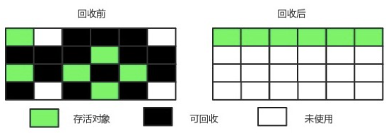

# JVM

Java程序运行环境（二进制**字节码**的运行环境）。Java虚拟机屏蔽了与具体操作系统平台相关的信息，使得Java程序只需生成在Java虚拟机上运行的目标代码（字节码），就可以在**多种平台**上不加修改地运行。
简单来说JVM是用来解析和运行Java程序的。

> 优势：
>
> - 一次编译，到处运行
> - 自动内存管理
> - 数组下标越界自动检查


# JVM 内存结构


## 程序计数器

**作用：存储下一条JVM指令的执行地址(当前线程所执行的字节码的行号指示器)**

java代码在**编译**过程中，会被转化为**JVM指令（二进制字节码）**。二进制字节码通过**字节码解释器**解释为**机器码**，才能经**CPU**处理。这个过程中，程序计数器时刻指向下一条JVM指令地址。

**特点：**

- **线程私有：**每条线程具有独立的程序计数器，各条线程之间程序计数器互不影响，独立存储。
- **唯一一个不存在内存溢出**(`OutOfMemoryError`)的区域

## 虚拟机栈

**虚拟机栈：每个线程运行时所需要的内存空间**

**栈帧：方法调用时所需要的内存空间**

**每个栈由多个栈帧组成**，对应着每次调用方法时所占用的内存。每个线程只能有一个**活动栈帧**，对应着当前正在执行的方法。

> 两种异常状况
>
> - `StackOverflowError`
>
> 如果线程请求的栈深度大于虚拟机所允许的深度，抛出`StackOverflowError`异常。如栈帧过多或过大。
>
> - `OutOfMemoryError`
>
> 虚拟机栈可以申请动态扩展。当扩展时无法申请到足够内存时，抛出`OutOfMemoryError`异常

**特点：**

- 栈是**线程私有**的
- **垃圾回收不涉及栈内存**
- 当扩展时无法申请到足够内存时，抛出**`OutOfMemoryError`异常**

## 本地方法栈

作用同虚拟机栈。

**不同点在于：本地方法栈为虚拟机使用到的 Native 方法服务；虚拟机栈为虚拟机执行 Java 方法(字节码)服务。**

也会抛出`StackOverflowError`和`OutOfMemoryError`异常。

## Java堆

**Java虚拟机管理的内存最大的一块区域，用于存放对象实例，在虚拟机启动时创建。**

**特点：**

- Java堆是被所有**线程共享**的内存区域。
- 存在**垃圾回收机制**。
- 当堆中没有内存完成实例分配，并且堆无法扩展时，抛出**`OutOfMemoryError`异常。**

**根据Java虚拟机规范的规定，Java堆可以处于物理上不连续的内存空间，只要逻辑上连续即可。在实现时，可实现成固定大小，也可实现堆空间扩展(通过 -Xmx 和 -Xms 控制)。**

## 方法区

**用于存储已被虚拟机加载的类信息、常量(运行时常量池)、静态变量等数据。**

**特点：**

- 方法区是**线程共享**的内存区域
- **可以选择不实现垃圾回收**
- 当方法区无法满足内存分配需求时，抛出**`OutOfMemoryError`异常**

Java虚拟机规范规定：方法区不需要连续的内存；可以选择固定大小或可扩展；可以选择不实现垃圾回收。

方法区垃圾回收目标主要是针对**常量池的回收**和对**类型的卸载**

## 运行时常量池

**常量池：用于存放编译期生成的各种字面量和符号引用。**虚拟机指令根据这张常量表找到要执行的类名、方法名、参数类型、字面量信息
**运行时常量池**：
常量池是 *.class 文件中的，**当该类被加载以后，它的常量池信息就会放入运行时常量池，并把里面的符号地址变为真实地址**

运行时常量池具有**动态性**。常量并不一定只在编译期间产生，运行期间也可能将新的常量放入池中。常见例子：**`intern()`方法**

运行时常量池是方法区的一部分，与方法区相同，可以抛出`OutOfMemoryError`异常

## 直接内存

- **常用于NIO操作，用于数据缓冲区**
- **分配和回收成本高，但读写较快**
- **不受垃圾回收机制管理**

直接内存并不是虚拟机定义的内存区域，但是这部分内存也会被频繁使用，并且动态扩展时可能抛出`OutOfMemoryError`异常

**在IO的过程中，Java无法直接操作磁盘文件，而是使用本地方法操作和读取磁盘文件。这个过程是在系统内存中创建缓冲区，将数据读取到系统缓冲区，随后将缓冲区数据拷贝至堆内存中。**

JDK1.4引入了一种基于通道和缓冲区的IO方式(NIO)之后，可以使用Native函数库直接配堆外内存，然后通过`DirectByteBuffer`对象操作这块内存。**避免了在Java堆和Native堆中来回复制数据，可以显著提升性能**


### 字节码

二进制字节码包含类的基本信息、常量池、类方法定义、虚拟机的指令

```java
//获取下列代码编译后的常量池和运行时常量池
public class Demo01 {
    public static void main(String[] args) {
        System.out.println("213");
    }
}
//命令行窗口
javap -v Demo01.class
```

常量池：


运行时常量池


### StringTable

字符串池：在JDK1.7之后存在于堆中的一块区域。内部是`HashTable`结构，不能扩容。

串池机制可以避免重复创建对象

```java
String s1 = "a";
String s2 = "b";
String s3 = "ab";
/*
首先，s1 s2 s3都被加载到运行时常量池中。a b ab都是常量池中的符号，还没有变为Java对象。
随后，创建StringTable(串池),将a符号转换为"a"字符串对象,添加到串池中。
b ab 同上。
*/
String s4 = s1 + s2;
/*
实际过程：
new StringBuilder().append("a").append("b").toString()
*/
System.out.println(s3 == s4);//false
/*
s3存在于串池，s4存在于堆
*/
```

- **常量池中的字符串仅是符号，只有在被用到时才会转化为对象**
- **利用串池的机制，来避免重复创建字符串对象**
- **字符串变量拼接的原理是StringBuilder**
- **字符串常量拼接的原理是编译器优化**
- **可以使用intern方法，主动将串池中还没有的字符串对象放入串池中**

#### `intern()`

**将字符串对象尝试放入到串池中，如果没有该字符串对象则放入成功。不管是否放入成功，都会返回串池中的字符串对象。**

注意：**如果成功，则堆内存与串池中的字符串对象是同一个对象；如果失败，则不是同一个对象。**

```java
String str = new String("a") + new String("b");
String str2 = str.intern();//将字符串对象从堆中放入串池。str变为串池对象。
String str3 = "ab";
System.out.println(str == str2);//true
System.out.println(str == str3);//true
```

# 垃圾回收

## 判断对象可否回收

### 引用计数算法

- **过程**：给对象添加一个引用计数器，**每当被引用时，计数器值加一；引用失效时，值减一。当计数器值为0时，该对象就不会再被使用。**

- **缺陷**：虽然实现起来简单，并且效率也较高，但是**很难解决对象间相互引用的问题。**因此主流Java虚拟机不选用引用计数算法来管理内存。

### 可达性分析算法

Java虚拟机中的垃圾回收器采用可达性分析来探索存活的对象

- **过程**：扫描堆中的对象，沿着**`GC Roots`对象为起点的引用链**上是否有该对象，如果没有，说明该对象可以被回收

### 引用类型

1.强引用 2.软引用 3.弱引用 4.虚引用 5.终结器引用

#### 1.强引用

代码中普遍存在(最常见)的引用方式。

特点：被强引用关联的对象不会被回收

```java
Object obj = new Object()
```

 #### 2.软引用

**特点：被软引用关联的对象只有在内存不够的情况下才会被回收。**

使用 `SoftReference`类来创建软引用。

```java
Object obj = new Object();
SoftReference<Object> sf = new SoftReference<Object>(obj);
obj = null;  // 使对象只被软引用关联
```

#### 3.弱引用

**特点：被弱引用关联的对象一定会被回收，也就是说它只能存活到下一次垃圾回收发生之前。**

使用`WeakReference`类来实现弱引用。

```java
Object obj = new Object();
WeakReference<Object> wf = new WeakReference<Object>(obj);
obj = null;
```

#### 4.虚引用

又称为幽灵引用或者幻影引用。

**特点：一个对象是否有虚引用的存在，完全不会对其生存时间构成影响，也无法通过虚引用取得一个对象。**

**为一个对象设置虚引用关联的唯一目的就是能在这个对象被回收时收到一个系统通知。**

使用`PhantomReference`类来实现虚引用。

```java
Object obj = new Object();
PhantomReference<Object> pf = new PhantomReference<Object>(obj);
obj = null;
```


## 垃圾回收算法

### 标记清除(Mark Sweep)

将存活的对象进行标记，然后清理掉未被标记的对象。

**优点：速度快**
**缺点：会产生大量不连续的内存碎片，导致无法给大对象分配内存。**


### 标记整理(Mark Compact)

让所有存活的对象整理在一起，然后直接清理掉其他内存。

**优点：没有内存碎片**
**缺点：速度慢**



### 复制(Copy)

将内存划分为大小相等的两块，每次只使用其中一块，当这一块内存用完了就将还存活的对象复制到另一块上面，然后再把使用过的内存空间进行一次清理。

**优点：没有内存碎片**
**缺点：需要双倍内存空间**


​		**现在的商业虚拟机都采用这种收集算法来回收新生代**，每次使用 Eden 和其中一块 Survivor。在回收时，将 Eden 和 Survivor 中存活的对象一次性复制到另一块 Survivor 空间，最后清理 Eden 和使用过的那一块 Survivor。

​		**HotSpot 虚拟机的 Eden 和 Survivor 的大小比例默认为 8:1**，保证了内存的利用率达到 90%。如果每次回收有多于 10% 的对象存活，那么一块 Survivor 空间就不够用了，此时需要依赖于老年代进行分配担保，也就是借用老年代的空间存储放不下的对象。

### 分代收集算法

一般将Java堆分为**新生代**和**老年代**，对应的收集算法不同。

- 在新生代中，划分一块较大的 Eden 空间和两块较小的 Survivor 空间。每次回收时都会发现大批对象死去，只有少量存活，因此**新生代采用复制算法。**

- 在老年代中，对象存活率高，并且没有额外空间进行分配担保。因此**老年代使用标记-清除和标记-整理算法**


## 常用虚拟机参数


## 垃圾回收器

**HotSpot 虚拟机中的 7 个垃圾收集器：**


(连线代表两种收集器可以搭配使用)

- **串行：垃圾回收线程和用户线程交替进行，并且垃圾回收线程是单线程的。在垃圾回收过程中需要暂停用户线程(Stop The World)。**GC线程是单线程的并非说明环境是单CPU下，在多核CPU下进行GC的时候只会使用单核CPU。
- **并行(Parallel)：多条垃圾回收线程同时执行，此时用户线程处于暂停(Stop The World)。**这里肯定是在多核CPU环境下。
- **并发(Concurrent)：垃圾收集器和用户程序同时执行。**除了 CMS 和 G1 之外，其它垃圾收集器都是以串行的方式执行。

### Serial收集器

Serial 收集器是一个**单线程的收集器**，串行，是**虚拟机运行在 Client 模式下的默认新生代收集器**。

**他只会使用一个CPU或一条收集线程去完成垃圾回收。在进行垃圾收集时，必须暂停掉其他所有工作线程(Stop The World, STW)，直到它收集结束。**

**它的优点是简单高效**，对于单个 CPU 环境来说，由于没有线程交互的开销，因此拥**有最高的单线程收集效率**。

它是 Client 模式下的默认新生代收集器，因为在用户的桌面应用场景下，分配给虚拟机管理的内存一般来说不会很大。Serial 收集器收集几十兆甚至一两百兆的新生代停顿时间可以控制在一百多毫秒以内，只要不是太频繁，这点停顿是可以接受的。


### ParNew收集器

它是 Serial 收集器的多线程版本，并行。

**是虚拟机运行在 Server 模式下的首选新生代收集器**，除了性能原因外，主要是因为除了 Serial 收集器，**只有它能与 CMS 收集器配合工作。**

默认开启的线程数量与 CPU 数量相同，`-XX:ParallelGCThreads` 可以设置线程数。


### Parallel Scavenge收集器

与 ParNew 一样是多线程收集器。

**其它收集器关注点是尽可能缩短垃圾收集时用户线程的停顿时间，而它的目标是达到一个可控制的吞吐量，它被称为“吞吐量优先”收集器。**这里的吞吐量指 CPU 用于运行用户代码的时间占总时间的比值。

**停顿时间越短就越适合需要与用户交互的程序**，良好的响应速度能提升用户体验。而**高吞吐量则可以高效率地利用 CPU 时间，尽快完成程序的运算任务**，主要适合在后台运算而不需要太多交互的任务。

> 控制参数：
>
> - `-XX:MaxGCPauseMillis`设置最大垃圾收集停顿时间
> - `-XX:GCTimeRatio`设置吞吐量大小
>
> 开关参数：
>
> - `-XX:+UseAdaptiveSizePolicy`打开 GC 自适应的调节策略(GC Ergonomics)
>
>   不需要手动指定新生代的大小(-Xmn)、Eden 和 Survivor 区的比例、晋升老年代对象年龄等细节参数。虚拟机会根据当前系统的运行情况收集性能监控信息，动态调整这些参数以提供最合适的停顿时间或者最大的吞吐量。**自适应调节策略是parallel Scavenge收集器和ParNew收集器的重要区别**

### Serial Old收集器

**Serial收集器的老年代版本**，也是给 **Client 模式**下的虚拟机使用。

如果用**在 Server 模式下**，它有两大**用途**:

- **在 JDK 1.5 以及之前版本**(Parallel Old 诞生以前)中**与 Parallel Scavenge 收集器搭配使用**。
- **作为 CMS 收集器的后备预案**，在并发收集发生 Concurrent Mode Failure 时使用。


### Parallel Old 收集器

**Parallel Old 是 Parallel Scavenge 收集器的老年代版本**，**使用多线程和“标记-整理”算法**。

在注重吞吐量和CPU资源敏感的场合，都可以优先考虑 Parallel Scavenge 加 Parallel Old 收集器。


### CMS收集器

CMS(Concurrent Mark Sweep，并发-标记-清除），是HotSpot虚拟机中第一个并发收集器，实现了让垃圾收集线程和用户线程同时工作。

CMS是一种以**获取最短回收停顿时间**为目标的收集器。


**运作过程四个步骤**:

- **初始标记**: 仅仅只是标记一下 GC Roots 能直接关联到的对象，速度很快，需要停顿(Stop The World)。
- **并发标记**: 进行 GC Roots Tracing 的过程，它在整个回收过程中耗时最长，不需要停顿。
- **重新标记**: 为了修正并发标记期间因用户程序继续运作而导致标记产生变动的那一部分对象的标记记录，需要停顿(Stop The World)。
- **并发清除**: 不需要停顿。

整个过程中，耗时最长的并发标记和表发清除过程收集器线程可以与用户线程一起工作，不需要停顿。

> 优点：
>
> 并发收集、低停顿。CMS也被称为并发低停顿收集器。
>
> 缺点：
>
> - **总吞吐量低。**
>   - 在并发阶段，CMS收集器会因为占用了一部分线程(CPU资源)而导致应用程序变慢，总吞吐量因此降低。CMS默认的回收线程数是(CPU数量+3)/4。
>
> - **无法处理浮动垃圾。**
>   - **浮动垃圾：在并发清除阶段由于用户线程继续运行而产生的垃圾**，这部分垃圾只能到下一次 GC 时才能进行回收。
>   - 由于浮动垃圾的存在，因此需要预留出一部分内存，意味着 CMS 收集不能像其它收集器那样等待老年代快满的时候再回收。如果预留的内存不够存放浮动垃圾，就会出现 Concurrent Mode Failure，这时虚拟机将临时启用 Serial Old 来替代 CMS。
> - **收集结束后产生大量空间碎片。**
>   - 标记 - 清除算法导致的空间碎片，往往出现老年代空间剩余，但无法找到足够大连续空间来分配大对象，不得不提前触发一次 Full GC。

### G1收集器

 G1是一种面向服务器端应用的垃圾收集器。

**在G1之前的收集器收集的范围是整个新生代或老年代，G1收集器将整个堆划分为多个大小相等的独立区域(Region)，仍然保留新生代和老年代的概念，但二者不再物理隔离了，他们都是一部分Region的集合**。


**Region 之间的对象引用通过 Remembered Set 实现**。每个 Region 都有一个 Remembered Set，在可达性分析过程中**可以避免全堆扫描**。

通过引入 Region 的概念，从而将原来的一整块内存空间划分成多个的小空间，使得**每个小空间可以单独进行垃圾回收**。这种划分方法带来了很大的灵活性，使得可预测的停顿时间模型成为可能。通过记录每个 Region 垃圾回收时间以及回收所获得的空间(这两个值是通过过去回收的经验获得)，**跟踪各个 Region 里面的垃圾堆积的价值大小**，并**维护一个优先列表**，每次根据允许的收集时间，**优先回收价值最大的 Region**。

> **G1收集器的特点**
>
> - **空间整合**：G1是基于“标记 - 整理”算法实现的收集器，从局部(两个 Region 之间)上来看是基于“复制”算法实现的，这意味着运行期间不会产生内存空间碎片。分配大对象时不会因为找不到连续的内存空间而提前触发下一次GC。
> - **可预测的停顿**：G1和CMS都追求降低停顿时间，但G1还**能建立可预测的停顿时间模型**，能让使用者明确指定在一个长度为 M 毫秒的时间片段内，消耗在 GC 上的时间不得超过 N 毫秒。

**G1收集器的运行步骤**

- **初始标记**：仅仅标记一下GC Roots能直接关联到的对象，该阶段需要停顿线程，但耗时很短。
- **并发标记**：从GC Roots开始进行可达性分析，找出存活的对象。该阶段耗时较长，与用户程序并发进行。
- **最终标记**：为了修正在并发标记期间因用户程序继续运作而导致标记产生变动的那一部分标记记录，虚拟机将这段时间对象变化记录在线程的 Remembered Set Logs 里面，最终标记阶段需要把 Remembered Set Logs 的数据合并到 Remembered Set 中。这阶段需要停顿线程，但是可并行执行。
- **筛选回收**：首先对各个 Region 中的回收价值和成本进行排序，根据用户所期望的 GC 停顿时间来制定回收计划。此阶段其实也可以做到与用户程序一起并发执行，但是因为只回收一部分 Region，时间是用户可控制的，而且停顿用户线程将大幅度提高收集效率。


适用场景

- 同时注重吞吐量和低延迟，默认的暂停目标是200 ms
- 超大堆内存，将堆划分为多个大小相等的 Region
- 整体是标记整理算法，两个区域之间是复制

### G1详解

- 在 Young GC 时会进行GC Root 的初始标记

- 老年代占用堆空间的比例达到阈值时，会进行并发标记(不会STW)

  `-XX : InitiatingHeapoccupancyPercent=percent`控制调整阈值(默认45%)

- 最终标记和筛选回收阶段，会对E S O进行全面垃圾回收。会STW。

  `-XX:MaxGCPauseMillis=ms`控制暂停时间。G1将根据暂停时间和优先列表进行回收。


## 内存分配与回收策略

### Minor GC、Major GC、Full GC

JVM 在进行 GC 时，并非每次都对堆内存（新生代、老年代；方法区）区域一起回收的，大部分时候回收的都是指新生代。

- 部分收集：不是完整收集整个 Java 堆的垃圾收集。其中又分为：
  - **新生代GC（Minor GC/Young GC）**发生在新生代的垃圾回收动作。由于Java对抓了大都具有朝生夕死的特性，所以Minor GC非常频繁，回收速度也很快。
  - **老年代GC（Major GC/Old GC）**：发生在老年代的垃圾回收，经常会伴有至少一次的Minor GC。
    - 目前，只有 CMS 和 GC 会有单独收集老年代的行为
    - 很多时候 Major GC 会和 Full GC  混合使用
  - **混合收集（Mixed GC）**：收集整个新生代以及部分老年代的垃圾收集
    - 目前只有 G1 GC 会有这种行为
- **整堆收集（Full GC）**：收集整个 Java 堆和方法区的垃圾

### 内存分配策略

- **对象优先在Eden分配**
  - 对象在新生代Eden区分配，当Eden区没有足够空间时，发起一次Minor GC
- **大对象直接进入老年代**
  - 大对象：需要大量连续内存的Java对象(长字符串或数组)
  - `-XX:PretenureSizeThreshold`，大于此值的对象直接在老年代分配，避免在 Eden 区和 Survivor 区之间的大量内存复制。

- **长期存活的对象进入老年代**

  - 对象存在**年龄计数器**。对象在Eden出生并经过Minor GC依然存活，将移动到Survivor中，年龄增加一岁，增加到一定年龄则移动到老年代中。
  - `-XX:MaxTenuringThreshold` 用来定义年龄的阈值。

- **动态对象年龄控制**

  - 虚拟机并不是永远地要求对象的年龄必须达到 MaxTenuringThreshold 才能晋升老年代，如果在 Survivor 中相同年龄所有对象大小的总和大于 Survivor 空间的一半，则年龄大于或等于该年龄的对象可以直接进入老年代。

- **空间分配担保**

  - 在Minor GC之前，虚拟机会检查老年代的最大可用连续空间是否大于新生代的对象总空间。若大于，则Minor GC是安全的。

  - 否则，虚拟机会查看`HandlerPromotionFailure`的值是否允许**担保失败**。如果允许，虚拟机检查老年代最大可用连续空间是否大于**历次晋升到老年代对象的平均大小**。若大于，则尝试进行一次Minor GC，此时的Minor GC是**有风险的**。

  - 如果小于，或者`HandlerPromotionFailure`不允许冒险，则改为进行一次Full GC。

  - > 取平均值(经验值)进行比较其实是一种动态概率的手段。如果某次Minor GC后存活的对象激增，依然会导致担保失败(HandlePromotionFailure)，只好在失败后重新发起一次Full GC。

### Full GC触发条件

- **调用`System.gc()`**

- **老年代空间不足**

- **空间分配担保失败**

- **JDK 1.7及以前的永久代空间不足**

  在 JDK 1.7 及以前，HotSpot 虚拟机中的方法区是用永久代实现的，永久代中存放Class的信息、常量、静态变量等数据。

  当系统中要加载的类、反射的类和调用的方法较多时，永久代可能会被占满，在未配置为采用 CMS GC 的情况下也会执行 Full GC。如果经过 Full GC 仍然回收不了，那么虚拟机会抛出 java.lang.OutOfMemoryError。

- **Concurrent Mode Failure**

  执行 CMS 或 G1 的 GC 过程中同时有对象要放入老年代，而此时老年代空间不足(可能是 GC 过程中浮动垃圾过多导致暂时性的空间不足)，便会报 Concurrent Mode Failure 错误，并触发 Full GC。

# 类文件结构

各种不同平台的虚拟机与所有平台都使用**统一的程序存储格式**——字节码(ByteCode)——构成平台无关性的基石

Java虚拟机不和包括Java在内的任何一门语言绑定，它只与“Class”文件这种特定的二进制文件格式所关联。

## Class类文件结构

- 任何一个Class文件都对应着唯一一个类或接口的定义信息，但类或接口并不一定以磁盘文件的形式存在，也可以通过类加载器直接生成。

- Class文件是一组以**8位字节为基础单位的二进制流**，存储的内容几乎全部是程序运行所必须的数据，没有空隙存在。
- Class文件格式采用类似于C语言结构体的伪结构存储数据。只有两种数据类型：**无符号数**和**表**
  - 无符号数：属于基本数据类型。**u1 u2 u3 u4分别代表1 2 4 8个字节的无符号数**。描述数字、索引引用、数量值、字符串值(UTF-8)
  - 表：由多个无符号数或其他表构成的复合数据类型，以“_info”结尾。描述有层次关系的符合结构的数据。


### 魔数

定义：Class文件的**前4个字节**称为魔数。

作用：确定文件格式。是否是一个可以被虚拟机接受的Class文件。

Class文件魔数：`CAFEBABE`

### 版本号

魔数后面的4个字节存储Class文件的版本号。

5 6 字节是次版本号，7 8 字节是主版本号。

Java版本号从 45 开始，对应JDK 1.1。JDK1.6 —— 50 —— 0x0032

### 常量池(Constant pool)

主次版本号后是常量池入口。

主要存放两类常量：**字面量**和**符号引用**。字面量类似于java中的常量概念，如文本字符串，final常量等，而符号引用则属于编译原理方面的概念，包括以下三种:

- 类和接口的全限定名
- 字段的名称和描述符号
- 方法的名称和描述符

不同于C/C++, **JVM是在加载Class文件的时候才进行的动态链接**，也就是说这些字段和方法符号引用只有在运行期转换后才能获得真正的内存入口地址。**当虚拟机运行时，需要从常量池获得对应的符号引用，再在类创建或运行时解析并翻译到具体的内存地址中**。

```Java
//案例:
public class Main {
    
    private int m;
    
    public int inc() {
        return m + 1;
    }
}

//生成的class文件
cafe babe 0000 0034 0013 0a00 0400 0f09
0003 0010 0700 1107 0012 0100 016d 0100
0149 0100 063c 696e 6974 3e01 0003 2829
5601 0004 436f 6465 0100 0f4c 696e 654e
756d 6265 7254 6162 6c65 0100 0369 6e63
0100 0328 2949 0100 0a53 6f75 7263 6546
696c 6501 0009 4d61 696e 2e6a 6176 610c
0007 0008 0c00 0500 0601 0010 636f 6d2f
7268 7974 686d 372f 4d61 696e 0100 106a
6176 612f 6c61 6e67 2f4f 626a 6563 7400
2100 0300 0400 0000 0100 0200 0500 0600
0000 0200 0100 0700 0800 0100 0900 0000
1d00 0100 0100 0000 052a b700 01b1 0000
0001 000a 0000 0006 0001 0000 0003 0001
000b 000c 0001 0009 0000 001f 0002 0001
0000 0007 2ab4 0002 0460 ac00 0000 0100
0a00 0000 0600 0100 0000 0800 0100 0d00
0000 0200 0e
    
//反编译
//javap -verbose -p Main.class
Classfile /E:/JavaCode/Main.class
  Last modified 2018-4-7; size 362 bytes
  MD5 checksum 4aed8540b098992663b7ba08c65312de
  Compiled from "Main.java"
public class com.rhythm7.Main
  minor version: 0
  major version: 52
  flags: ACC_PUBLIC, ACC_SUPER
Constant pool:
   #1 = Methodref          #4.#18         // java/lang/Object."<init>":()V
   #2 = Fieldref           #3.#19         // com/rhythm7/Main.m:I
   #3 = Class              #20            // com/rhythm7/Main
   #4 = Class              #21            // java/lang/Object
   #5 = Utf8               m
   #6 = Utf8               I
   #7 = Utf8               <init>
   #8 = Utf8               ()V
   #9 = Utf8               Code
  #10 = Utf8               LineNumberTable
  #11 = Utf8               LocalVariableTable
  #12 = Utf8               this
  #13 = Utf8               Lcom/rhythm7/Main;
  #14 = Utf8               inc
  #15 = Utf8               ()I
  #16 = Utf8               SourceFile
  #17 = Utf8               Main.java
  #18 = NameAndType        #7:#8          // "<init>":()V
  #19 = NameAndType        #5:#6          // m:I
  #20 = Utf8               com/rhythm7/Main
  #21 = Utf8               java/lang/Object
{
  private int m;
    descriptor: I
    flags: ACC_PRIVATE

  public com.rhythm7.Main();
    descriptor: ()V
    flags: ACC_PUBLIC
    Code:
      stack=1, locals=1, args_size=1
         0: aload_0
         1: invokespecial #1                  // Method java/lang/Object."<init>":()V
         4: return
      LineNumberTable:
        line 3: 0
      LocalVariableTable:
        Start  Length  Slot  Name   Signature
            0       5     0  this   Lcom/rhythm7/Main;

  public int inc();
    descriptor: ()I
    flags: ACC_PUBLIC
    Code:
      stack=2, locals=1, args_size=1
         0: aload_0
         1: getfield      #2                  // Field m:I
         4: iconst_1
         5: iadd
         6: ireturn
      LineNumberTable:
        line 8: 0
      LocalVariableTable:
        Start  Length  Slot  Name   Signature
            0       7     0  this   Lcom/rhythm7/Main;
}
SourceFile: "Main.java"
```

可见，反编译后的内容主要是常量池和方法表集合。这里的常量池生声明了实例构造器并声明了一个int类型的字段。方法表集合是对类内部方法的描述。

### 访问标记(access_flags)

在**常量池结束后**，紧跟着**两个字节**(u2)的**访问标记**。**用于识别类或接口访问信息**。


### 类索引、父类索引与接口索引集合

位置：在access_flags后

类索引(this_class)和父类索引(super_class)都是**u2类型**的数据，接口索引集合(interfaces)是一组u2类型的数据的集合。

Class文件靠这三项数据**确定类的继承关系**。

> - 类索引用于确定该类的全限定名
> - 父类索引用于确定该类的父类的全限定名
> - 索引集合用于描述该类实现了哪些接口

### 字段表集合

**字段表(field_info)用于描述接口或类中声明的变量。不包括在方法内部声明的变量。**

可以表示：字段的作用域(public private protected)、实例变量还是类变量(static)、可变性(final)、并发可见性(volatile)、可否被序列化(transient)、字段数据类型(基本类型、对象、数组)、字段名称

由于各个修饰符都是布尔值，很适合用标志位来表示。而字段名字和字段数据类型都是无法固定的，只能引用常量池中的常量描述。

字段表结构：

| 类型           | 名称                 | 数量             |
| -------------- | -------------------- | ---------------- |
| u2             | **access_flags**     | 1                |
| u2             | **name_index**       | 1                |
| u2             | **descriptor_index** | 1                |
| u2             | **attributes_count** | 1                |
| attribute_info | **attributes**       | attributes_count |

### 方法表集合

方法表用于描述方法信息，方法表结构同字段表一样，依次包括**访问标志(access_flags)、名称索引(name_index)、描述符索引(descriptor_index)、属性表集合(attributes)**

### 属性表集合

属性表(attribute_info)，在Class文件、字段表、方法表中都可以携带自己的属性表集合，用于描述特殊的属性。

# 类加载机制

虚拟机把描述类的数据从Class文件加载到内存，并对数据进行校验、转换解析和初始化，最终形成可以被虚拟机直接使用的Java类型。这就是虚拟机的类加载机制。

Class文件应当是一串二进制字节流，无论以何种形式存在都可以。

## 类的生命周期

- 类的生命周期：加载、验证、准备、解析、初始化、使用、卸载
- **类的加载：加载、验证、准备、解析、初始化**
- 连接：验证、准备、解析


其中，**加载、验证、准备、初始化、卸载**这五个阶段的顺序是确定的而**解析**阶段则不一定，它在某些情况下可以在初始化阶段之后开始，这是为了支持Java语言的运行时绑定(也成为动态绑定或晚期绑定)。另外注意这里的几个阶段是按顺序开始，而不是按顺序进行或完成，因为这些阶段通常都是互相交叉地混合进行的，通常在一个阶段执行的过程中调用或激活另一个阶段。

## 加载

类加载过程的第一个阶段，在加载阶段，虚拟机需要完成以下三件事情:

- **通过一个类的全限定名来获取其定义的二进制字节流**。
- **将这个字节流所代表的静态存储结构转化为方法区的运行时数据结构**。
- **在Java堆中生成一个代表这个类的`java.lang.Class`对象**，作为对方法区中这些数据的访问入口。

相对于类加载的其他阶段而言，*加载阶段(准确地说，是加载阶段获取类的二进制字节流的动作)是可控性最强的阶段*，因为开发人员既可以使用系统提供的类加载器来完成加载，也可以自定义自己的类加载器来完成加载。

加载阶段完成后，虚拟机外部的 二进制字节流就按照虚拟机所需的格式存储在方法区之中，而且在Java堆中也创建一个`java.lang.Class`类的对象，这样便可以通过该对象访问方法区中的这些数据。

类加载器并不需要等到某个类被“首次主动使用”时再加载它，JVM规范允许类加载器在预料某个类将要被使用时就预先加载它，如果在预先加载的过程中遇到了.class文件缺失或存在错误，类加载器必须在程序首次主动使用该类时才报告错误(LinkageError错误)如果这个类一直没有被程序主动使用，那么类加载器就不会报告错误。

## 连接

### 验证

验证是连接阶段的第一步，这一阶段的目的是为了确保Class文件的字节流中包含的信息符合当前虚拟机的要求(**确保被加载类的正确性**)，并且不会危害虚拟机自身的安全。

> 验证阶段的动作：
>
> - 文件格式的验证
>
>   验证字节流是否符合Class文件格式的规范
>
> - 元数据验证
>
>   对字节码描述的信息进行语义分析，以保证其描述的信息符合Java语言规范的要求；
>
> - 字节码验证
>
>   通过数据流和控制流分析，确定程序语义是合法的、符合逻辑的。
>
> - 符号引用验证
>
>   确保解析动作能正常运行

验证阶段是非必须的，对运行期没有影响。

可采用`-Xverifynone`参数来关闭大部分的类验证措施，以缩短虚拟机类加载的时间。

### 准备

**为类的静态变量分配内存，并将其初始化为默认值。这些内存都将在方法区中分配**

> 注意：
>
> - 准备阶段仅仅类变量(static)进行内存分配，实例变量不分配，实例变量会在对象实例化时随对象一块分配在堆中。
> - 类变量的初始值通常是数据类型默认的零值(`0`、`0L`、`null`、`false`等)
>
> 假设一个类变量的定义为：`public static int value = 3;`
> 那么变量`value`在准备阶段过后的初始值为`0`，因为此时尚未开始执行任何Java方法，把value赋值为3的动作将在在程序编译后的初始化阶段才会执行。

### 解析

把类中**符号引用**转换为**直接引用**

解析动作主要针对`类`或`接口`、`字段`、`类方法`、`接口方法`、`方法类型`、`方法句柄`和`调用点`限定符7类符号引用进行。

- 符号引用 ：描述目标的一组符号，可以是任何字面量。

- 直接引用 ：直接指向目标的指针、相对偏移量或一个间接定位到目标的句柄。

## 初始化

**JVM负责对类进行初始化，为类的静态变量赋予正确的初始值。**

在加载阶段**用户可以通过自定义类加载器**参与，其余动作完全由虚拟机主导和控制，到**初始化阶段才开始执行类中定义的Java代码(字节码)**

**初始化阶段是调用类构造器`<cinit>()`方法的过程**，虚拟机会保证这个类的构造方法的线程安全。

> `<client>()`方法：
>
> - 该方法是由编译器自动收集类中的所有**类变量的赋值动作**和**静态语言块(`static{...}`)**中的语句合并而成的。
> - 虚拟机会保证在子类的`<client>()`方法方法执行之前，父类的`<client>()`方法已经执行完毕。因此虚拟机中第一个被执行的`<client>()`方法一定是`java.lang.Object`
> - 父类的静态语言块要优于子类的变量赋值操作
> - 接口中不能使用静态代码块，但仍然有变量初始化的赋值操作。执行接口的`<client>()`方法不需要先执行父接口的`<client>()`方法，只有当父接口中定义的变量使用的时候才会初始化父接口。接口的实现类在初始化时也不会执行接口的`<client>()`方法
> - 如果多个线程同时初始化一个类，那么只有一个线程会执行这个类的`<client>()`方法，其他线程阻塞等待。

**JVM初始化步骤**

- 假如这个类还没有被加载和连接，则程序先加载并连接该类
- 假如该类的直接父类还没有被初始化，则先初始化其直接父类
- 假如类中有初始化语句，则系统依次执行这些初始化语句

**类初始化时机**: 只有当对类的主动使用的时候才会导致类的初始化，类的主动使用包括以下六种:

- 创建类的实例，也就是new的方式
- 访问某个类或接口的静态变量，或者对该静态变量赋值
- 调用类的静态方法
- 反射(如`Class.forName("...")`)
- 初始化某个类的子类，则其父类也会被初始化
- Java虚拟机启动时被标明为启动类的类(Java Test)，直接使用java.exe命令来运行某个主类

## 使用

类访问方法区内的数据结构的接口， 对象是Heap区的数据。

## 卸载

**结束生命周期的几种情况**

- 执行了`System.exit()`方法
- 程序正常执行结束
- 程序在执行过程中遇到了异常或错误而异常终止
- 由于操作系统出现错误而导致Java虚拟机进程终止

## 类加载器

“**通过一个类的全限定名获取描述此类的二进制字节流**”这个动作放到Java虚拟机外部去实现，对应的代码模块称为类加载器。

| 名称                    | 加载哪的类            | 说明              |
| ----------------------- | --------------------- | ----------------- |
| Bootstrap ClassLoader   | JAVA_HOME/jre/lib     | 无法直接访问      |
| Extension ClassLoader   | JAVA_HOME/jre/lib/ext | 上级为Bootstrap   |
| Application ClassLoader | classpath             | 上级为Extension   |
| 自定义类加载器          | 自定义                | 上级为Application |

类加载器只用于实现类的加载动作。

**对于任意一个类，都需要该类和加载该类的加载器共同确定其在虚拟机中的唯一性。**即：比较两个类是否相等，只有在这两个类是由同一个类加载器加载的前提下才有意义。否则即使两个类来源于同一个Class文件，被同一个虚拟机加载，只要加载它们的类加载器不同，那么这两个类就不同。


从虚拟机的角度讲，只存在两种类加载器。**一种是启动类加载器，使用C++编写，是虚拟机的一部分。另一种是所有的其他类加载器，由Java实现，独立于虚拟机外，并且均继承自`java.lang.ClassLoader`。**

- **启动类加载器(Bootstrap ClassLoader)**

  负责加载存放在JDK\jre\lib下，或被`-Xbootclasspath`参数指定的路径中的，并且能被虚拟机识别的类库(所有的`java.*`开头的类均被Bootstrap ClassLoader加载)。**启动类加载器无法被Java程序直接引用**。负责加载Java核心类库，无法加载自定义类。

- **扩展类加载器(Extension ClassLoader)**

  它负责加载JDK\jre\lib\ext目录中，或者由java.ext.dirs系统变量指定的路径中的所有类库(如`javax.*`开头的类)，**开发者可以直接使用扩展类加载器**。

- **应用程序类加载器(Application ClassLoader)**

  **这个类加载器是ClassLoader中的`getSystemClassLoader()`方法的返回值**。它负责加载用户类路径(ClassPath)所指定的类，**开发者可以直接使用该类加载器，如果应用程序中没有自定义过自己的类加载器，一般情况下这个就是程序中默认的类加载器**。

```java
//寻找类加载器
ClassLoader loader = Thread.currentThread().getContextClassLoader(); System.out.println(loader);//sun.misc.Launcher$AppClassLoader@18b4aac2
System.out.println(loader.getParent());//sun.misc.Launcher$ExtClassLoader@424c0bc4
System.out.println(loader.getParent().getParent());//null
```

**类的加载三种方式**：

- 命令行启动应用时由JVM初始化加载
- 通过`Class.forName()`方法动态加载
- 通过`ClassLoader.loadClass()`方法动态加载

### 双亲委派机制

双亲委派机制的过程：

- **当`AppClassLoader`加载一个class时，它首先不会自己去尝试加载这个类，而是把类加载请求委派给父类加载器`ExtClassLoader`去完成。**

- **当`ExtClassLoader`加载一个class时，它首先也不会自己去尝试加载这个类，而是把类加载请求委派给`BootStrapClassLoader`去完成。**

- **如果`BootStrapClassLoader`加载失败(例如在$JAVA_HOME/jre/lib里未查找到该class)，会使用`ExtClassLoader`来尝试加载；**

- **若`ExtClassLoader`也加载失败，则会使用`AppClassLoader`来加载，如果`AppClassLoader`也加载失败，则会报出异常`ClassNotFoundException`。**

> 双亲委派机制的**优点**：
>
> 1.系统类防止内存中出现多份同样的字节码
>
> 2.保证Java程序安全稳定运行

```java
//代码实现双亲委派模型
public Class<?> loadClass(String name)throws ClassNotFoundException {
            return loadClass(name, false);
}
protected synchronized Class<?> loadClass(String name, boolean resolve)throws ClassNotFoundException {
            // 首先判断该类型是否已经被加载
            Class c = findLoadedClass(name);
            if (c == null) {
                //如果没有被加载，就委托给父类加载或者委派给启动类加载器加载
                try {
                    if (parent != null) {
                         //如果存在父类加载器，就委派给父类加载器加载
                        c = parent.loadClass(name, false);
                    } else {
                    //如果不存在父类加载器，就检查是否是由启动类加载器加载的类，通过调用本地方法native Class findBootstrapClass(String name)
                        c = findBootstrapClass0(name);
                    }
                } catch (ClassNotFoundException e) {
                 // 如果父类加载器和启动类加载器都不能完成加载任务，才调用自身的加载功能
                    c = findClass(name);
                }
            }
            if (resolve) {
                resolveClass(c);
            }
            return c;
}
```

