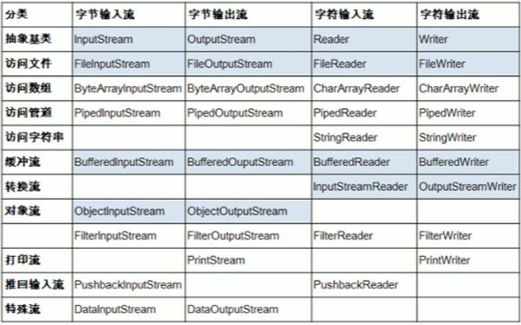
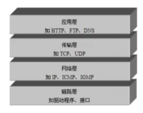

#  Java基础

## JVM、JRE、JDK

`JVM java`虚拟机；
`JRE java`运行环境，包括`JVM`和`java`核心类库；
`JDK java`开发工具包，包括`JRE`和`java`开发工具；

## 命名规则
包：相当于文件夹，区分相同的类名，全部小写
     单级：`lirongchun`
	 多级：`cn.itcast`
	       `cn`
		      `itcast`

类/接口：
     一个单词：单词首字母大写
	     举例：`Student，Dog`
     多个单词：每个单词首字母大写 
         举例：`HelloWorld`

方法/变量：
     一个单词：首字母小写（`main`，`age`）
	 多个单词：从第二个单词开始，每个单词首字母大写（`studentAge`，`showAllNames()`）

常量：
     一个单词：全部大写（`PI`）
	 多个单词：全部大写用_隔开（`STUDENT_MAX_AGE`）

## 进制
二进制：0,1     0b开头
八进制：0-7     0开头
十进制：0-15   默认整数是十进制
十六进制：0-f   0x开头

进制间的转化：

十进制转为其他进制：除以进制数，依次余数，最后将所有余数逆向写下
8421码：十进制和二进制之间转化
拆分组合：二、八、十六进制之间转化
0b1011001    000 001 011 001
       131     →  0     1     3     1

## 原码、反码、补码
正数三码相同，负数反码是符号位不变，数值位相反，补码为反码+1
内存中操作的是补码，可视化结果为原码

## 数据类型
整数      字节数
  byte        1
  short       2
  int           4
  long        8
浮点数
  float        4
  double    8
字符
  char        2
布尔
  boolean  1
float定义时，末尾加F；long定义时，末尾加L
数据类型需注意：**整数默认int，浮点数默认double**

## 数据参与运算的转换
**数据类型按照精度从低到高排列：byte , short , char（先转为int），int , long , float , double**

- 隐式转换：从低精度类型转到高精度类型，系统自动执行。

  ```java
  int i = 9;
  double dou = i;//9.0
  ```

- 显式转换（强制转换）：从高精度数据转换为低精度类型。可能导致精度损失。

  `目标数据类型 变量 = （目标数据类型） （被转换数据）`

  ```java
  long a = (long)456.6F;//456
  int b =(int)'d';//100
  ```

变量运算，首先转化变量类型再运算；常量运算，首先计算结果，再将结果与类型对应的范围相对比，再输出

字符转化为数字对照`AscII`码，48 65 97

## 运算符
1.“/”获得商；“%”获得余数

2.a++、a--先赋值后运算，++a、--a先运算后赋值

3.“&”（与）、“|”（或）、“^”（异或）、“！”（非）、“~”按位取反运算

**4.“&&”和“&”、“||”和“|”异同点:**
   **输出结果相同，当“&&”左边执行结果为false时，右边不执行（相当于短路）**

**5.`<<`:左移，直接移动（相当于把<<左边的数据乘以2的移动次幂）**

**`>`:右移，最高位是0，左补0；最高位是1，左补1；（相当于把<<左边的数据除以2的移动次幂）**

**`>>>`:无符号右移，直接移动**

```java
int i = 9;
int r = i << 2;//36
int l = i >> 2;//2 不取余
```

## 循环语句

### switch语句

```java
switch(score/10){
            case 10:
            case 9:
                System.out.println("优秀");
                break;
            case 8:
                System.out.println("良好");
                break;
            case 7:
                System.out.println("中等");
                break;
            case 6:
                System.out.println("及格");
                break;
            default :
                System.out.println("不及格");
                break;
	}
```

表达式取值：byte、short、int、char、String

case是switch语句的入口（只能是常量），break是出口（跳出），default相当于else。

执行switch语句时，不管default在哪，首先从上到下判断执行case，当所有case都不符合条件而后才判断执行default。如果default在中间，执行完default后会继续向下检测执行。

**`case`中没有`break`时会造成“`case`穿透”。**

### for、while语句的区别

**for循环结束后，循环变量会消失，可提高内存的使用效率**
**while循环结束后，可以继续使用该变量**

### break

break表示跳出单层循环。
在想跳出的循环前加标志位，可实现跳出多层循环：
`outer: while(...) {...}`......`break outer;`

## 控制中断语句
1.`break`：跳出单层循环；跳出多层循环（标签名：语句）
2.`continue`：跳出一次循环，进入下一次执行
3.`return`：跳出方法

## 键盘录入
`import java.util.Scanner;`
`Scanner sc = new Scanner(System.in);`
`int a = sc.nextInt();`

## 方法重载

本类中方法名相同，参数列表不同的方法。在调用时，虚拟机（JVM）通过参数列表的不同来区别同名方法

## 数组

数组是存储同一种类型的多个元素的集合

1.数组初始化方式：动态初始化（只指定长度）；静态初始化（只指定元素初始值）。动态初始化和静态初始化不能同时使用。

一维数组：
动态初始化：`int[] arr = new int[3];`
静态初始化：`int[] arr = new int[]{1,2,3};或int[] arr = {1,2.3};`

二维数组：
动态初始化：`int[][] arr = new int[3][2];`
静态初始化：`int[][] arr = {{1,2,3},{1,2},{1,2,3,4}};`

3.注意，在数组被定义时（如：int[] arr = new int[3]）,首先在堆内存开辟地址和空间。

## Java的空间划分

java程序在运行中需要在内存中分配空间，为提高运算效率，对空间进行划分：

1.堆：存储“new”开辟的空间
堆内存的特点：
A:定义的变量都有默认值
    byte short int long   0
	float double              0.0
    char                           `\u0000` (相当于空字符)	
	boolean                    false
	引用类型                   null
**B:堆内存使用完不会立即消失，而栈内存用完就释放掉**

2.栈：存储局部变量（在方法定义中或方法声明上的变量是局部变量）
A:栈内存的两个引用指向同一个堆内存空间时，两个引用均可操作同一个堆内存空间

3.方法区

4.本地方法区（和系统相关，例如：Win、Mac）

5.寄存器（CPU专用）

## Java中参数传递问题

栈存放主方法和自定义的方法以及数据类型，在调用方法时，**基本类型传递的是值，引用类型传递的是地址值（对应的值存放在堆中）。**

形式参数是方法定义时的参数名（没有值）
实际参数是方法被调用时形式参数对应的方法名和值

基本类型：形式参数的改变对实际参数没有影响
引用类型：形式参数的改变直接影响实际参数（数组的实际参数和形式参数地址值一致）

在栈中，引用类型的对象名直接指向地址值
在堆中，引用类型的地址值指向实参

## 格式化输出

```java
double d = 345.678;
String s = "Hello!";
int i = 1234;
//"%"表示进行格式化输出，"%"之后的内容为格式
System.out.printf("%f",d);//"f"表示格式化输出浮点数
System.out.printf("%9.2f",d);//"9.2"中的9表示输出的长度，2表示小数点后的位数。
System.out.printf("%+9.2f",d);//"+"表示输出的数帯正负号。
System.out.printf("%-9.4f",d);//"-"表示输出的数左对齐（认为右对齐）。
System.out.printf("%+-9.3f",d);//"+-"表示输出的数帯正负号且左对齐。
System.out.printf("%d",i);//"d"表示输出十进制整数。
System.out.printf("%o",i);//"o"表示输出八进制整数。
System.out.printf("%x",i);//"d"表示输出十六进制整数。
System.out.printf("%#x",i);//"d"表示输出帯有十六进制标志的整数
System.out.printf("%s",s);//"d"表示输出字符串。
System.out.printf("输出一个浮点数: %f,一个整数: %d,一个字符串: %s",d,i,s);//可以输出多个变量，注意顺序。
System.out.printf("字符串: %2$s,%1$d的十六进制数：%1$#x",i,s);//"X"表示第几个变量。
```

# 面向对象

## 什么是面向对象

面向过程：面向过程开发就是面向每一个具体的步骤和过程，并互相调用以完成需求
面向对象：面向对象的开发就是不断的创建、使用、调用对象，面向对象的设计就是管理和维护对象之间的关系

**特征：封装、继承、多态**

## 类、对象、方法

**类包括：成员变量、构造方法、成员方法**

**类的初始化过程：**
1.成员变量初始化
2.默认初始化
3.显示初始化
4.构造方法初始化

## 匿名对象

创建普通对象：
类名 对象名 = new 类名（）
`Student s = new Student()`

创建匿名对象（没有名字）：
new 类名（）
`new Student();`
**注意：匿名对象调用方法仅仅调用一次，调用完毕就会变成垃圾**

## 变量

**局部变量和成员变量：**
**成员变量在类中方法外**；**储存在堆内存中**；随着对象的创建（`new`）而存在，对象消失而消失
**局部变量在方法中**；**储存在栈内存中**；随着方法的调用而存在，调用结束而消失

**静态变量和成员变量：**
静态变量属于类，称为类变量；储存于方法区的静态区；
成员变量属于对象，称为实例变量 / 对象变量，储存于堆内存

**变量定义的规则？** 变量的范围越小越好（可以被及时回收）

## 常量

- 字面值常量

  "hello"、10、true等

- 自定义常量

  `final int a = 10;`

## 关键字

### 静态	static

静态修饰的内容称为：与类相关的 / 类成员（非静态称为对象成员）

特点：1.随着类的加载而加载
			2.可以修饰成员变量和成员方法
			3.**static修饰的静态属性和方法是为所有类所共享的。因此任何一个地方对静态数据的更改都会影响到其他类和对象。**
			4.通过类名 / 对象名调用
			5.静态中是没有this关键字的
            6.静态只能调用静态（变量和方法）；非静态都可

static在类加载时就被创建，this随着对象而创建，静态创建时还没有this或者其他变量。

非静态调用：先`new`一个类
静态调用：`类名.方法名（参数）`

### 最终	final

由于方法重写现象的存在，使得父类会被子类覆盖。而被final修饰的方法不能被覆盖。

final特点

- 修饰类

  最终类，不能被继承

- 修饰方法

  最终方法，不能被重写（覆盖、复写）

- 修饰变量

  最终变量，即常量，不能被重新赋值

**final修饰局部变量：

修饰基本类型是修饰值，基本类型不能改变，因为是常量
修饰引用类型是修饰地址值，引用类型在堆内存的值可变，但是地址值不能变

### 私有	private
权限修饰符，被`private`修饰的成员只能在本类中访问

### 抽象	abstract

修饰类		`abstract class Animal`
修饰方法	`public abstract void show();`
					**注意抽象方法一定没有方法主体(不需要有主体，反正会被子类覆盖掉)**

抽象类特点：
1.抽象类中不一定有抽象方法，但带有抽象方法的类必须是抽象类
2.抽象类的子类要么是抽象类，要么子类覆盖了父类所有的抽象方法
3.抽象类无法实例化（`Animal a2 = new Animal();`）

抽象类中成员方法特性：
抽象方法：强制子类做的事情，抽象方法的存在就是为了让子类重写该方法
非抽象方法：子类继承的事情，提高代码复用性

关于abstract的面试题

- 一个抽象类可不可以没有抽象方法，如果可以，意义是什么？

  可以，不让创建对象

- abstract不能和哪些关键字共存？

  private	继承矛盾
  final		 继承矛盾
  static	   抽象方法没有主体，无意义

## 构造方法

`Student s = new Student()`是在调用无参构造方法以开辟空间和分配地址值。如果我们没有给出构造方法，系统将提供一个默认的无参构造方法；如果给出了构造方法（无参或有参），系统将不再提供默认构造方法。

**作用：给对象进行初始化**

**格式：方法名与类名一致；不需要定义返回值类型**
`public Student(...){...}`

类的组成：成员变量、构造方法（有参 无参）、成员方法（get set等）

## main方法格式

`public`:公共的，访问权限最大。由于main方法被JVM调用，访问权限要足够大

`static`:静态的，不需要创建对象（通过类名就可调用）。方便JVM调用

`void`:方法的返回值返回给调用者，而main方法被JVM调用。返回内容没有意义

`main`:main方法

`String[] args`:一个字符串数组；长度为0，没有值；早期时为了接受键盘录入数据的

## 帮助文档

(02 ArrayDemo.java)

制作说明书的过程：
1.对工具类加入文档注释
`/**
*这是针对数组的操作的工具类
*@author 李荣春
*@version V0.0
*/``
``/**
*这是获取数组中最大值的方法
*@param arr 这是要操作的数组
*@return 返回数组中的最大值
*/`
2.用javadoc解析文档注释
格式：
`javadoc -d 目录 -author -version 类名.java`

## 代码块

在`{}`中的代码叫做代码块。

**1.局部代码块：**
在方法中出现，限定变量生命周期，及早释放，提高内存利用率。

**2.构造代码块：**
在类中成员位置，**每次调用构造方法执行前**，优先执行构造代码块。
作用：可以把多个构造方法中共同代码放在一起，对对象进行初始化。

**3.静态代码块：**
比构造代码块多个`static`，且只加载一次。
作用：对类进行初始化（因为静态随着类的加载而加载）。

静态代码块  优先于  构造代码块  优先于  局部代码块
构造代码块优先于构造方法

代码块和属性赋值属于同一优先级，读取时看顺序

## 继承（extends）

父类（基类/超类）	子类（派生类）

**格式：**
`class 子类名 extends 父类名 {...}`

**注意事项：**
1.Java支持多层继承
2.子类不能继承父类私有方法
3.通过`super`访问父类构造方法
4.子类中所有构造方法默认都会访问父类的无参构造方法
5.子类的每一个构造方法的第一条语句默认都是：`super();`

Java在运行过程中，首先加载class，static静态随之加载；随后进行初始化，创建成员变量和成员方法以及构造方法的分配地址值和内存空间
即：先加载类空壳，后初始化变量和方法

**instanceof	测试它左边的对象是否是它右边的类的实例**

### 方法重写

子类中出现了和父类中方法声明一模一样的方法，相当于子类覆盖了父类
**方法重写作用：**子类在继承父类的同时有自己特有的特点时使用方法重写

## super

super代表父类存储空间的标识

**注意：**
1.子类中必须有一个访问父类的构造方法的入口
2.this和super语句必须出现在第一条语句上（否则父类会进行多次初始化）
3.子类构造方法中第一句之前默认有一个`super();`它仅仅表示分层初始化（先初始化父再子）

**`super`和`this`区别：**

|              | super（访问父类） | this（访问本类） |
| :----------: | :---------------- | :--------------- |
| 调用成员变量 | super.成员变量    | this.成员变量    |
| 调用构造方法 | super(...)        | this(...)        |
| 调用成员方法 | super.成员方法    | this.成员方法    |

## 多态

同一个对象在不同时刻体现出来的不同状态，提高了代码的扩展性

### 前提
1.要有继承关系
2.要有方法重写
3.要有父类引用指向子类对象
`父类 f = new 子类（）;`

### 三种方式

- 具体类多态
- 抽象类多态
- 接口多态

### 成员访问特点
1.成员变量	编译看左边，执行看左边
					（因为对象的类型是父类，调用父类变量）
2.构造方法	创建子类对象的时候，访问父类构造方法对父类进行初始化
3.成员方法	编译看左边，执行看右边
					（成员方法存在方法重写，父类被子类覆盖，显示子类）
4.静态方法	编译看左边，执行看左边
					（静态只和类相关，不算方法重写，仍是父类）

### 对象间的转型问题

多态中会存在无法使用子类特有功能的情况。若重新创建（new）子类，会增加内存空间并且在逻辑上不合理，此时可以采用转型

- 向上转型
  `Father f = new Son();`
  f顶着父类的帽子，看起来是父类实际是子类
- 向下转型
  `Son s = (Son) f;`
  摘下帽子，外表上（形式上）由父类化为子类，实际上一直是子类没变

### 内存空间分配

过程：
首先方法区依次加载所有类，随后静态main方法随之加载；
随后栈中加载引用类型`Animal a`，并在堆中分配地址值和内存空间，栈中的引用类型通过地址值指向堆中`new Dog()`;
随后执行`Dog d =(Dog) a;`，把a赋值（地址值）给d，将`Dog d`通过地址值指向堆中`new Dog()`;
随后执行`a = new Cat();`,首先创建`Cat()`的地址值和内存空间，再将新地址值赋给a；

最后`Dog dd = (Dog) a;`	会出现运行异常：ClassCastException，
即类型转换异常（不能猫转为狗），一般出现在向下转型中

## 接口

关键字：`interface `

类实现接口用`implements`表示:	`class 类名 implements 接口名 {}`

**特点**

1.接口不能实例化，但是可通过多态的方式进行实例化
2.接口的子类一般是具体类（也可以是抽象类，但是意义不大），要重写接口中所有抽象方法

**接口中成员特点：**
变量
		接口中的变量默认是**常量**，并且是**静态**的
		默认修饰符：`public static final`
构造方法
		**没有构造方法**，因为接口主要是用来扩展程序的，没有具体存在
		所有的接口子类都继承自Object
成员方法
		**只能是抽象方法**
		默认修饰符：`public abstract`

### 类与接口

类与接口之间是实现关系，可以单或多实现，还可以在继承一个类的同时实现多个接口

接口与接口之间是继承关系，可以多继承

抽象类定义共性功能；接口定义扩展功能

## 内部类

定义在其他类内部的类叫做内部类

### 匿名内部类

格式：`new 类名或者接口名() {重写方法;}`

本质：一个继承了类或实现了接口的子类匿名对象

# 异常处理

在Java语言中，将程序执行中发生的不正常现象称为“异常”

分为两类：
Error：JVM无法解决的严重问题
Exception：其他因编程错误导致的一般性问题，可以使用针对性代码进行处理

异常分为编译时异常和运行时异常。

## 异常体系结构

```java
java.lang.Throwable		异常的父类
    java.lang.Error		一般不编写针对性代码进行处理
    java.lang.Exception	可以编写针对性代码进行异常处理
    	checked（编译时异常）
    		IOException
    			FileNotFoundException
    		ClassNotFoundException
    	unchecked、RunTimeException（运行时异常）
    		NullPointerException
    		ArrayIndexOutOfBoundsException
    		ClassCastException
    		NumberFormatException
    		InputMismatchException
    		ArithmeticException
```

## 异常的处理

### 抓抛模型

**tre-catch-finally**

过程一	

抛：程序在执行过程中，会在出现异常处生成一个对应异常类对象，并将该对象抛出。一旦抛出对象后，其后的代码就不再执行。异常的产生可以自动也可以手动。

过程二

抓：异常的处理方式
1.try-catch-finally
2.throws

使用try将可能出现的异常代码包装起来，在执行过程中生成的异常类对象会在catch中进行匹配，并进行相应catch中异常的处理，处理完成后跳出当前try-catch结构。（无finally）

```java
常用异常处理方式：
String getMessage()		//message一般在Exception的带参构造中
void printStackTrace()	//常用
```

finally	必须被执行，且顺序优先于返回值

在修改异常时，运行时异常一般不用try-catch-finally，只在编译时异常中使用try-catch-finally进行预防（相当于把异常推迟至运行时异常）

**throws**

写在方法声明处。指明此方法执行时，可能会抛出的异常类型。

注意：在方法重写时，**子类重写方法抛出的异常类型不大于父类被重写的方法抛出的异常类型，若父类没有异常，那么子类也不能抛出异常（只能try-catch）**

### 手动抛出异常（throw）

手动抛出异常对象，用于提醒用户异常的发生，实际上throw是产生了一个异常，而没有处理和解决异常。

用法：`throw new 异常类型()`			如：`throw new Exception("出现异常")`	Exception中可以输入massage

### 区别和用法

throw						手动生成一个异常
throws					  将异常抛给了方法的调用者（处理异常）
try-catch-finally	   真正解决异常

### 自定义异常

1.自定义异常须继承自现有异常
2.须添加构造方法（有参、无参）

```txt
步骤：
1.自定义异常须继承自某现有异常
2.需要有自己的序列号标识serialVersionUID
3.需要构造方法
```

## API

### String

**特点**
1.**String声明为final，不可被继承**
2.String实现了Serializable接口：说明字符串支持序列化
		   实现了Comparable接口：表示String可以比较大小
3.String内部定义了final char[] value用于储存字符串数据
4.当对字符串进行连接或重新赋值时，需要重新指定内存区域进行赋值
5.字符串常量池中不会储存相同内容的字符串

**常用构造方法**
String();	创建一个空白字符串
String(char[] chs);	根据字符数组创建一个字符串
String(byte[] bys);	根据字节数组创建一个字符串

**String\StringBuffer\StringBuilder区别**

String:不可变字符序列
StringBuffer:可变字符序列；线程安全；效率低
StringBuilder:可变字符序列；线程不安全；效率高

**常用方法：**

```java
String类的获取功能
int length() :获取字符串的长度。
char charAt (int index) :获取指定索引位置的字符
int indexOf (int ch) : 返回指定字符在此字符串中第一次出现处的索引。
为什么这里是int类型，而不是char类型?
原因是: a和97其实都可以代表a
int indexOf (String str) :返回指定字符串在此字符串中第一次出现处的索引。
int indexOf (int ch,int fromIndex) :返回指定字符在此字符串中从指定位置后第1次出现处的索引。
int indexOf (String str,int fromIndex) :返回指定字符串在此字符串中从指定位置后第一次出现处的索引。
String substring(int start) :从指定位置开始截取字符串，默认到末尾。
String substring(int start, int end) :从指定位置开始到指定位置结束截取字符串。
```

```java
String的转换功能:
byte[] getBytes () 					把字符串转换为字节数组。
char[] toCharArray()  				把字符串转换为字符数组。
static String valueOf (char[] chs) 	把字符数组转成字符串。
static String valueOf (int i) 		把int数据转成字符串。
    注意: String类的value0f方法可以把任意类型的数据转成字符串。
String toLowerCase () 				把字符串转成小写。
String toUpperCase () 				把字符串转成大写。
String concat (String str) 			把字符串拼接。等价于“+”
```

```java
String类的替换功能:
String replace(char old, char new)
String replace(String old,String new)
String trim()						去除字符串前后空格
int compareTo(String str)			按字典顺序比较两个字符串
int compareToIgnoreCase(String stx)	同上忽略大小写
```

```java
String类的判断功能：
boolean endsWith(String suffix)		测试此字符串是否以指定的后缀结束
boolean startsWith(String prefix)	测试此字符串是否以指定的前缀开始
boolean contains(CharSequence s)	当且仅当此字符串包含指定的char值序列时，返回true
```

**面试题**

```java
public static void main(String[] args) {
    String s1 = "lrc";
    String s2 = "123";

    String s = "lrc123";
    String s3 = "lrc" + "123";
    String s4 = s1 + "123";		 //在堆中操作
    String s5 = "lrc" + s2;		 //在堆中操作
    System.out.println(s == s3); //true
    System.out.println(s == s4); //false
    System.out.println(s == s5); //false
    System.out.println(s4 == s5);//false
    
    //intern()  返回常量池中的字符串
        String s6 = s5.intern();
        System.out.println(s == s6); //true
}
```

**常用基本类型与字符串之间的转换**

整数→字符串：	String类下`valueOf(int i)`方法
字符串→整数：	Integer类下`parseInt(String str)`方法

字符数组→字符串：	String带参构造方法
字符串→字符数组：	`toCharArray()`方法

字节数组→字符串：	String带参构造方法
字符串→字节数组：	`getBytes()`方法

### Object

Object是根类，所有的类都直接或间接的继承自Object

Object类的构造方法有一个，并且是无参构造
		这也是为什么子类构造方法默认访问父类的构造是无参构造

常用方法：
`toString()`	默认返回：类的全路径+'@'+哈希值的十六进制表。**子类需要重写**。**引用类型返回地址值**
`equals()`		比较两个对象是否相等，**默认比较地址值。子类需要重写**
`hashCode() `	返回对象的哈希值。不是实际地址值，可以理解为地址值
`getClass()` 	返回对象的Class对象，反射中我们会详细讲解
				`getName()`	获得该类路径并输出

### Scanner

格式
`import java.util.Scanner;
Scanner sc = new Scanner(System.in)
... ... = sc.next...();`

解释：System.in	System中in是标准输入流，类型是InputStream

常用方法：
`hasNext...()`	判断键盘录入的下一次是否为某数据类型（Int、Double等）**阻塞式方法**
`next...()`		  键盘录入某数据（Int、Double等）

### Math

工具类，存放一些运算方法

```java
public static int abs (int a)				    返回参数的绝对值
public static double ceil (double a)			返回大于或等于参数的最小整数（double）
public static double floor (double a)			返回小于或等于参数的最大整数（double）
public static int round (float a)				按照四舍五入返回最接近参数的int
public static int max (int a,int b)				返回两个int值中的较大值
public static int min (int a,int b)				返回两个int值中的较小值
public static double pow (double a,double b)	 返回a的b次幂的值
public static double random ()					返回值为double的正值，[0.0,1.0)
```

### StringBuffer & StringBuilder

| String     | StringBuffer                             | StringBuilder                              |
| ---------- | ---------------------------------------- | ------------------------------------------ |
| 内容不可变 | 内容可变，线程安全(同步)但效率低，单线程 | 内容可变，效率高但不安全（不同步），多线程 |

相同点：

1.默认重写`toString()`方法
2.在做大多数操作时都是对自己本身进行，不建立新对象
3.底层都是采用`char[]`储存

```java
StringBuffer的构造方法:
    public StringBuffer()				    无参构造
    public StringBuffer(int capacity)		指定容量
    public StringBuffer(String str)			指定字符串内容
StringBuffer返回长度:
    public int capacity() 				理论值（默认16）
    public int length() 				实际值
StringBuffer的添加功能：
    public StringBuffer append(String str)
    public StringBuffer insert(int offset,String str)	在指定位置插入XXX
StringBuffer的删除功能：
    public StringBuffer deleteCharAt(int index)
    public StringBuffer delete(int start,int end)
StringBuffer的替换功能：
    public StringBuffer replace(int start,int end,String str)
    public void setCharAt(int index,char value)
StringBuffer的反转功能：
    public StringBuffer reverse()
StringBuffer的查找功能：
    public char charAt(int index)
StringBuffer的截取功能：	!!!!!注意返回值是String，结果不会对原StringBuffer造成影响!!!!
	public String substring(int start)
	public String substring(int start, int end)
```

## 包装类

工具类。为了对基本类型进行更方便的操作，Java针对每一种基本类型都有对应的类。

| byte | short | int         | char          | long | float | double | boolean |
| ---- | ----- | ----------- | ------------- | ---- | ----- | ------ | ------- |
| Byte | Short | **Integer** | **Character** | Long | Float | Double | Boolean |

### Integer

```java
int→String转化
记       Integer.toString(int i)
String→int转化
记       Integer.parseInt(String s)
```

```java
int类型的进制转换
Integer.toBinaryString(i)
Integer.toOctalString(i)
Integer.toHexString(i)

//十进制到其他进制（2-36）
Integer.toString(i,radix)//radix是进制数
//其他进制到十进制
Integer.parseInt(s,radix)
```

将基本类型自动转化为包装类型		自动装箱
将包装类型自动转化为基本类型		自动拆箱

```java
public class IntegerDemo03 {
    public static void main(String[] args) {
        Integer i = 100;
        i += 100;
        System.out.println("i:" + i);
    }
}
/*
反编译结果：
通过反编译后的代码
Integer i = Integer.value0f(100);
i = Integer.valueOf(i.intValue() + 100) ;
System.out.println((new StringBuilder("i:")).append(i).toString()) ;
*/
```

**注意：在自动拆装箱过程中，针对-128-127之间的数据，存在一个数据缓冲池，如果数据是该范围内的，每次并不创建新的空间**

### Character

基本类型char类的包装类

常用方法：

```java
public static boolean isUpperCase (char ch) :   判断给定的字符是否是大写字符
public static boolean isLowerCase (char ch) :   判断给定的字符是否是小写字符
public static boolean isDigit (char ch) :       判断给定的字符是否是数字字符
public static char toUpperCase (char ch) :      把给定的字符转换为大写字符
public static char toLowerCase (char ch) :      把给定的字符转换为小写字符
```

### 正则表达式（regex）

符合一定规则的字符串

常用方法：

```java
//判断功能
public boolean matches(String regex)	//在String类中
//分割功能
public String[] split(String regex)		//
```

## 日期时间

### currentTimeMillis()

```java
public static long currentTimeMillis()
    //System类中，用于返回当前时间（ms）		时间戳
```

### Date类

`java.util.Date类`					父类	
			`java.sql.Date类`		  子类	**数据库中的日期数据**

构造方法：

```java
Date()		//创建一个当前时间的Date对象
Date(long l)//创建一个指定毫秒数的Date对象
```

常用方法：

```java
toString()  //返回当前时间（年月日时分秒）
getTime()	//获得时间戳（相当于currentTimeMillis）
```

### SimpleDateFormat

**作用：进行Date的格式化和解析**

```java
构造方法：
SimpleDateFormat()//默认的模式和语言环境创建对象
SimpleDateFormat(String pattern)//指定格式创建对象
常用方法：
public String format(Date date) //格式化：将时间化为字符串
public Date parse(String source)//解析：将字符串化为时间
```

### Calendar

抽象类，不能直接实例化。

可以通过`getInstance()`获取其子类构造GregorianCalendar构造方法

```java
常用方法：
get(...)
set(...)
    //获取和设置具体信息，
    //YEAR\MONTH\DAY_OF_WEEK\HOUR_OF_DAY\MINUTE\SECOND
add(...)
    //增减当前时间
getTime()     //Calendar 化为 Date
setTime()     //Date 化为 Calendar
```

### JDK8新时间

Date类中问题：
时间偏移、Calendar类中只能操作Date数据、线程不安全等

**常用类：**
`LocalDate`			本地日期
`LocalTime`			本地时间
`LocalDateTime`    本地日期加时间
`ZoneDateTime`	  时区
`Duration`			  持续时间

**位置：**
`java.time` 	              包含值对象的基础包
`java.time.format `	格式化和解析时间和日期

**常用方法：**

| 方法       | 作用                       |
| ---------- | -------------------------- |
| now()      | 静态方法，创建当前时间对象 |
| of(...)    | 静态方法，创建指定时间对象 |
| get...()   | 返回时间整数或枚举值       |
| with...()  | 设定时间                   |
| plus...()  | 添加时间                   |
| minus...() | 减去时间                   |

### Instant

`java.time.Instant`	时间线上的一个瞬时点。 

```java
//now( ):获取本初子午线对应的标准时间
Instant instant = Instant.now();
System.out.println(instant);//2021-11-12T08:55:53.484832300Z
//添加时间的偏移量
OffsetDateTime offsetDateTime = instant.atOffset(ZoneOffset.ofHours(8));
System.out.println(offsetDateTime);//2021-11-12T16:55:53.484832300+08:00
//toEpochMilli():获取自1970年1月1日0时0分秒(UTC)开始的毫秒数
long milli = instant.toEpochMilli();
System.out.println(milli);
//ofEpochMilli():通过给定的毫秒数，获取Instant实例
Instant instant1 = Instant.ofEpochMilli(1636707353484l);
System.out.println(instant1);
```

### DateTimeFormatter

格式化或解析日期、时间

实例化：
1.预定义的标准格式。如：ISO_LOCAL_DATE_TIME;ISO_LOCAL_DATE;ISO_LOCAL_TIME
2.本地化相关的格式。如：ofLocalizedDateTime(FormatStyle.LONG) 
**3.自定义的格式。	    如：ofPattern(“yyyy-MM-dd hh:mm:ss”)**

## 比较器

需求：Java中对数组或集合进行排序时，常用到`Array.sort()`、`Collection.sort()`，当需要对集合中元素进行自定义排序时，就会用到比较器（元素类型，排序方法自定义）

**接口**：**Comparable**或**Comparator**

原理：

像String、基本类型包装类等都实现了Comparable或Comparator接口

### 方式一：自然排序：java.lang.Comparable

像String、包装类等，内部都实现了Comparable接口，并重写了compareTo()方法
**重写compareTo(Object obj)**
1.比较结果由小到大排列 ，分别对应负数、零、正数（即返回三种整数）
2.对于自定义类的排序，需要实现Comparable接口并重写compareTo()方法

**注意** 
排序主要靠compareTo()方法，而该方法重写时只需要获得int返回值即可，后续有对比和排序。大致相当于`A.compareTo(B)`

### 方式二：定制排序：java.util.Comparator

**重写compare(Object o1, Object o2)**
比较o1和o2的大小：如果方法返回正整数，则表示o1大于o2；如果返回0，表示相等；返回负整数，表示 o1小于o2。

### 区别

Comparable接口被写好实现后，可以随时调用；Comparator接口一般实现类即用即写（匿名内部类）

## System

`java.lang.System`	存放系统级的属性和控制方法。

```java
常用方法：
    long currentTimeMillis()
    void exit(int status)//该方法的作用是退出程序。其中status的值为0代表正常退出，非零代表异常退出。使用该方法可以在图形界面编程中实现程序的退出功能等。
    void gc()//该方法的作用是请求系统进行垃圾回收。至于系统是否立刻回收，则取决于系统中垃圾回收算法的实现以及系统执行时的情况。
    String getProperty(String key)//该方法的作用是获得系统中属性名为key的属性对应的值。
```

## BigInteger&BigDecimal

大整数&大浮点数

# 多线程

## 基本概念

**程序（program）**

为了完成特定任务、用某种语言编写的一组指令的集合。即一段静态的**代码**

**进程（process）**

是程序的一次执行过程，或是正在运行的一个程序。即一个**动态的过程**：有生命周期

- 进程作为资源分配的单位，系统在运行时会为每个进程分配不同的内存区域。

**线程（thread）**

进程可进一步细化为线程，是**程序内部的一条执行路径**。

- 若一个进程同一时间并行执行多个线程，就是支持多线程的

- 线程是调度和执行的最小单位，**每个线程拥有独立的运行栈和程序计数器**，线程切换的开销小

- **一个进程的多个线程共享相同的内存地址空间，他们从同一堆中分配对象**，可以访问相同的变量和对象。这就使得多线程变得高效，但会带来安全隐患。

一个Java程序一般需要至少同时三个线程：主线程main()、垃圾回收线程gc()、异常处理线程

**并发（concurrency）**

指在同一时刻只能有一条指令执行，但多个进程指令被快速的轮换执行。使得在宏观上具有多个进程同时执行的效果，但在微观上并不是同时执行的，只是把时间分成若干段，使多个进程快速交替的执行。

**并行（parallelism）**

指在同一时刻，有多条指令在多个处理器上同时执行，所以无论从微观还是从宏观来看，二者都是一起执行的。

并发和并行的目标都是最大化CPU的使用率，将cpu的性能充分压榨出来。并行在多处理器系统中存在，而并发可以在单处理器和多处理器系统中都存在

## 多线程创建四种方式

### 一  通过继承Thread类

1.创建一个Thread的子类
2.重写run()方法
3.创建子类对象并调用start()方法

```java
//案例1：主线程和自定义线程，输出奇偶数
public class ThreadDemo01 {
    public static void main(String[] args) {
        MyThread myThread = new MyThread();
        myThread.start();//启动当前线程，调用当前线程的run方法
        myThread.run();
        //奇数
        for (int i = 1; i < 100; i ++){
            if(i%2 != 0) {
                System.out.println(Thread.currentThread().getName() + "奇数" + i);
            }
        }
    }
}
class MyThread extends Thread {
    @Override
    public void run() {
        //偶数
        for (int i = 1; i < 100; i ++){
            if(i%2 == 0) {
                System.out.println(Thread.currentThread().getName() + "偶数" + i);
            }
        }
    }
}
//案例2：通过匿名内部类创建线程
public static void main(String[] args) {
    new Thread(){//匿名内部类
        public void run() {
            for (int i = 1; i < 100; i ++){
                if(i%2 == 0) {
                    System.out.println(Thread.currentThread().getName() + "偶数" + i);
                }
            }
        }
    }.start();

    new Thread(){
        public void run() {
            for (int i = 1; i < 100; i ++){
                if(i%2 != 0) {
                    System.out.println(Thread.currentThread().getName() + "奇数" + i);
                }
            }
        }
    }.start();
}
```

### 二  通过实现Runnable接口

1.创建实现runnable接口的类，并实现run()抽象方法
2.创建实现类对象和Thread类对象，并**将其作为参数传递到Thread的构造方法中**
3.通过Thread类调用start()方法

```java
public class ThreadDemo05 {
    public static void main(String[] args) {
        CThread ct = new CThread();
        Thread t = new Thread(ct);
        t.start();//启动线程，通过target调用runnable接口内被重写的run方法
    }
}
class CThread implements Runnable {
    @Override
    public void run() {
        for (int i = 1; i < 100; i ++){
            if(i%2 == 0) {
                System.out.println(Thread.currentThread().getName() + "偶数" + i);
            }
        }
    }
}
```

**两种方式的对比**

> 开发中：优先选择方法二（实现Runnable接口）
> 原因：1.由于java中只能单继承，因此方式一具有继承上的局限性
>             2.方式二更适合处理多线程中有共享数据的情况（只需要创建一次实现类对象，多个线程共用该对象数据）

联系：`public class Thread implements Runnable`(Thread类是Runnable接口的实现类)
两种方式的相同点：都需要重写run方法，并将要执行的逻辑声明在run方法中

```java
常用方法
1. start()//启动当前线程;调用当前线程的run()
2. run()//通常需要重写Thread类中的此方法，将创建的线程要执行的操作声明在此方法中
3. currentThread()//静态方法，返回执行当前代码的线程
4. getName()//获取当前线程的名字
5. setName()//设置当前线程的名字
6. yield()//释放当前CPU执行的线程
7. join()//暂停当前线程，join另外一个线程，待其结束后再继续当前线程
8. stop()//强制停止当前线程（已过时）
9. sleep(long millitime)//当前线程睡眠（阻塞）指定的毫秒数
10.isAlive()//判断线程是否存活
```

```java
线程的优先级
有三个常量表示优先级（10档）
MAX_PRIORITY        10
MIN_PRIORITY        1
NORM_PRIORITY       5

可通过get/set方法设置优先级挡位
注意：高优先级的线程在CPU上抢占低优先级的线程执行权，但只是先执行的概率较大
```

### 三	实现Callable接口

**步骤：**

1.创建Callable接口实现类并重写call方法（抛异常、返回Object）
2.构建实现类的实例；将该对象传递到FutureTask的带参构造器中，创建FutureTask对象
3.将FutureTask对象作为参数传递到Thread带参构造中并创建Thread对象，调用start()方法
4.若需要call()方法的返回值，可通过FutureTask对象的get()方法获取返回值

```java
public class ThreadTest {
    public static void main(String[] args) {
        Athread athread = new Athread();
        FutureTask futureTask = new FutureTask(athread);
        new Thread(futureTask).start();
        
        try {
            //get()方法返回值为FutureTask构造器参数实现类重写的call()方法返回值
            Object sum = futureTask.get();
            System.out.println(sum);
        } catch (InterruptedException e) {
            e.printStackTrace();
        } catch (ExecutionException e) {
            e.printStackTrace();
        }
    }
}

public class Athread implements Callable {
    @Override
    public Object call() throws Exception {
        int sum = 0;
        for(int i = 0; i <= 100; i ++) {
            if(i % 2 == 0) {
                System.out.println(i);
                sum += i;
            }
        }
        return sum;
    }
}
```

**Callable和Runnable接口的对比**
1.Call()方法有返回值
2.Callable可以抛出异常，外界可获取异常的信息
3.Callable支持泛型

**Future接口**

1.FutureTask是Future接口的唯一的实现类
2.可以对具体Runnable、Callable任务的执行结果进行取消、查询是否完成、获取结果等。
3.FutureTask同时实现了Runnable, Future接口。它既可以作为Runnable被线程执行，又可以作为Future得到Callable的返回值

### 四	线程池

由于经常创建和销毁使用量特别大的资源会对性能产生很大影响。可以提前创建多个线程，放入线程池，使用时直接获取，使用完放回池中。

优点：
提高响应速度
降低资源消耗
便于线程管理

API

`ExecutorService`（线程池接口）和`Executors`（线程池工具类）

```java
ExecutorService	
真正的线程池接口。常见子类ThreadPoolExecutor

void execute(Runnable command)			//执行任务/命令，没有返回值，一般用来执行Runnable
<T> Future<T> submit(Callable<T> task)	 //执行任务，有返回值，一般用来执行Callable
void shutdown()						   //关闭连接池

Executors
工具类、线程池的工厂类，用于创建并返回不同类型的线程池
Executors.newCachedThreadPool()		//创建一个可根据需要创建新线程的线程池
Executors.newFixedThreadPool(n)		//创建一个可重用固定线程数的线程池
Executors.newSingleThreadExecutor()	//创建一个只有一个线程的线程池
Executors.newScheduledThreadPool(n)	//创建一个线程池，它可安排在给定延迟后运行命令或者定期地执行。
```


## 线程的生命周期


## 同步

**案例**

三个窗口共同出售100张票。

若不采用同步机制，会出现两个问题（可通过sleep方法将问题放大）：
1.可能出现相同票号	2.出现0号票甚至负号票

原因：当某个线程在执行共享数据时，由于某些原因可能会“阻塞”一小段时间，若在这段时间内，其余线程也执行了共享数据，那么就造成了上述两个问题。

注意：sleep方法只是将问题出现的概率放大了，原本也会存在这种问题。

### 1.synchronized

同步方法优势：操作同步代码块时，只能有一个线程参与，相当于单线程。安全性高，但是降低了效率。

**方法一	同步代码块**

`synchronized(同步监视器) {需要被同步的代码}`

注：
同步监视器，即锁。
		任何一个对象都可作为锁。
		要求所有线程共用一个锁。
同步代码
		多个线程共同操作共享数据的代码

**方法二	同步方法**

关键字`synchronized`

注意:
同步方法依然存在同步监视器，只是不需要显式的声明
		非静态的同步方法，锁是this
		静态的同步方法，锁是当前类本身（`类名.class`）

### 2.Lock

通过显式定义同步锁对象来实现同步。同步锁使用Lock对象充当。

代码：

```java
import java.util.concurrent.locks.Lock
    
    ReentrantLock lock = new ReentrantLock();
	lock.lock();//上锁
	lock.unlock();//解锁
```

控制多个线程对共享数据进行访问的工具。每次只能有一个线程对Lock对象进行加锁。

ReentrantLock类实现了Lock，它拥有和synchronized相同的并发性和内存语义。但ReentrantLock可以显式加锁和释放锁。

应注意，所有线程应共用一个锁

### 区别

1. synchronized是隐式锁，有自己的作用区域；而Lock是显式锁，可以自定义开锁和解锁。
2. synchronized有代码块锁和方法锁；Lock只能锁代码块。
3. 对于Lock锁，JVM可以更快的调度线程，性能更好，并且Lock具有更好的扩展性子类

## 单例模式


### 特点
1.某个类只有一个实例；
2.且自行实例化；
3.单例类必须给其他对象提供该实例

在计算机系统中，单例模式经常被设计为资源管理器。
单例模式保证了系统全局对象的唯一性。
如：系统启动读取配置文件就需要单例模式来保证配置的唯一性

### `getInstance()`
在主函数开始时调用，返回一个实例化对象，此对象是static的，在内存中保留着它的引用，即内存中有一块区域专门用来存放静态方法和变量，可以直接使用，调用多次返回同一个对象。

特点：
1.可以直接使用，调用多次返回同一个对象。
2.getInstance往往是static的。
3.对象使用之前通过getInstance得到而不需要自己定义，用完之后不需要delete。
4.对于抽象类，要想对其实例化，只能用getInstance方法，是不能new出来的。

## 死锁

不同的线程都在执行，并且分别占用了对方的资源，所有线程都处于阻塞状态。
但是此时执行结果不会返回异常。

## 注意事项

1.在同步机制中，锁可以是任何对象，但一般使用`this`或`本类.class`当作锁

synchronized代码块需要自行添加对象当作锁。
synchronized方法默认锁是`本类.class`。
Lock锁是一个类，需要先实例化，并且Lock自身有很多扩展性的功能（方法）。

2.sleep和wait方法的异同：


## 线程通信

```java
常用方法：
wait()      当前线程进入阻塞状态，并释放同步监视器
notify()    唤醒被wait的一个线程。若有多个线程，首先唤醒优先级高的线程
notifyAll() 唤醒全部被wait的线程
```

注意：
1.三个常用方法不能用在Lock锁中，只能用于synchronized关键字
2.三个常用方法的调用者必须是同步监视器（默认是this），且是同一个锁
			否则会出现异常：	IllegalMonitorStateException
3.三个常用方法定义在java.lang.Object类中

```java
案例：AB线程交替输出1-100；
过程：
    B在此等待，A线程正在锁中
    B线程进入，A线程已经被wait阻塞并释放同步监视器
    B在锁中，并唤醒阻塞的A线程，A线程在锁外等待
 B线程被wait阻塞并释放当前同步监视器，A进入
```

sleep和wait的异同：
同：
都可以使当前线程进入阻塞状态
异：
1.sleep()在Thread类中；wait()在Object类中
2.sleep在任何情况下都可以调用；wait仅能在同步代码块或同步方法中调用
3.sleep阻塞后不会释放同步监视器；wait阻塞后释放当前锁

# 枚举类

类的对象是有限个的、确定的。若需要定义一组常量，使用枚举类。

### 创建方式

**一	自定义枚举类	继承自Object类	JDK5之前**
1.首先public static final修饰枚举类中需要被枚举的量
2.创建私有的带参构造方法
3.内部自行初始化
4.重写toString()
**需注意：**自定义枚举类是内部私有构造，并在内部已经创建了实例化对象和重写toString方法，外部在使用时只需调用该对象即可。

**二	使用enum关键字	继承自Enum类	JDK5之后**
1.列出全部枚举值，对象间用“，”隔开
2.public static final修饰枚举类中需要被枚举的量
3.创建私有带参构造方法
4.内部自行实例化

```java
常用方法：
values()//返回当前枚举类的全部枚举值数组
valueof(String str)//把一个字符串转为对应的枚举类对象
    //若找不到，有异常：IllegalArgumentE
```

# 注解

Annotation，即代码里的特殊标记，这些标记可以在编译, 类加
载, 运行时被读取, 并执行相应的处理。

使用Annotation时要在其前面加@

## 作用一	

文档注解

```java
@author 标明开发该类模块的作者，多个作者之间使用,分割
@version 标明该类模块的版本
@see 参考转向，也就是相关主题
@since 从哪个版本开始增加的
@param 对方法中某参数的说明，如果没有参数就不能写
@return 对方法返回值的说明，如果方法的返回值类型是void就不能写
@exception 对方法可能抛出的异常进行说明 ，如果方法没有用throws显式抛出的异常就不能写
```

## 作用二	

编译时格式检查

```java
JDK内置的三个基本注解：
@Override			表示重写父类方法
@Deprecated			表示所修饰的元素已过时
@SuppressWarnings	抑制编译器警告
```

## 作用三	

跟踪代码依赖性，实现替代配置文件功能

## 注意

Annotation 可以像修饰符一样被使用, 可用于修饰包,类, 构造器, 方法, 成员变量, 参数, 局部变量的声明, 这些信息被保存在 Annotation 的 “name=value” 对中。

注解是一种趋势，一定程度上 可以说：框架 = 注解 + 反射 + 设计模式。

## 自定义注解

自定义注解：
1.注解声明用**@interface关键字**
2.内部成员通常用value表示
3.如果注解有成员，在使用时需要指明成员的值
4.可以通过default关键字指定成员的默认值
5.如果自定义注解没有成员，则起标识作用（@Override）
6.自定义注解必须配上信息处理流程（反射）才有意义

## JDK中的元注释

元注解用于修饰其他 Annotation 定义。（定义在注解前）

JDK5.0提供了4个标准的meta-annotation类型，分别是： 
Retention 、Target 、Documented 、Inherited

在自定义注解中常用Retention、Target

### @Retention

用于修饰Annotation，指定其生命周期

**成员变量：**	RetentionPolicy（枚举）
RetentionPolicy.SOURCE:在源文件中有效（即源文件保留）RetentionPolicy.CLASS:在class文件中有效（即class保留）RetentionPolicy.RUNTIME:**在运行时有效（即运行时保留），当运行 Java 程序时, JVM会保留注释。程序可以通过反射获取该注释。**

### @Target

用于修饰Annotation，指定其可以修饰的元素种类（枚举成员）

### @Documented

用于修饰 Annotation，Annotation类将被javadoc工具提取成文档。默认情况下，javadoc是不包括注解的。

**注意：定义为Documented的注解必须设置Retention值为RUNTIME。**

### @Inherited

被它修饰的 Annotation 将具有继承性。其子类将自动具有该注解。

## JDK8新特性

**可重复注解**
1.新建一个注解文件，并设置已有注解的value()数组
2.声明@Repeatable，成员值为另一个文件.class
3.保持两注解文件的@Target和@Retention等元注解相同

**类型注解**

# 集合

集合对多个对象进行动态存储

## 集合框架

```java
Collection接口//单列集合，用来存储单个的对象
    List接口//存储有序的可重复的数据（动态数组）
    	ArrayList、LinkedList、Vector//实现类
    Set接口//存储无序的、不可重复的数据（数学集合）
    	HashSet、LinkedHashSet、TreeSet//实现类
Map接口//双列集合，存储成对的（key-value）数据（xy函数）
    	HashMap、linkedHashMap、TreeMap、Hashtable、Properties//实现类
```

## Collection

**JDK中没有此接口的任何直接实现，而是提供更具体的子接口（List、Set、Queue接口）**

在JDK5之前，集合会丢失容器中所有对象的数据类型（都是Object类型）；
在JDK5之后，泛型使得Java集合可以记住容器中对象的数据类型。

### 常用方法

```java
//添加
add(Object obj)
addAll(Collection coll)
//获取有效元素的个数
int size()
//清空集合
void clear()
//判断是否是空集合
boolean isEmpty()
//判断是否包含某个元素
boolean contains(Object obj)
    //通过equals()
boolean containsAll(Collection c)
    //通过equals()
//删除
boolean remove(Object obj)
    //equals()判断。只会删除找到的第一个元素
boolean removeAll(Collection coll)
    //取两集合的差集
boolean retainAll(Collection c)
    //取两集合的交集
//判断集合相等
boolean equals(Object obj)
//转成Object数组
Object[] toArray()
//获取集合对象的哈希值
hashCode()
//遍历
iterator()
    //返回迭代器对象，用于集合遍历
//数组转为集合	Arrays类中
asList()
```

**注意：以上方法中凡是需要用到equals()方法的都需要先重写equals()方法。**

### 遍历方法

#### Iterator迭代器

访问一个容器(container)对象中各个元素，而又不需暴露该对象的内部细节。迭代器模式，就是为容器而生。

**注意：**

1.Collection接口继承了`java.lang.Iterable`接口，该接口有一个iterator()方法，那么所有实现了Collection接口的子类都有一个iterator()方法，用以返回一个实现了Iterator接口的对象
2.Iterator不承载数据，只用来**遍历**集合的元素
**使用：**`Iterator iterator = collection.iterator();`

```java
常用方法：
next()//1.将指针移动到下一个位置2.返回该位置的元素
hasNext()//判断下一个位置是否有元素并返回boolean值
remove()//删除集合中的某个元素
```

#### 增强for()循环

for()循环的增强版，可用于遍历集合和数组

**格式：**	`for(类型 接收变量 : 集合) {...}`

过程：	从集合中依次取元素并赋值给接收变量再进行操作

### List接口

储存元素**有序、可重复**；集合中每一个元素都有其对应的**顺序索引**；相当于动态数组。

**三个实现类：**
ArrayList：主要实现类。**线程不安全、效率高**。底层采用`Object[] elementData`存储数据。
LinkedList：用于频繁添加和删除操作。底层使用**双向链表**。
Vector：古老实现类。线程安全、效率低。底层采用`Object[] elementData`存储数据。

#### ArrayList

默认长度10

JDK7中ArrayList实例化会先创建一个长度为10的空集合，在扩容时每次扩充原先的0.5倍，再将原有数组复制到新的数组中。
JDK8中ArrayList实例化会创建一个长度为0的空集合，扩容时才会引入初始长度10，后面操作相同。

建议采用带参构造，可指定容量（capacity）

#### LinkedList

内部声明了first和last属性，默认为null

```java
双向链表：
void linkLast(E e) {
        final Node<E> l = last;
        final Node<E> newNode = new Node<>(l, e, null);
        last = newNode;
        if (l == null)
            first = newNode;
        else
            l.next = newNode;
        size++;
        modCount++;
    }
```

#### 常用方法

```java
void add(int index, Object ele)//在index位置插入ele元素
boolean addAll(int index, Collection eles)//从index位置开始将eles中的所有元素添加进来
Object get(int index)//获取指定index位置的元素
int indexOf(Object obj)//返回obj在集合中首次出现的位置
int lastIndexOf(Object obj)//返回obj在当前集合中末次出现的位置
Object remove(int index)//移除指定index位置的元素，并返回此元素
Object set(int index, Object ele)//设置指定index位置的元素为ele
List subList(int fromIndex, int toIndex)//返回从fromIndex到toIndex位置的子集合
```

**注意：集合中remove()方法重载为List（索引）和Iterator（对象）**

**ArrayList / LinkedList / Vector的异同？**
1.前二者都线程不安全，相对于线程安全的Vector执行效率更高。
2.ArrayList是实现了基于动态数组的数据结构，LinkedList基于链表的数据结构。
3.对于随机访问get和set，ArrayList优于LinkedList，因为LinkedList要移动指针。
   对于新增和删除操作add(特指插入)和remove，LinkedList比较占优势，因为ArrayList要移动数据。
4.Vector和ArrayList几乎是完全相同的,唯一的区别在于Vector是同步类(synchronized)，属于强同步类。因此开销就比ArrayList要大，访问要慢。正常情况下,大多数的Java程序员使用ArrayList而不是Vector,因为同步完全可以由程序员自己来控制。Vector每次扩容请求其大小的2倍空间，而ArrayList是1.5倍。

### Set接口

储存**无序的、不可重复**的数据。判断两数据是否相同采用的是equals()方法

其中：
无序是指存储的数据并不按照数组索引顺序添加，而是根据数据的哈希值排列
不可重复是指需要保证在按照equals()方法判断时不能返回true，即：相同元素不能重复

对于存放在Set容器中的对象，对应的类一定要重写 equals() 和 hashCode(Object  obj) 方法，以实现对象相等规则。即：“相等的对象必须具有相等的散列码”。

#### HashSet

Set接口的主要实现类。线程不安全、效率高。可以存储null值。

#### add()过程


**实际上：HashSet底层是数组+链表的格式**

**对应的类一定要重写equals()和hashCode()方法，以实现对象相等规则。即：“相等的对象必须具有相等的散列码”。**

#### LinkedHashSet

LinkedHashSet是HashSet子类。遍历其内部数据。

根据元素的哈希值来决定元素的储存位置，同时还具有双向链表，所以遍历时看起来是按照顺序的，实际上仍是无序的。

LinkedHashSet插入性能略低于HashSet，但在迭代访问 Set 里的全部元素时有很好的性能。

#### TreeSet

按照添加对象的指定顺序进行排序，采用红黑树的存储结构。

存储数据类型必须一致，否则报异常：ClassCastException

注意：
1.TreeSet中添加对象需要添加**相同类型**的数据
2.TreeSet中中对于**自定义对象**需要设置**比较器**（Comparable和Comparator）

```txt
Comparable	自然排序  对应Set无参（默认）
	1.	继承接口
	2.	重写compareTo(Object obj)方法
		    先判断类型是否一致，再做返回值
Comparator	定制排序  对应Set带参
	1.	实例化Comparator对象
	2.	重写compare(Object o1, Object o2)方法
```

### Map接口

存储双列数据（key-value）对的数据，具有无序性

特点：
1.**使用一个键值对来存储key-value**，一个键值对是一个Entry对象。
2.key	**无序的、不可重复的**，**使用Set存储**，key所在的类需要重写equals()和hashcode()
3.value	**无序的、可重复的**，**使用Collection存储**，value所在类需要重写equals()
4.Entry	无序的、不可重复的，**使用Set存储**

#### HashMap

**Map类的主要实现类**；线程不安全效率高；可存储null值的key-value；有子类LinkedHashMap

底层：JDK7前	数组+链表
		   JDK8后	数组+链表+红黑树

LinkedHashMap	保证在遍历map元素时可以按照添加顺序实现遍历。因为其底层在HashMap基础上添加了一对指针，因此对于频繁的遍历操作此类效率明显高于HashMap

#### HashMap底层实现原理

`HashMap map = new HashMap()`
实例化之后，底层创建了长度为16的`Entry[] table`数组

在执行`map.put(key1,value1)`时，底层操作如下

**JDK7**

通过hashCode()计算key1哈希值，该哈希值经算法处理后，得到在Entry[]中的存放位置。若此位置上数据为空，key1-value1添加成功。**----情况1**

若此位置上数据不为空，意味着此位置上存在一个或多个数据(以链表形式存在)，比较key1和已存在数据的哈希值。若key1的哈希值与已存在数据的哈希值都不相同，此时key1-value1添加成功(链表增长)。**----情况2**

若key1和已存在的某一个数据(key2-value2)的哈希值相同，继续比较:调用equals()比较key1和key2。若返回false：此时key1-vaLue1添加成功(链表增长)。**----情况3**

若返回true：value1替换value2。**----情况4**

在不断的添加过程中，会涉及到扩容问题，默认的扩容方式:扩容为原来容量的2倍，并将原有的数据复制过来。

**jdk8相较于jdk7在底层实现方面的不同**

1. new HashMap()∶底层没有创建一个长度16的数组
2. jdk8底层的数组是:Node[]，而非Entry[]
3. 首次调用put()方法时，底层创建长度为16的数组
4. jdk7底层结构只有:数组+链表。jdk8中底层结构:数组+链表+红黑树。
当数组的某一个索引位置上的元素以链表形式存在的数据个数>8且当前数组的长度>64时，此时此索引位置上的所有数据改为使用红黑树存储。

#### TreeMap

保证按照添加的key-value对进行**有序排序**，实现排序遍历。此时考虑key的**自然排序或定制排序**。底层红黑树。

#### Hashtable

古老实现类；线程安全、效率低；不可存储null值的key-value；有子类Properties

Properties	常用来处理配置文件。key-value都是String类型

#### 常用方法

```java
添加、删除、修改
Object put(Object key,Object value)//将指定key-value添加到(或修改)当前map对象中
void putAll(Map m)//将m中的所有key-value对存放到当前map中
Object remove(Object key)//移除指定key的key-value对，并返回value
void clear()//清空当前map中的所有数据
元素查询
Object get(Object key)//获取指定key对应的value
Object getOrDefault(Object key, V defaultValue)//获取value，找不到返回defaultValue
boolean containsKey(Object key)//是否包含指定的key
boolean containsValue(Object value)//是否包含指定的value
int size()//返回map中key-value对的个数
boolean isEmpty()//判断当前map是否为空
boolean equals(Object obj)//判断当前map和参数对象obj是否相等
```

**元视图操作**

```java
Set keySet()//返回所有key构成的Set集合
Collection values()//返回所有value构成的Collection集合
Set entrySet()//返回所有key-value对构成的Set集
    Entry getKey()
    Entry getValue()
```

## Collections工具类

可操作Set、List、Map等集合

**常用方法：**

```java
排序(均为static方法)：
reverse(List)//反转List中元素的顺序
shuffle(List)//对List集合元素进行随机排序
sort(List)//根据元素的自然顺序对指定List集合元素按升序排序
sort(List，Comparator)//根据指定的Comparator产生的顺序对 List 集合元素进行排序
swap(List，int，int)//将指定list集合中的i处元素和j处元素进行交换

查找、替换：
Object max(Collection)//根据元素的自然顺序，返回给定集合中的最大元素
Object max(Collection，Comparator)//根据 Comparator 指定的顺序，返回给定集合中的最大元素
Object min(Collection)
Object min(Collection，Comparator)
int frequency(Collection，Object)//返回指定集合中指定元素的出现次数
void copy(List dest,List src)//将src中的内容复制到dest中
boolean replaceAll(List list，Object oldVal，Object newVal)//使用新值替换List对象的所有旧值
    
同步(static)：
static Xxx synchronizedXxx(Xxx)//返回一个线程安全的集合
```

# 泛型

JDK 1.5前用Object，之后才引入泛型的概念

泛型**将数据类型参数化****。在泛型使用过程中，操作的数据类型被指定为一个参数，这种参数类型可以用在类、接口和方法中，分别被称为**泛型类、泛型接口、泛型方法**。

- 泛型中的类型在使用时指定，不需要强制类型转换（**类型安全**，编译器会**检查类型**）

## 泛型实例化

必须在类名后指明类型，相当于把“T”赋值，指定T代表的类型

> **注意：**
>
> **1.指定泛型时不能使用基本数据类型，用包装类替代**
>
> **2.静态方法中不能使用类的泛型**
>
> **3.异常类不能是泛型的**
>
> **4.不能在try-catch中使用泛型**

## 泛型类

```java
public class GenericDemo5 {
    public static void main(String args[]){
        Point<String> p = new Point<String>();
        p.setVar("it");
        System.out.println(p.getVar().length());// 2
    }
}
class Point<T>{// 此处可以随便写标识符号，T是type的简称
    private T var;
    public T getVar(){
        return var;
    }
    public void setVar(T var){// 设置的类型也由外部决定
        this.var = var;
    }
}
```

## 泛型接口

```java
interface Info<T>{
    public T getVar();
}
class InfoImpl<T> implements Info<T>{//定义泛型接口的子类  
    private T var;// 定义属性  
    public InfoImpl(T var){
        this.setVar(var);
    }
    public void setVar(T var){
        this.var = var;
    }
    public T getVar(){
        return this.var;
    }
}
public class GenericDemo6 {
    public static void main(String arsg[]){
        Info<String> i = null;//声明接口对象  
        i = new InfoImpl<String>("汤姆") ;//通过子类实例化对象  
        System.out.println("内容：" + i.getVar()) ;
    }
}
```

## 泛型方法

方法中出现了泛型的结构。

> **注意：**
>
> **1.泛型方法所属的类是不是泛型类都没有关系**
>
> **2.泛型方法可以是静态的，因为泛型参数在调用方法时确定，并非在实例化类时确定。**

**为什么要使用泛型方法呢**？因为泛型类要在实例化的时候就指明类型，如果想换一种类型，不得不重新new一次，可能不够灵活；而泛型方法可以在调用的时候指明类型，更加灵活。

## 通配符

类A是类B的父类，`G<A>`和`G<B>`是无关的，二者共同的父类是`G<?>`

`?`	即通配符

对于定义了通配符的对象不能继续添加数据（null除外）；可以读取其中数据，类型为Object。

- 通配符指定上限 上限extends：使用时指定的类型必须是继承某个类，或者实现某个接口，即<=
- 通配符指定下限 下限super：使用时指定的类型不能小于操作的类，即>=

# IO流



## File

1.File类的一个对象代表一个文件或文件目录（文件夹）
2.File类声明在java.io包下

```java
实例化方法：
File file = File(String fiLePath);
File file = FiLe(String parentPath,String childPath);
File file = FiLe(File parentFiLe,String childPath);
```

```java
File类的获取功能
public String getAbsolutePath()//获取绝对路径
public String getPath()//获取路径
public String getName()//获取名称
public String getParent()//获取上层文件目录路径。若无，返回null
public long length()//获取文件长度（即：字节数）。不能获取目录的长度
public long lastModified()//获取最后一次的修改时间，毫秒值
public String[] list()//获取指定目录下的所有文件名称的String数组
public File[] listFiles()//获取指定目录下的所有文件的File数组
```

```java
File类的重命名功能
public boolean renameTo(File dest)//把文件重命名为指定的文件路径
```

```java
File类的判断功能
public boolean isDirectory()//判断是否是文件目录
public boolean isFile()//判断是否是文件
public boolean exists()//判断是否存在
public boolean canRead()//判断是否可读
public boolean canWrite()//判断是否可写
public boolean isHidden()//判断是否隐藏
```

```java
File类的创建功能
public boolean createNewFile()//创建文件。若文件存在，则不创建，返回false
public boolean mkdir()//创建文件目录。如果此文件目录存在，就不创建了；如果此文件目录的上层目录不存在，也不创建。
public boolean mkdirs()//创建文件目录。如果上层文件目录不存在，一并创建
```

**创建注意事项：**
如果你创建文件或者文件目录没有写盘符路径，那么，默认在项目路径下

```java
File类的删除功能
public boolean delete()//删除文件或者文件夹
```

**删除注意事项：**
Java中的删除不走回收站。
要删除一个文件目录，请注意该文件目录内不能包含文件或者文件目录

## IO

- input：读取外部数据到程序(内存)中
- output：将内存数据输出到存储设备中

**按数据单位分为：字节流(8 bit)，字符流(16 bit)**
**按数据流向分为：输入流和输出流**
**按流的角色分为：节点流和处理流**

| 抽象基类 | 字节流       | 字符流 |
| -------- | ------------ | ------ |
| 输入流   | InputStream  | Reader |
| 输出流   | OutputStream | Writer |

### 抽象基类

InputStream
OutputStream
Reader
Writer

```java
int read()
int read(byte[] b)
int read(byte[] b, int off, int len)
int read(char[] c)//返回读入的字符，如果到达文件末尾返回-1    可自动迭代
int read(char[] c, int off, int len)//每次读入一定长度的字符串，返回长度
    
void write(int b/int c)
void write(byte[] b/char[] cbuf)
void write(byte[] b/char[] buff, int off, int len)
void flush()//强制写出缓冲的字节
void close()//需要先刷新，再关闭此流
```

由于通过程序打开的IO流资源不属于内存资源，因而垃圾回收器无法回收，所以应该显式关闭(close)该资源

总结：
1.对于文本文件(.txt,.java,.c,.cpp)，使用字符流处理
2.对于非文本文件，使用字节流来处理

### 节点流(文件流)

FileInputStream
FileOutputStream
FileReader
FileWriter

#### read & write

从硬盘文件中读入数据到内存，从内存中写出数据到硬盘文件里

过程：
1.实例化File
2.实例化FileReader
3.调用read()等方法，并遍历其中数据
4.关闭流
5.异常处理try-catch-finally、try-catch

**注意：**
**如果IO流中间的过程出现异常会导致不能正常关闭流(信息泄露)，需要通过try-catch-finally进行处理。不能用throws**

```java
FileWriter(File file)
       //如果存在文件,覆盖该文件
FileWriter(File file, boolean append)
       //append = true  继续写出
       //append = false 覆盖文件
```

```java
//在遍历读入时有两种方法，应注意在末尾时对数组长度的处理
char[] cbuf = new char[5];
int num;
while((num = fr.read(cbuf)) != -1) {
    //方法1   错误
    for(int i = 0; i < cbuf.length; i ++) {
        System.out.print(cbuf[i]);//lrcJava12345623
    }
    //方法1   正确
    for(int i = 0; i < num; i ++) {
        System.out.println(num + "\t" +cbuf[i]);//lrcJava123456
    }

    //方法2   错误
    String str = new String(cbuf);
    System.out.print(str);//lrcJava12345623

    //方法2   正确
    String str = new String(cbuf,0,num);
    System.out.print(str);//lrcJava123456
}
```

### 缓冲流（处理流）

BufferedInputStream（字节）
BufferedOutputStream
BufferedReader（字符）
BufferedWriter

**处理流的一种，可显著提高数据读写的速度。处理流就是套接在已有的流上的**

步骤：
1.实例化File类
2.实例化节点流
3.实例化操作流
4.遍历	read()	write()
5.关闭流

过程：
缓冲流读取数据时，8Kb的数据先进入缓冲区，缓冲区满后BufferedOutputStream才会把缓冲区中数据一次性写入文件中，而使用flush()可以强制将缓冲区的内容全部写入输出流。

注意：
1.使用时会创建一个内部缓冲区数组，缺省使用8Kb的缓冲区。
2.在关闭流时，应先关闭外部流，再关闭内部流。而关闭外层流的同时系统会自动关闭内层的流，因此只需要关闭外部的处理流

### 转换流（处理流）

**InputStreamReader:将一个字节输入流转换为字符输入流**
**OutputStreamwriter:将一个字符输出流转换为字节输出流**

作用：提供字节流和字符流之间的转换

编码：字符到字节
解码：字节到字符

转换流的编码应用
1.可以将字符按指定编码格式存储
2.可以对文本数据按指定编码格式来解读
3.指定编码表的动作由构造器完成

**注意：**
**在转换流实例化时需要确定字符集类型，尤其是读入时要和源文件字符集一致**

### 标准输入输出流*

`System.in`和`System.out`分别代表了系统的输入和输出设备，默认输入设备是键盘，输出设备是显示器。

`System.in`输入流的类型是`InputStream`（字节）
`System.out`输出流的类型是`PrintStream`（字节）其是`OutputStream`的子类

```java
重定向：改变默认设备
public static void setIn(InputStream in)
public static void setOut(PrintStream out)
```

### 打印流*

将基本数据类型的数据格式转化为字符串输出

`PrintStream`和`PrintWriter`
1.通过一系列print()和println()方法，实现输出多种数据
2.不会抛IOException
3.自动flush()
4.System.out返回的是PrintStream实例
5.PrintStream打印的字符会通过编码转化为字节；PrintWriter打印字符

### 数据流*

DataInputStream
DataOutputStream
分别“套接”在InputStream和OutputStream子类的流上

作用：用于读取和写出基本数据类型、字符串的数据

```java
常用方法：
boolean readBoolean() 	byte readByte()
char readChar() 		float readFloat()
double readDouble() 	short readShort()
long readLong() 		int readInt()
String readUTF() 		void readFully(byte[] b)
```

### 对象流

ObjectInputStream
ObjectOutputStream

用于存取基本数据类型和对象的处理流。它可以把Java对象写入到数据源中，再从中还原出来

### 随机存取文件流*

RandomAccessFile 声明在java.io包下，但直接继承于java.lang.Object类。
实现了DataInput、DataOutput两个接口，此类可读可写。

RandomAccessFile对象包含一个记录指针，用于标记当前读写处的位置，

```java
常用方法
long getFilePointer()//获取文件记录指针的当前位置
void seek(long pos)//将文件记录指针定位到pos位置
```

实际上，可以用RandomAccessFile类实现多线程下载。在下载时会创建两个文件，其一用于开辟文件空间并存储文件，其二用于记录当前的指针对应的下载位置或多个线程对应的位置以实现断点下载或上传

## 字符集

计算机只能识别二进制数据，早期是电信号。

ASCII：美国标准信息交换码，用一个字节的7位表示
ISO8859-1：拉丁码表。欧洲码表用一个字节的8位表示。
GB2312：中文编码表。最多两个字节编码所有字符
GBK：中文编码表，融合了更多的中文符号。最多两个字节编码
Unicode：国际标准码，融合了目前所有字符。每个字符有唯一字符码。所有的文字都用两个字节来表示。
UTF-8：变长的编码方式，可用1-4个字节来表示一个字符。

## 序列化

https://www.php.cn/faq/470743.html

**序列化：把内存中Java对象转换成平台无关的二进制流，这种二进制流可以持久的保存在磁盘上，或通过网络把二进制字节流传输到另一个网络节点。当其他程序获取到这种二进制流，就可以恢复成原来的状态。**

> **对象流中需要序列化和反序列化**
>
> **序列化**：用ObjectOutputStream类保存基本类型数据或对象的机制
> **反序列化**：用ObjectInputStream类读取基本类型数据或对象的机制

**对象的序列化的条件**
1.对象的属性必须是可序列化的，可序列化要求该类**实现Serializable接口**
2.实现Serializable接口的类都有一个表示**序列化版本号**的静态变量：`private static final long serialVersionUID`

注意：
对象的序列化通过该类实现Serializable接口，而序列化的机制时通过判断serialVersionUID来验证版本一致性的。若没有序列号，那么当该对象发生改变时，结果并不会发生改变

# 网络编程

计算机之间的信息互传、数据共享

## IP

唯一的标识一台Internet上的主机。

### IP地址分类

**IPV4和IPV6**
IPV4	4个字节，即4个0-255。如192.168.0.1	
IPV6	16个字节，即128位。如3ffe:3201:1401:1280:c8ff:fe4d:db39:1984

本地回环地址(hostAddress)：127.0.0.1
主机名(hostName)：localhost

### InetAddress类

封装了IP地址，提供了与IP地址相关操作的方法

InetAddress类表示IP地址，**无构造方法**，有两个子类Inet4Address、Inet6Address

域名通过DNS（域名解析服务器）转化为IP地址

```java
//创建一个本地主机的InetAddress对象
public static InetAddress getLocalHost()
//给定主机名的情况下确定主机IP地址
public static InetAddress getByName(String host)
//得到字符串格式的IP地址
public String getHostAddress()
//获取此 IP 地址的主机名
public String getHostName()
//测试是否可以达到该地址
public boolean isReachable(int timeout)
```

## 端口号

端口号标识正在计算机上运行的进程（程序）

不同的进程有不同的端口号，规定端口号为一个 16 位的整数 0~65535。

端口分类：
公认端口：0~1023。被预先定义的服务通信占用（如：HTTP占用端口 80）
注册端口：1024~49151。分配给用户进程或应用程序。（如：Tomcat占用端口8080，MySQL占用端口3306，Oracle占用端口1521等）
动态/私有端口：49152~65535

## Socket

利用套接字（Socket）开发网络应用程序早已作为广泛的标准

特点：
1.**端口号和IP地址组合出一个唯一能识别的网络套接字：Socket**
2.通信的两端都要有Socket，是两台机器间通信的端点(客户端和服务端)
3.网络通讯实际上就是Socket间的通讯

```java
常用构造器：
public Socket(InetAddress address,int port)//创建一个流套接字并将其连接到指定 IP 地址的指定端口号。
public Socket(String host,int port)//创建一个流套接字并将其连接到指定主机上的指定端口号。
常用方法：
public InputStream getInputStream()//返回此套接字的输入流。可以用于接收网络消息
public OutputStream getOutputStream()//返回此套接字的输出流。可以用于发送网络消息
public InetAddress getInetAddress()//此套接字连接到的远程IP地址；如果套接字是未连接的，则返回null。
public InetAddress getLocalAddress()//获取套接字绑定的本地地址。即本端的IP地址
public int getPort()//此套接字连接到的远程端口号；如果尚未连接套接字，则返回 0。
public int getLocalPort()//返回此套接字绑定到的本地端口。如果尚未绑定套接字，则返回-1。即本端的端口号。
```

## 网络协议

网络通信协议规定了数据的传输方式，如：数据的格式、数据的传输速率、通信规则等。网络通信协议有很多，常见的有：

- **传输控制协议		TCP	(Transmission Control Protocol)**
- **用户数据报协议	UDP	(User Datagram Protocol)**

TCP/IP协议形成的四层体系结构，即**物理链路层、IP层、传输层和应用层**



**TCP协议特点**
1.使用TCP协议前，须**先建立TCP连接**，形成传输数据通道
2.传输前，**采用“三次握手”方式**，点对点通信，是**可靠**的
3.TCP协议进行通信的**两个应用进程：客户端、服务端**。
4.在连接中可进行**大数据量的传输**
5.传输完毕，**需释放已建立的连接**，**效率低**

**UDP协议特点**
1.将数据、源、目的封装成数据包，**不需要建立连接**
2.每个数据报的**大小限制在64K内**
3.发送不管对方是否准备好，接收方收到也不确认，故是**不可靠**的
4.可以广播发送
5.发送数据结束时**无需释放资源，开销小，速度快**

### 基于Socket的TCP编程

基于套接字Socket编程分为服务器端和客户端

客户端Socket建立步骤：
1.**实例化，创建Socket对象**：若服务器端响应，则建立客户端到服务器端的通信线路。若没有响应（连接失败），会出现异常
2.**实例化，创建连接到Socket的IO流对象**：
3.读入写出操作
4.关闭流：断开客户端和服务器的连接

服务器端Socket建立步骤：
1.**ServerSocket(int port)**：创建一个服务器端套接字，监听客户端请求
2.**accept()**：监听连接请求，返回套接字
3.**调用Socket类的IO流**
4.读入写出操作
5.关闭流

### UDP网络编程

```txt
流程：
1. DatagramSocket与DatagramPacket
2. 建立发送端，接收端
3. 建立数据包
4. 调用Socket的发送、接收方法
5. 关闭Socket
```

#### DatagramPacket

封装发送和接收的数据。

#### DatagramSocket

监听目标端口或服务器发送过来的数据。

### URL

统一资源定位符，表示Internet上某一资源的地址。

**URL的基本结构由5部分组成：**
**<传输协议>://<主机名>:<端口号>/<文件名>#片段名?参数列表**
例如:  `http://192.168.1.100:8080/helloworld/index.jsp#a?username=shkstart&password=123`

# 反射

反射Reflection是被视为**动态语言**的关键，反射机制**允许程序在运行期间取得任何类的内部信息**，并且可以直接操作任意对象的内部属性和方法。

**动态语言：运行时代码可以根据某些条件改变自身结构**
静态语言：运行时结构不可变

> 反射相关的主要API：
> java.lang.class	代表一个类
> java.lang.reflect.Method	代表类的方法
> java.lang.reflect.Field	代表类的成员方法
> java.lang.reflect.Constructor	代表类的构造方法


**问题1	反射和面向对象中的封装性是否冲突？**
对属性和方法进行封装是表示建议，如public 修饰的属性建议直接调用而private所修饰的属性和方法不被建议直接使用，但是也可以使用，而使用的方法就是反射。

**问题2	通过直接实例化和反射都可以调用public的结构，开发中怎么选择？**
一般用直接实例化（new），在需要动态语言操作运行中的程序时用反射。
例如：在某些网页，后台服务器已经启动，网页上需要判断登录和注册，此时就需要用到反射，通过用户的选择调用不同的选择。

## Class类

java.lang.Class

**类的加载过程：**程序经过javac.exe命令以后，会生成字节码文件(.class)。接着将某个字节码文件加载到内存中，此过程是类的加载。加载到内存中的类成为运行时类，此运行时类作为Class的一个实例

**即：Class实例对应一个运行时类**

加载到内存中的运行时类会缓存一定时间，在此时间段内，可通过一些方法获取此运行时类

**class、interface、[]、enum、annotation、prinitive type、void等都可以作为Class实例化对象**

### Class实例化方法
**1.调用运行时类的属性   `.class`**

**2.调用运行时类的对象   `getClass()`**

**3.调用Class类的静态方法   `forName()`	最常用**

**4.使用类的加载器    ` ClassLoader`**

```Java
//实例化方法1    调用运行时类的属性   .class
Class<Person> clazz1 = Person.class;
System.out.println(clazz1);

//实例化方法2    调用运行时类的对象   getClass()
Person p = new Person();
Class clazz2 = p.getClass();
System.out.println(clazz2);

//实例化方法3    调用Class类的静态方法   forName()
Class clazz3 = Class.forName("java.lang.Object");
System.out.println(clazz3);

//实例化方法4    使用类的加载器     ClassLoader
ClassLoader classLoader = ClassDemo1.class.getClassLoader();
Class clazz4 = classLoader.loadClass("Reflection.Person");
System.out.println(clazz4);
```

- `newInstance()`创建运行时类的对象

```Java
Class<Person> clazz = Person.class;
//newInstance() 创建运行时类的对象
//内部调用了运行时类的空参构造器
Person obj = clazz.newInstance();
```
