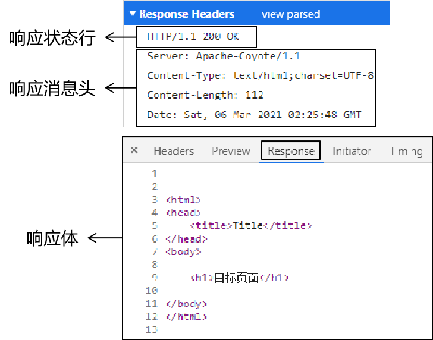

# JavaWeb

网页：展现数据
数据库：存储和管理数据
JavaWeb：逻辑处理，连接网页和数据库


### 单一架构技术体系

- 视图：用户的操作界面+数据的动态显示
  - 前端技术：HTML/CSS/JavaScript
  - 服务器端页面模板技术：Thymeleaf
- 控制层：处理请求+跳转页面
  - 服务器：Tomcat
  - 控制器：Servlet
  - 域对象：request、session、servletContext
  - 过滤器：Filter
  - 监听器：Listener
  - 异步交互：Ajax
- 业务逻辑层：业务逻辑计算
- 持久化层：操作数据库


Web2.0规范之前的网页开发并没有明确的将HTML、CSS、JavaScript代码分开，而是互相之间纠缠在一起，导致代码维护困难，开发效率很低。

> 在开发中我们把这样彼此纠缠、互相影响的现象称为『耦合』。而把耦合在一起的东西拆解开，让他们彼此独立出来称为『解耦』。各个组成部分独立完成自己负责的功能，和其他模块无关称为『内聚』。
>
> 将来大家经常会听到一句话：软件开发提倡『 **高内聚，低耦合**』。
>
> 一个软件项目只有做到了高内聚、低耦合才能算得上结构严谨，模块化程度高，有利于开发和维护。

# JDBC

JDBC（Java DataBase Connectivity）
即**用Java语言操作关系型数据库的一套API**

JDBC是一套标准接口，MySql、Oracle等数据库提供各自的实现类jar包。

## JDBC基本操作

```java
//1.注册驱动
Class.forName("com.mysql.jdbc.Driver");//需要抛异常

//2.获取连接
String url = "jdbc:mysql://127.0.0.1:3306/mydatabase";
String username = "root";
String password = "951esz753";
Connection connect = DriverManager.getConnection(url,username,password);

//3.定义sql语句
String sql = "update bank set money = 1596 where id = 1";

//4.获取执行sql的对象Statement
Statement state = connect.createStatement();

//5.执行sql
int count = state.executeUpdate(sql);

//6.处理结果
System.out.println(count);

//7.释放资源
state.close();
connect.close();
```

## API

### DriveManager

驱动管理类。
作用：1.注册驱动	2.获取数据库连接

- 注册驱动

`Class.forName("com.mysql.jdbc.Driver");`

我们查询MySQL提供的Driver类，看它是如何实现的，源码如下：


在该类中的静态代码块中已经执行了 `DriverManager` 对象的 `registerDriver()` 方法进行驱动的注册了，那么我们只需要加载 `Driver` 类，该静态代码块就会执行。而 `Class.forName("com.mysql.jdbc.Driver");` 就可以加载 `Driver` 类。

- 获取数据库连接

url ： 连接路径

> 语法：jdbc:mysql://ip地址(域名):端口号/数据库名称?参数键值对1&参数键值对2…
>
> 示例：jdbc:mysql://127.0.0.1:3306/db1
>
> ==细节：==
>
> * 如果连接的是本机mysql服务器，并且mysql服务默认端口是3306，则url可以简写为：jdbc:mysql:///数据库名称?参数键值对
>
> * 配置 useSSL=false 参数，禁用安全连接方式，解决警告提示

### Connection

Connection（数据库连接对象）
作用：1.获取执行 SQL 的对象	2.管理事务

* 获取执行 SQL 的对象

**普通执行SQL对象**

```sql
Statement createStatement()
```

入门案例中就是通过该方法获取的执行对象。


**预编译SQL的执行SQL对象：防止SQL注入**

```sql
PreparedStatement  prepareStatement(sql)
```

通过这种方式获取 `PreparedStatement` SQL语句执行对象，它可以防止SQL注入。

* 管理事务

```sql
开启事务 ： BEGIN; 或者 START TRANSACTION;
提交事务 ： COMMIT;
回滚事务 ： ROLLBACK;
```

MySQL默认自动提交事务

```java
try {
// ==========开启事务==========
conn.setAutoCommit(false);
//5. 执行sql
int count1 = stmt.executeUpdate(sql1);//受影响的行数
//6. 处理结果
System.out.println(count1);
int i = 3/0;
//5. 执行sql
int count2 = stmt.executeUpdate(sql2);//受影响的行数
//6. 处理结果
System.out.println(count2);

// ==========提交事务==========
//程序运行到此处，说明没有出现任何问题，则需求提交事务
conn.commit();
} catch (Exception e) {
// ==========回滚事务==========
//程序在出现异常时会执行到这个地方，此时就需要回滚事务
conn.rollback();
e.printStackTrace();
}
```

### Statement

执行SQL语句。针对不同的SQL语句使用不同的方法。

- 执行DML、DDL语句

`executeUpdate(String sql)`	执行给定的SQL语句，可以是INSERT、UPDATE、DELETE语句，或者不返回任何内容，如DDL语句的SQL语句。

- 执行DQL语句

`executeQuery(String sql)`	执行给定的SQL语句，返回单个Resultset对象

### ResultSet

结果集对象。封装了SQL查询语句的结果。

作用：存放SQL查询结果

`ResultSet`对象提供了操作查询结果数据的方法

```java
boolean next()
//将光标从当前位置向前移动一行并判断当前行是否为有效行
xxx getXxx(参数)
//获取数据
```

### PreparedStatement

作用：
1.预编译SQL语句并执行。
2.预防SQL注入。

#### SQL注入

通过操作输入来修改事先定义好的SQL语句，用以达到执行代码对服务器进行攻击的方法。

通俗讲，SQL注入就是利用**字符串的拼接**，人为的钻漏洞

例：在一些登录界面，如果输入密码`'or'1'='1`,则不论账号密码是否正确，直接实现登录。

#### PreparedStatement

* 获取 PreparedStatement 对象

  ```java
  // SQL语句中的参数值，使用？占位符替代
  String sql = "select * from user where username = ? and password = ?";
  // 通过Connection对象获取，并传入对应的sql语句
  PreparedStatement pstmt = conn.prepareStatement(sql);
  ```

* 设置参数值

  将sql语句中参数使用 ? 进行代替

  > PreparedStatement对象：setXxx(index，value)给 ? 赋值
  >
  > * index：第几个？，从1开始
  > * value：该？的值

* 执行SQL语句

  > executeUpdate();  执行DDL语句和DML语句
  >
  > executeQuery();  执行DQL语句
  >
  > 注意：调用这两个方法时不需要传递SQL语句，因为获取SQL语句执行对象时已经对SQL语句进行预编译了。

#### 原理

PreparedStatement通过**将敏感字符进行转义**来防止SQL注入

即通过反斜杠“\”：


**Java操作数据库的流程：**
1.检查SQL语句语法
2.编译SQL语句。将SQL语句编译成可执行的函数。
3.执行SQL语句

其中：**检查SQL和编译SQL花费的时间比执行SQL的时间还要长**。如果我们只是重新设置参数，那么检查SQL语句和编译SQL语句不需要重复执行。这样可以提高性能，这就引入了**预编译**。

开启预编译：在代码的url处加上`useServerPrepStmts = true`

## 数据库连接池

数据库连接池是个容器，负责分配、管理数据库连接(Connection)

它允许应用程序重复使用一个现有的数据库连接，而不是再重新建立一个；

释放空闲时间超过最大空闲时间的数据库连接来避免因为没有释放数据库连接而引起的数据库连接遗漏

**好处：资源重用、提升系统响应速度、避免数据库连接遗漏**

### 实现

标准接口：DataSource

官方(SUN) 提供的数据库连接池标准接口，由第三方组织实现此接口。该接口提供了获取连接的功能：

```java
Connection getConnection()
```

那么以后就不需要通过 `DriverManager` 对象获取 `Connection` 对象，而是通过连接池（DataSource）获取 `Connection` 对象。

常见的数据库连接池
Druid（德鲁伊）	阿里巴巴开源的数据库连接池项目

# Maven

Maven是一个项目管理和构建的工具

- 提供了一套标准化的项目结构
- 提供了一套标准化的构建流程（编译，测试，打包，发布......)
- 提供了一套依赖管理机制

## 生命周期

生命周期描述的是一次构建过程经历了多少个时间

Maven将项目生命周期的划分为3套
		clean		清洁工作
		default	 核心工作
		site			产生报告，发布站点

注意：同一周期内，执行后面的命令，前面的所有命令都会自动执行


## Maven命令


## 坐标

Maven中的坐标是**资源的唯一标识**，使用坐标来定义项目或引入项目所需的依赖。

**Maven 坐标主要组成**

* groupId：定义当前Maven项目隶属组织名称
* artifactId：定义当前Maven项目名称
* version：定义当前项目版本号

```xml
<!--当前项目坐标-->
    <groupId>org.example</groupId>
    <artifactId>maven_demo</artifactId>
    <version>1.0-SNAPSHOT</version>

    <!--导入mysql  驱动jar包-->
    <dependencies>
        <dependency>
            <groupId>mysql</groupId>
            <artifactId>mysql-connector-java</artifactId>
            <version>5.1.32</version>
        </dependency>
        <dependency>
            <groupId>junit</groupId>
            <artifactId>junit</artifactId>
            <version>4.12</version>
        </dependency>
    </dependencies>
```

## 依赖

即，使用坐标来描述当前项目依赖哪儿些第三方jar包

**Dependency**

### 依赖范围

即对应jar包的作用范围（编译环境、测试环境、运行环境）

**Scope**

scope取值

| **依赖范围** | 编译classpath | 测试classpath | 运行classpath | 例子              |
| ------------ | ------------- | ------------- | ------------- | ----------------- |
| **compile**  | Y             | Y             | Y             | logback           |
| **test**     | -             | Y             | -             | Junit             |
| **provided** | Y             | Y             | -             | servlet-api       |
| **runtime**  | -             | Y             | Y             | jdbc驱动          |
| **system**   | Y             | Y             | -             | 存储在本地的jar包 |

* compile ：作用于编译环境、测试环境、运行环境。
* test ： 作用于测试环境。如Junit
* provided ：作用于编译环境、测试环境。
* runtime  ： 作用于测试环境、运行环境。jdbc驱动一般将 `scope` 设置为该值

# MyBatis

MyBatis是一款持久层框架，**用于简化JDBC开发**

MyBatis几乎免除了所有的JDBC代码以及设置参数和获取结果集的工作

**框架：通用的软件基础代码模型**
**持久层：负责将数据保存到数据库的代码**
**JavaEE三层框架：表现层、业务层、持久层**

## JDBC缺点


解决硬编码的方式：在程序外建立**配置文件XML**，专门用来存放重要的字符串等信息

## MyBatis基本操作

步骤：

```txt
1.创建user表，添加数据
2.创建模块，导入坐标
3.编写MyBatis核心配置文件--替换连接信息解决硬编码问题
4.编写SQL映射文件--统一管理sql语句，解决硬编码问题
5.编码
		定义POJO类
		加载核心配置文件，获取SqlSessionFactory 对象
		获取SqlSession对象，执行SQL语句
		释放资源
```

# HTML

HTML是**H**yper **T**ext **M**arkup **L**anguage的缩写。意思是**『超文本标记语言』**。

HTML技术通过**HTML标签**把其他网页、图片、音频、视频等各种多媒体资源引入到当前网页中，让网页有了非常丰富的呈现方式，这就是超文本的含义——本身是文本，但是呈现出来的最终效果超越了文本。

- **html语言是解释性语言，不是编译型语言(Java等)。**
- **浏览器是容错的。**

### html文件结构

- `<html></html>`

  html标签是整个文档的根标签，所有其他标签都必须放在html标签里面。

- `<head></head>`

  head标签用于定义文档的头部

- `<body></body>`

  body标签定义网页的主体内容


### 请求方式

浏览器和服务器之间在互相通信时有大量的**『数据』**需要传输。

由于浏览器和服务器均存在多种不同产品，因此需要一套规范格式来保证彼此之间传输的数据能被理解，**发送端按照格式发送数据，接收端按照格式解析数据，实现数据的跨平台传输**。这里规范的格式就是应用程序间的**通信协议**。

**HTTP协议的底层就是TCP/IP协议**。

HTTP1.1中共定义了八种请求方式：

- GET
- POST
- PUT
- DELETE
- HEAD
- CONNECT
- OPTIONS
- TRACE

在HTML标签中，点击超链接是GET方式的请求，提交一个表单可以通过form标签的method属性指定GET或POST请求，其他请求方式无法通过HTML标签实现。

### 表单

使用`form`标签来定义一个表单。而对于form标签来说有两个最重要的属性：action和method。

> - action：**服务器端接受表单数据的地址**
> - method：**定义提交表单的请求方式**。只有两个可选值：get或post，没有极特殊情况的话使用post即可。


**name和value属性**：

在各个具体的表单标签中，我们通过**『name属性』**来给数据起**『名字』**，通过**『value属性』**来保存要发送给服务器的**『值』**。

**在服务器端使用Map类型来接收请求参数的**。具体的是类型是：`Map<String,String[]>`。


#### 单行文本框

```html
个性签名：<input type="text" name="signal"/><br/>
```

![./images](data:image/png;base64,iVBORw0KGgoAAAANSUhEUgAAAQwAAAAfCAIAAACd22RFAAADFklEQVR42u2bv27aQBzHj7cIUjpYyhMwFY+V+gDFolJh6syGkBhCOxAyICE2xox2pUaQB6iUETplyVrJQ5HgLdy785/c2Xf+ByGo/n4mcGwOne7j7+93DjXP8wgAQE8NkgCQDiQBIANIAkAGkASADCAJYzgcvvVXAOfCdDqNHYEkzJDkvIDKklwPeSXZ/7DqHWL/XXYu9Sf8GXjfmvLhzW1tZiiv2jrWu25j412/zzoY4/dtrfmU8k0OnxRQZcpKwtfuir4YrxMaBMiS7J3P9eWn3fKLq5Nkc1Mzv0tHWs7aejC79/J5sRH5NyEO/eSL15sUUGXKSULTwByxxUroC6K5zfOoWZG2vfvZuWBL2R14101dkrA0IGt2gvwJiiwSiFxV0yoXL5AEiJSQhGVCl/ClTzSlDlu7y8aYjMhgTUyTrHdXMyaMigl17DKsqah0vz5wK/go9xOuDXvt9hMq+oYoo+yweIEkQKSoJDxD2qEhPklPeCzYzlOX5sBX19kabjNKD0WS0EJrdhUsaJoed8bCmHMP+259bvCx4p74MdWiGhh3oVfSnyaKfJP1LjIpoMoUkUS+c7MW4lnMk1G0Lv0yiaUHL5bY2wcrXJr6xl01Cl/xjVgZJtZm++3msW+GS587TCbx8wMgCShDXkmSt2dJEn4gbFQMv0dfkB6XxJBDIEUSv8Qi8RDgBrbSaqfgQsJ6/SN08JAEiOSSJOGD9qB44y+0BRxsbY013cvYtp+7VAOVA356pO2zHT4poMqUf06ilETkRZK0PShWGhFmiK5GksYMwyqqxFap5+f5zFyTAqrMSSSRr8voScKrY506He7xY/DWjx2aKmFFpxLhZdP5CJMCqswZSULP75FFVE1J7T5tS4JtrjxDcCAJOBJnJEk8PfjDFoudqXlOUlgS7G6BMpyVJOrn7mwgom7KIQk4ASeQhAS7Tzra9m5Oemn/XSIhbhBn9e5o3MEROH2SHBP0JOAElJfkPwaSABFIogCSABFIogCSABFIoga/cQcR+I07AIWBJABkAEkAyACSAJABJAEgg39BES7w14RMuwAAAABJRU5ErkJggg==)

#### 密码框

```html
密码：<input type="password" name="secret"/><br/>
```


#### 多行文本框

```html
自我介绍：<textarea name="desc"></textarea>
```

![./images](data:image/png;base64,iVBORw0KGgoAAAANSUhEUgAAAP4AAAApCAIAAACazwORAAADQUlEQVR42u2dv2/aQBTHz/8FkZoBKWuWTgWpS/6EoFYKTFUHhmxRJAZoBkoGJJSdqVOo1Ij2D6jECJ26dK3E0EjwX7jn33fnd7aJMEh+388E9nFnmc979+6whOO6rgCAHw5n9Xu93rEvAZTLeDy2neKrvvQ+476AapDxLUN9UGWgPgHU5wDUJ4D6HID6BFCfA1CfAOpzAOoTQH0OQH0CqM8BqE8A9TkA9QmgPgegPgHU5wDUJ4D6HID6BFCfA1CfAOpzAOoTQH0OQH0CqM8BqE8A9TkA9QmgPgegPgHU5wDUJ4D6HID6BFCfA1CfAOpz4GXqb2fvTzrnS/dTI3eA7dfWSfu7fHE528zfLlqn61u3X5cH/95mf3z12WneXT7+m7dfWVo8z1qn81ZGgxJuCqgML1I/17lf905jEL5+97j51q4lH/TVf14tbpqdp9HS7TeyexhaA8yLDRGejQPMRB19HzcFVIbi6q/uneYgpzdTZc/IH620+kEb1V0db6zf4SxhiTG9q3hAOR2tb9z+G/+djJ+HOtQHJDupP6nnlB+mi6b6XieLC1umT9o0B0M1nb9OTw4ybCZnm/lVzZ8fRNjAmI6gPqDodrvT6bQM9f2VwFPhC9FqEs37gFT8qE577cUqTPPGNLI1VxT+hYn8EgjqV5jAe3HwrC/luxYPlk68Hjpi5udyHSP3a5V9GCeE1qmCCupzJ/ZeHLrWT9fiPy/Udeooyt8E/sJXaxDnfiNm/Ld+ZGRuENmB+pVE9V4cIusnGy+eiPUvao0+GM02H69qa5me/4TJOCnioz6UaImWv/IsvczdD1C/eqjel1frB1vy0XF9ezGovzdnE1uOz1RfKAev1+dicOfHlax5PqyjTK8zLPTjgwHUrxhp78XBC564GrGWIsXUV9J/0i015+T9cEYC9asE6b04xuamFz9xvs9ZDNBHdhkd6vPG5r04pPphFTRcetWOelDbhEmPYlc/Xs6GBU+u+tjhAQnlqy/lCwrxpOyOHwGqG1oTBRKpfvCYg/mIRG6tX1R9gT8UYkDxPxTaqdZPGtv2K6Ol8EjfrRepNcARCh7AnD1k/eLYHlgoqj4A+4Pv8/qAOVAfMOU/9sHo3PXGr8wAAAAASUVORK5CYII=)

#### 单选框

```html
你最喜欢的季节是：
<input type="radio" name="season" value="spring" />春天
<input type="radio" name="season" value="summer" checked="checked" />夏天
<input type="radio" name="season" value="autumn" />秋天
<input type="radio" name="season" value="winter" />冬天
```

![./images](data:image/png;base64,iVBORw0KGgoAAAANSUhEUgAAAYQAAABECAIAAAAOQNWEAAASfklEQVR42u1dX2hcxRr/8lYJBH2wNJBCTigmDwYhNFcTTB8CVYxP3TVeb1IvtBUVyr3UNbQPjRG324eWupZ7CagYC9cm19u66ZMRFfJgJFtvSkDiQyIlGzCQUB+UQLBvuWfm/JuZM3POzNnd5LT3+z2lu2fPzPnm+37z+75vttuws7MDCAQCsddoQDJCIBBpAJIRAoFIBZCMEAhEKoBkhIjB5r+zzXdHdt7p2euJIB5yqMlofSp7sJT9pTTUAnD7YkPP4qTzdx1g7u7liw29UN45/4zifXby7Ci3shs3hg5oDkKeetT7R0by+PYFRYu5Ydys9g7Ly8t37txZXV3d3t5ubGxsa2s7fPhwR0eHzmdtu52G8dJfdM1WJWaW4dMF+G4Vft2GxxvhSBuc7IYBrZnuARIYtnyhoXcMMlMbnkk3p15uruR2w20SucHuebWSjNjQtc135dBGhDuSi4emI4YJTE9oYjjqUuFT1gTDCDYK8zvne8hNKiP2HxHzEdlNveQc6TDIz8fwoz4ZqYbwn6qeiz09Pb22ttbX19fe3t7U1LS1tbWysjI3N9fa2prJZATL2VYavhl/T29BySOPxl+uYUyKN6fh+wrkjsAL7dDcBBtb8NUKFL+DZy34UJip9lSd+ZK9ZD1mFXxoLoeJYQNDhW4u98zYmOIeTUMlmMyWmTehThp0UffWXovByQg1oCIjcvfSMepwavrwKSZadGhxmY4y8jjIUqwTmU/frDhb5/klT6FcRfV8jAKAoWBCRqBY0fpujLYL3r9/f2hoKPzW1NTUvn37IhwRHF9cmjSQkzTqFqc2Eigpm4l+/wM+HyZ/f/MzrP0GrY/Bc0+Qf74yCY8+EuYjiSVdp9VEFZI/kWGla63rAJSeuuJ4oYazjSHETNQq00jp1NqBfCjIiJEetjvOHg1birOggTICXXHkbiD2xdeskvNIrhKxxVJIgPh5GfCiyRMvFeEpvOv75zT3H5n1U6+MbFk+MzOTy+VUFxSLxYGBAUGoO3lEFKJkTkIysrOzs1/CT2/D8j34639g4Rf39e6D8K8/Q8d+ePJ9uPxiKF/T8KWomElKRskMy0YNE1ZiKE1YJakzJCajhLP1nDbsnBpyqXZkFOyHbLyxyRG/1VepjKLhf9wVLEdn3aF5xuwF+uTrMjLKVZo51pAXlbwFgMmpxeG7XYWx0ZhU2YyMjJQRXUswkiQSXL9+3dbk3d3dqgsWFhZsrX78+HGV5Q1lESQmo5c+I0Rzshv+9M+AiRzYfPTfv5FCkk1YX7zKfywuYY/xvaRkZGzY0G6UyRdgDOjMGQegbtlVHj//jGTCickogRs48oLQUAuh+67Aq2m+ORjrFbUiI2e3oeNVLmQrJ7ylkgY/M/WIYSSaIlIphJQUIQ7rmu1Y89lbvUz+SOfDupSMjCY7hytQWDx0ir+n4MTUynTP99I0qyaMoPO80jpC9UPn8/kzZ840NTWpLtja2rp69erYmCeEDCp6qo0xYb1z/3vw41uwtAnPfyJ59+vXoPMAPPUB3HuXf6MGyggShLexYZnZ+oHNupkvlyKo07gDk3i2wlbtEkKhAKOjN6Ozs2CyximzjIy8skiY/OJ2IQOImoJDeEko2UFmcLorJ6Raofmsy9O0A0KQcJc5xUVFCclZiSAx0SvZCtbbo5rRuXPnLl26lOSadWE/dOZ5GoqsicwqaNGpaMNZ2LkMH/8Ab5Qk736Uhdefdq8JzVNPGZl0TtRUW51h6Z5U4FTGFeuXkcpBqiWtiSAo4nYvDnE6JbkbuGAWWpahx+f1DCK4TCQjh33nj5V6fQ72/bLFXXgI1LuZOwZWM1JGgTl4F5Fq7LDP+YOKhxUIO4CX/VpqcUe8B+iExZVQ8Egk1e4mkmzg8UEb2b6hK6u3eXLYE2VEo0i3G1WtYZmglZRQie5YtIoRM5GFQD1ny9nW9fwg3mOWWNzCtSCSUZnmZaSs65FRIA79XWg9nEbaBO/a0eDQkFi44e4jIOw3Tm4oGkWpjLyb+LWwGH0eKZe8KcSSkXaDVmOBzWFYLAjc3ZIvorNA45AjHimdLc3fC4Ul65QhF+9FzYiK5Tyfv9fFsN5Uc5UuGIXchlVk3IZ4y2LmJmSjOdEpJ+UBjpZMRbTpbD3SjHL+QA3JGIeSRlcBoP+GAXXKC9hMdspkN0LNKChthjKX/OTk0rCgmBzfNQpOQdTYKzG65OfMNCntLMCSNS5WppVkFPDdeqR40U1I1SdEQpHMvbhb0ilp0yeCQyPZmelRqlpCKux+N81z8v7Zlycsk5hJZlhKi6TiSR2mfPHlyinvEF8vkHiJrrB4VVrwP1jX2QYIkhh9CemRBlzMVgyIPoaMKizpsCHKiSOpMgLmxWrLIsFK+J0adzKnKsKdY8iIMbHX8tdPd0PJuT4Z8RUrWZZac1nkIPkBE6UyUnkk20Cxr5ztN0wokp4zcvdCs+MRrAPby/Ftv+n3XcwMG+WuNDmI3h2ZikSyA/FVHjfzLUZ5P4aVylwZR6gzRiGSjIpwmk3H+DhnGmphZURf9wIeQp4dr49Y7cemVK7fWEGtXki49MgopjFRlTKS9RFu8yWneGVUm26agwRHbxOQkXgOIFG7w+AEtnZBWsby4vmDZN+/MzDsbUcjgOAwQhDJj0SEmgnJzsqYu4EX1yaln9D5g+gNjENsmiYYRepeypqRRzpi1S167bl3JQeCxCMM3DmDiAI2KO8gwpyMuIaCOKIji0ilYPim972EXSQjMP9SkmGapphtolM8Cb+bJozlsL+0zUQ9BEJhn+hQlalhud1LPDooNZfYgGMMbniKx3y2zFhBySW2kBQqsUs6s3KYkJGs6BvlteVsqcflBWF30ldGoU0gOA0k2gsmuSq7P2c37AWbSroS3Ky0dgOd9JPf8aLbiIbdh/pBXxm5RlPNnDmzVvsU1KD/7YSQ6wOqhE7eEqmpXfndSwxs5wiL92JMC8XZ/+r6rUYJXJuHwieC/cF/lphWoA4ZBVmYzjpRP87SAnaBO6LNuKyBMgo9kuJ0b8K9ojrEk1GVp8/TDd1mc/2DXAO6zWbnoZL0+zUtRhwGlM1cN80pQ6/WCQmtIK83dE9I3JaejwmA/58RAoFIBZCMEAhEKoBkhEAgUgEkIwQCkQogGSEQiFQAyQiBQKQCSEYIBCIVQDJCIBCpAJIRAoFIBZCMEAhEKoBkhEAgUgEkIwQCkQogGSEQiFQAyQiBQKQCSEYIBCIVQDJCIBCpAJIRAoFIBZCMEAhEKoBkhEAgUgEkIwQCkQogGSEQiFQAyQiBQKQCSEYIBCIVQDJCIBCpAJIRAoFIBZCMEAhEKoBkhEAgUgE1GZHfJi9lnd/PJj+SvVifXx8nIL8vfnck7kfQWZCfGIey+kfu2cmzo9zKbtwY0v69d3uUK5b8qcmPppeOeT+FLhsuVVheXr5z587q6ur29nZjY2NbW9vhw4c7Ojp0P09/qL4rwuBaRtPCzDJ8ugDfrcKv2/B4Ixxpg5PdMKA3U/Kj70uTJktcLYwMK/dzYtvKyM55pfdzxucd7+GCkozY0LXX+MqhqOcnFw9NRwyTmWLjdjjqUuFT1kRDzyjzWmHeXra49ZOtOlnFSk4STuHJe7OVxpVznw2rGPiEfYfTMB7lH4TNR0GNglacJ8T09PTa2lpfX197e3tTU9PW1tbKysrc3Fxra2smk+GvJSzPTDTj7EAmQS7cQTBpDN6chu8rkDsCL7RDcxNsbMFXK1D8Dp614MNM7Kfd0ReVY5G1G74Z8XHqXXUxLB3ec8voePFtRcw+xs8qlrkeZKjIiCFgNX34VosWHVpcpqOMvJWwFGtJ5tM3K852kEaR5CkycVpPSkbOi+OQ88lIHn7c/QkZgcLRlSxZE9gBc//+/aGhofBbU1NT+/bt48OGfWTv73UJk6rJJbkyspno9z/g82Hy9zc/w9pv0PoYPPcE+ecrk/DoIyIfxW6BGrNlYK9R0dJXVWaG5Xcjbj5SfnHcNT+/8w6w9vToyfzpHgQoyIgxkP38s0fDocKFkIEyAl1x5IoF++JrVsnhKdddbLEUytH8RAn4pfU8rCI8RXRipRAyZEot/OQHJ+ePla4QWQSuQYCOWITT7P33SBnZScTMzEwul1NdUCwWBwYGmLQiTEYjlYM21TLEKpgu7tE0n9HOzs5+CT+9Dcv34NXP4c66+/rhFvjsFejYD0++D5df5PI1zT1M3AsVpGNUKzA3rDCEWqMRAupx7ZyD8RtDQHX3yN3mK1CAMeBpq7472S5DTkaBLGdXjqVwfquvUhlFw/+4u5ZHZ92hecbsBbqK6zIyylWaBf/TqfJw13hVKptrvu3fecfylGPlYsNsPxnODeP+OTrJExVxGmbKiDorVFv+uH79up1BdHd3qy5YWFiwM4vjx4/7xhbICPIwupRlDBjKg4TYVu7zMcnFS58RojnZDd3/CJjIgc1HC38nhSSbsL54tQpzOJZVkI6Rl5obVj00Yxz+gs1ge7PpPj8/D72ukzO3fNjJyFEuNLupXMhWTrBbYij4fSvrKyOI305DSoqQgnXNdpf57K1eJn+k82Hr6zIymuwcrkBh8dApiTaWz4QKAZCQUf+3jsJy09hxOO1WixgJRnyaZIsCGRkpo9qQUT6fP3PmTFNTk+qCra2tq1evjo350l9eMwJ3f8pkbk5P5/l4UJOR6xXC9Qrsfw9+fAuWNuH5TyTvfv0adB6Apz6Ae+8CN7S5KFOQjllUmxuWjuFzTczMXbO7Bhz0ZIGkifSQk5EnIAdDkVDD4llkfh52F7oqkBmc7soJqVbcJhwMxDfgxM/KFpW7xvn4hlWcsG7Yr4hNDW/OXrLWMlWdMqoNzp07d+nSJZNrXGVEeZ+PWC+5FnlT1M5BDssWYmNFR8NZ2LkMH/8Ab5Qk736Uhdefdq+JQrzgVVk7rj9brWHp2ISMspNLwxWFGwtsRQ0IrKfZF0xYJWaSDzUZOQnX/LFSr592+Z1FL8Ag6K3Etid4+ARnpIzovOhAfLNDuleEC1L+oOJhBeCaFDQ/58KFu0aoy1Iygsw0ZL3qOF+xMqyG1gnJNnAQ6cORS75atM3L1+aLFnEYZw8nxTJhh9CK8yTKKIx4MlJ1GzjEloSTGNb1ecd0GjUjCi/nKMxzm6JvzIeajMo0LyOFD4+MgnqQT+HiqRMuUA0KgaLrRDViaB+B63856yT6jVIZeTfxa2EMGbG6ht2FggcRiYz6s+s3gUridjY6Lmh3fKAObZHENSNbGdGuTaaQh9ExEBk/2LcPhESuLNo1MrVkNSNpd0mEXp7oQesgj7Fhb5NS48ahK9o1I8+MbkONISBuD672VFeqIC9gMwVphomFmlFw8CTkf/lJW4sKxO/4rn47loAXNV1OMdUdlDpNZwGWrHGxMq0kI65dHbxe9orQ7MflxxpplNrb1KmK9y5jCsZWIWXEUdtu6abE3TQ2TZMFfLArmB8llSNBN02CGpw+1SKjqrtpzN/yasPmZsuBYAcd4yiVOdf2/0RGFZZ0WKtx4kiqjNjzEdWKSa9eDkErx50MIYVKRCFJFfbM635K4kedd9iSz+M4L/dc1r6MuY9f1A/Jw3Joc9M/uVMVkp0zEsmIa+KUxZMv3rth2jJ6KNNzRhIEyxTiFI1qN51tRbN4ZGhYAqG1rzjHxxM97QDIJVVoLR50RJIRyf+ZdIyPc8YLw8poXkxVeFPG6yNWWrMp1W2hs35AUv3RICM+93RdoRCIGijA6KLoymwFWvR1+kRd3FkH9pFvu91ZbWVUm26aA8MT2EZkxNlBKFSz/9RsnFd7Ajt0GmPRmOINKtmJT2AzZxp74g49enubVH6m/ntIRohN04Qnl3bTlDWjUPmNub+6rqQs1njvk0DtDMKDi5aIAjYo7yA+T+jbDwLXCEEY/S7TiWsevkn3vfVdJSMw+AoVXcpyttTj2tAWCyN3m5VkJD2KJWui65/iqea7aaK3rG+WAXpaTExo+DXMRN9NcwQ+OaRCllhS8g+tirgfsLMFo6+wpBkmZCR7crXGyUzyPh1q1Wspo5ATUxWWlxz9ckNXqYyE/oX6W0jsY4Z1EzNiSJoxCnGQK6gF+3N0smBWaq055Kc6ImpG/FlT92wa+0Fv7eqRTWj1xTxEfOlMbGzVJV/21r1Q5r7VCBHH3FpYyxfYZgu7HHX9VuMuQ4eMglXXWSf/MAXbiRfOvxkoIw4RwjtG7NQaul+ervL0eRqgTtM2yxcmKifOu/3+MJOykbbHPIt4AID/nxECgUgFkIwQCEQqgGSEQCBSASQjBAKRCiAZIRCIVADJCIFApAL/AwFJYLSVb22DAAAAAElFTkSuQmCC)

- name属性相同的radio为一组，组内互斥
- 当用户选择了一个radio并提交表单，这个radio的name属性和value属性组成一个键值对发送给服务器
- 设置checked="checked"属性设置默认被选中的radio

#### 多选框

```html
你最喜欢的球队是：
<input type="checkbox" name="team" value="Brazil"/>巴西
<input type="checkbox" name="team" value="German" checked="checked"/>德国
<input type="checkbox" name="team" value="France"/>法国
<input type="checkbox" name="team" value="China" checked="checked"/>中国
<input type="checkbox" name="team" value="Italian"/>意大利
```

![./images](data:image/png;base64,iVBORw0KGgoAAAANSUhEUgAAAcMAAAAVCAIAAAC19BIPAAAJ8UlEQVR42u1cT2gcVRj/chQvvShZSSGrvQZj7MENFOpCT+IhWaI0C9qQg5Zeagjm0G3E7QaJhFQPoXgIqYfdYssmXjwVVqGy20NdI8FbYQJdTNCD9iD2Fue9mXn/35s3szPbBOZ32uzO7rz3ve/7vd/3vW8ydHR0BBkyZMiQoQ8MZUyaIUOGDH0iY9IMGTJk6BcaJu01SqebpSfN2RGAhytDhW7de50CDu+Uco8Xj64XrL/RWRmahM7Rtbc0n7ODZ++yUzq4Ozsc8S7F+0NrZw6aF0O+17lhddnAcHh4uLOzs7+/r7tgdHR0ampqePg5D3jrESz9AH/9q73gpRdh9R2YO6uYYuO9K7DOrrK7ZGv59Bw1ukm1vq1y0eNhVQrXpSehHSUw4yAJR0WhWqnaD9X1nFxzyiJaEfVV8Kvpuswn/MqqmZTlnVCOQBfPbhvGM90Ivo4cqGy6VPhWfjOYiYda++haAf2Is+i+MIxHdF9kO2dBJF/kK8vM3zN1hmo9Jj2YHxl2togF8JoxYyT2NVmJrocaNcOuEBe3bt0aHx8vFLS+1el0dnd3L1++zNltNnRx8BLIpjN/Rz/Blz83BbwHN+z//Ex8E7voRA0qlXthow2zv804Y5q019g8Xa4ERqPQMKndEoAc2ElZlZuOiUlRQJVNlg/AxVQiVrW+ddU0eB2T8kvALxzDPJZMytxJz32EH81yz4qIbTRpMI28xtvQeM61xNF6C6mYBfVFzQCUype+iS0+QQwdxqTQVlO/muL7x9LS0urqaqRrJDtIY9PvYcx3o81o6FP1+6degJ0P4Ouf4fvf0Z9HX0q3Y4zPrI5Kk7r2X8+HpSPhw45hUvLLYtwamDQ8FsKldzyrircJY9LwVbawfFyrBrKMp0vsGBCWQNtpUtnbIzMp8wXXmq0Lsr04O0bQpGArS3114F68lW96w/VXxZWpEsERvwR+8sFCOsIseD9mjCJITnkWTsCk4mIcN0160pn09vvw4Zvw9BmcwsqXjXkuWozu5Dvec2bSAEY3qJHtOU0mNVjVNsnwmet5Mam1IMXgmIdiUEyKbLqHpRxrCPZ3eZHVpyY1g3zdH/qFln9rnu79zbOnYtIFJycsp5ZJuTubNOmIqCkS1aTYXaAepaorIn0mTSa/U8b81XNw81304o2vYPcP9IKJeVIexWvRqHdn8ZACX4U7pSuw0bwINFq8j9bhipZz3QRlAxaSZlJDMdSsSZGT6zjXzTeLrVhMarSqwoFlTSrvl8X7ev51OdedSHqa1A4Ry1BtKGi0lDudOScKk3qbPPZ+50bJmQsWTMlcxL72mhTCNZqkYZHP5VGxsl3amWTKDkEIkQMxFZPWx8oO1Lpn5vnfpJfx/rGZv+u9zzIped9/c95RkE55TJMKRdakJ4ZJyadMHEr5ivGgj8S8m3j+8x96cf41+PEj9GLuLtx+5H8q56G+ExLnDmVSbgyyrEtBk/YOG1u58rJKGdln94o8IIImtbdqPCZlzaUYfGrZfTg/mg6gUBR3GyHyDt8ifp00EBqyjgg754kAo33lFfWyuemZ7YnQTLOnzu6HBYGpKbn6Z1zMV/CBYB6zZP1gbnZ4hB7o+7KdtZuO+05QndT6xIkfOZsuxWHSS2eRXHr7GxT2v15F8f/tL3DpO3qZyKTEpDGz+4EwqTBU9s2BMGkkq544JjVkuiFdB6oCq/wbuNAXl0k9v29PNSeJ9+O7Tvj5LPoVILl/xJoFZedImhSPC9+In5WyN0uOK3JTsa+Lr04wRgkWyfFMWatWKpQ0CSPz2xr+cZiB0npafS1RkYQmlaDTpBwvxGHS3U/g9RwK+P2/YfwV+O0Axm9yl/FMqvJyA/x4LrZ07oqcBH2aYp00/HgATSfvLwFo6/Uo/sGSSSNZNSaTgjaWUaYFx1GTYp+E6XsTIf0/6JrtbTZltGfSDk7niw+o99NIIL9CuNX3OW6HjNAcKm7Lpp0WG47r/PAElMi5Wk0a/Aip/+qZFP3IAmzgo63uzPQ2lKTWqOBwgHAEvpG7A62hvFJQ05ZNX7rqeEykwqQcKGPyIceV8y2Z1JVLP32Mwt7F02cw+oWfkxLwddJcc6wGy7CIKoaTxv4m7DM9rSbNb63AdUWxIimTIijkpza71GvSeedGq3idbOdWTBrFqgmcOPmDn3NWHhSveVM7jprU98/Fxzn9L+Ba/EKpWXAWOzCpKh5anTgx3s8kxUKdlJdpnDdX6/W9srD5ezQRiVkEOTlRhcoeickgnPbyG+JRkpZJqQvyoaVx3/K2X4FmvZYxCKXjgDvOtTAFK/yGu4XVUXK/GBiTopIx33cirrLdiRMJe3IewoLGvNfOwdT+CTR9JqDP7hfzPWgVWsVgEdNgUnkv4cMHxIuVTPqkCD1nbd3zrmh1UiurJpfdH1wAx1nzJcUxrJOSsDXU3NyP7hdJCT5PWu5iM6nDLjlLUpwsVWpSNgHptxQYrCjQnZxs1OY2Hd1CPjQwKal4+u1WiCloJKiYlKdU1Uz5Kq2quJGsIIUUmZRITnSk40zVu7OmZ3XsT5wAh/35V/1WRwFinZStdHv1KMHrhGKO18JhakI6yK+nwaSS/OQCWOREn4zOrOkFh6uyF53TEc7uI1iVh0U/KTKatr7n7qBy20wyVuWHYtVDqlgOjbANFgU47YiuRO3qMZgUd41MqGoEvJVlTYrfZ85ShVuGK1N2P2E9z9sr8BEQPZZlNxY7JhXCmxpF3CF8+mNEBH6zWqssoxmTDlMaKso7etRJJhW+USdwdh/zGSerZkbaURu6QYYyacyncfyFRtk910rxcKXkzAceH3QL9ZLpJ41hUpV/sjF1eNjbzDHl/qT6SQfzjFMi/aQxn3Eaa2s3zuAaqWNUbrBRdDpqWyqhr+yegfbsXlsnDRhTPBkwuwv3qaLGJJqDW2/DiZPeoJTZq1ors7qYNb2cqUn+5z91indvXdlOtEH/TBrzIfHQf01AD/qSYdKYT4hjbyw1uk2cRQoeJTpYQp35MUzKOQPeUPnjC+KrfowkxaTpP3efGJNGtir1QJUdKGMIZKp5Nh+vAtCkgemDNHYr9cGkqrKCXl1O1zulZsF3FCF1tdekkvxWmoPhHa0mFdoMuIfHNZm10l8lelUUvNhBdkTFamhaiPAvGFKC6REvgsBciT15HQfCQks7KNeim9Bz97EGSRWoXNrjLIm39qSeu08Eg3nuPiI4GaSulkpxpD6dZiaqbgUxMqlsnFAmpdFlU8vDVF3CJ0417nDc9Y9ghhE0qTThrv7xL21jfNS1It48o2ZJxdm9ZjxtmDxW/yAqUSSjSQeBhDTpAJCUJk0Eg9GkKUPVQKm8TmZbFZMyW524mWX/nzRDhgwZ+kXGpBkyZMjQLzImzZAhQ4Z+8T+6c6yaywG+VAAAAABJRU5ErkJggg==)

#### 下拉列表

```html
你喜欢的运动是：
<select name="interests">
    <option value="swimming">游泳</option>
    <option value="running">跑步</option>
    <option value="shooting" selected="selected">射击</option>
    <option value="skating">溜冰</option>
</select>
```

![./images](data:image/png;base64,iVBORw0KGgoAAAANSUhEUgAAAMQAAABrCAIAAACnjroHAAAPr0lEQVR42u2dW0wdxxnHh5tx3TROH9rYrdP4NO5TRS5UamJU54LNayVDsbm5kY2qVLITIoKMbTCXwzk2UAwGjFSpsixVARwTbKmvGKI0KeBIpUl4zOUkDS1OXpqkqVVf6bczu7OzM7PnsmfxbvH3f0C7ezh75uz8zv/7ZmZ3JmdlZYWgUH4oB2FC+SWECeWbECaUb0KYUL4JYfr/UHNzc9BFkNXT0yMdSQXT0ljFQ5MVn03WbCFkPp6zfWGUbaehq+MVmz9sWjm+Pe3izcVzSsjcSstTaRRG/JRLFcsXajY5P3xsz0HSn25RU5WqL5L2t14NAUlqzQUutVQpYBKraq4rp2/b8mT1Js3/GdVcezG9QpSPLU9GzuZsbxWOxWZXWrYbJ0k0wUaSwsh0AjSbE406/gD9/ogJmfEzaNWfNDrLTmicvMbxDYxyGl/WHaYkp2XfKskPIxOtDZiMqprcTa+pOy7WRVfenKYzWQxFlOq0z79jRv70ylEDFE2pyrl3Av0lZDYTa9QqOUxkVk+/O+WZSwsTXN6DZES58kks2WeLzRAmwSqgYmbK1EsjXLL0zMn8scI/n4tMsmo2LQTMSolxPK4Rp2lZrpOQSiXHQbh8M6XuVpdCLsZj+02QzuQGTVhhMn7Zi9QAxJAhBqNkP80U4kHTNLCyGfNUToJNa1nSwdSY2MxLxaRLqrKV45zOrC5jZzIO1pJRJcPLsNqk321UdF8RJvpxE+7nrcy4JMlKlQwmVmL6eYmuisR+q4a0lU34xU32S3UERKuSIueAqtmKSyVCPKXnF/N9HUyjRbUJElvYVu88p5J1pVMqOYczXxk1TTEJTBk5k3eYuru7xar51SvkzGtmOpg7Rbrajx+X3tP5lztyfJ+L556K/P31lL+0zs7OhoaGBx54gB/58ssvh4aG2traxH87cuRImjBZUKvwJkmTRQNTpObvNOcl5ZUXixulUKWcf0kf5jZJtWv9GwHK6Rd35nNCCqiXzk4cH52lM2UgsV6g2mSYflRnO1Pn27dbbWca33uInHq9WhfmTuSdinyqfckWkBSNRh9//PHp6WnG01dffVVaWvruu+8CTB0dHW6lygFpYWKNuNndkyW81U2Nqhiu4xahwhadqGXkTNYVr52IOepD2wGhJmSccrnzwq5dGV/7Vfjcs5ELCgRwqkYyIv0YHOe8G90Eao0ozjROncn4YivzJ/IvP7f0yKlzkYmjT9Kqq3qR9E0AMfPx/F+0p/qwzrdvOXkHEwJ03n///cceewx4giO7du0CkmB3ZmZGtKt0nWmOxrXSt+x+AbuPgP9SOV7Sj0+TBbtWgBEo28pFdFgTXcbO1Zmsk/DczhUmhy1pW5rW/xPX/7S+mnFlatLsCXFt7abEiO9CtZ08eVKEqXLrvkt8t+Otmy1bx6tfIn0Xqn941dpQTz9/sqB/6yfalxwCnnbu3Ml4gt333nvv0UcflUgCHT16lCMOrkSSJ+BCJ5Ng71LORGuRjGdwcSVTKY6S1kXe60irvChGFiMjcmbtCpPN65IMmQ2T/BY1DAlNP/vjnJFRSfAdqCWN8hmRJG1DtZ04ccI+sjS+p4kMj1c9CDtXutdNP3vj2FPkH+fpwefeqAZnulBFifn8tT0vkuELex9kV617Xf/WhPYlDU9gSMATbANJly9fZiQxaJiOHTsGiItH0oIpIUY0sV7dzCk9Wfk7AVIXxsTsuz4h1XQKmCzNu8GkNJjNuBlTbWxOzLeMxFzIijSmmyIfT9OWtCSxDREmdqS7sNARvtrf/C+NcIRBUttAes/vZcRcqGogg+f3MGKu9Kwf2PqR9iWNIFUqKyuDjampqY0bNzqgodsiTGk7Uz85KBLjrFexQXc1pT9FpaafVU+wPVW6cjxi24CU26YHkzS04uh9cClY+ZjcJWs2wYyPIDHSurBbm3UJ9PAvldqZXFtzKkAqTOJBtnGlu/qTHz+x/+Nnrh0RYKp7mfSMW8RUv0xOj1sw9W44/fAH2pdceYK/QBIRPInT4wmmtFtzybu8tcmHkEjRC11k0+bod0iSgBOXM7C3GDUd0aT5/LuoGbelOaWFQaEsnnW07JYj/XBymvYteYTJjSS+AdUWj8cdML3Ts+HZzvY3/nOY9H57+ulvbJiu9N735jPfHGb7n0/UPLL/T26l+eW5j8Yqk8GkMiTC1NLSAojzXdfWXDKY3NvD6TuT0k1gVExrdFYddzMvvaszSf1yJjGsJOAxpVMQs2JeulXFr6n6Fi3wwpiQkCVpxkZTDOlo3UiCKRaL8eMX9t134KfT/25e6f3Ori5g4uwHr1Y++E7P/bvi9HQtl79u/nnK7/f5RN0r5NSrqWBictgPFWy0trZ6honWNz3ubTDO/VVnxTjfJNlVupqPx0lLml2LKStbVbIx7wyl2pIqqLauri7xCHHCt6pSSWI6fvw4IC4ewfuZApbWkFSYotHonTt3RJLuPkziRm5ubltbG8IULmlh4tywbfCAjo6OJDCtUiVqoxuHCYoEiOdSIUyhkNaTODewcfv2bdhob293A2hVa1DNu/luZ2cnoyovL8/kCWEKVpLZiBjBXyAJNiCasNoKurAOQdmOHDmSZ8koIcIUoNxSJUYSs6Vbt2719vaG8E7Lw4cPNzY2AkYFBQWMJ4QpSKkwSQGOwdTX1xdCmJqbmw8dOgQk5VtCmIKUW959h4qRBOrv7w8nTC+88MK6desKqBCmgKXCxAOcCNPAwIADJkefrT3mqNwVLt217PHWPDcBTPX19essAU8IU5BSU28xW2Iw3bx5c3BwUHYmzpM9IqS5+9s5/kOV3di8KIDp+eefX79+fWFhIcIUvNxgYo04+HuTamhoSBPmnOOVsbHRhRph+NIau2R2NUIO8pGu9O+vSi6Aqa6ubj0V8IQwBSwOkxjdRGdiMA0PDwswOZ8/swaq1ceH9A8UmTdobM/+OVWAqaamhsME5oQwBSk3mERnunHjxpkzZyRnMgcHd8xYMM3F9/QtTFy0jcoIZLonpK0BbJL18CLAVFVV9S0qdKbgpXYvcZhEZ1JhMmVHOvvWZ8fwPLOuxsRmNtQdnaWPlLWWV5ZfLMroyX2NGExgSwwmdKaApYWJN+W4M42MjEgwmQ0305lKZ3jAsqOYLPMtkbMVU0S+K9qTAKa9e/dyZ0KYApZnmMx8iPA7VM+S3Qu14s1k/PF5u61HH8iZj1ck6ps+3Kx7PjszMZjAmTZs2IAwBS+vMJm5c+lbrGOJ2E9uSc5k7dpdUBSmyepE9s9sIUzhkleYIN1O1BvRjT12IXROOmGyDUyYEIbCtCmbR/uZEKZwySNMjBhIpe3HmrUw0SfA5iom+4X73DlMXibQcghhCpe8wcRiFs172OMMtJm2P8FaduVjLo8KWrcv+zg3C8IUInlOwMMghClcQphQvglhQvkmhAnlmxAmlG9CmFC+KYsecP5QvDXrtfukCVwus9x6FMIULmUBExs/Mbsrk9xPIt7LizCtZfkD02eRPvcpYiSYSsQ5TjOfZEEUwhQu+RLmYtFWUuacAs8YudPDhM60ZpWVMzWSkqlSYxSlcZJY91iaqzkI+RPCdK8oq9YcH9Pl2TcbxLVgSkhBTassIh3CFC55hMlxM275KL8vwAmTmo2jM61lZQsTdyYrATfDHF+XxpD9FIoDJuFeFG9CmMIl32ByJknOuUNrydjsyI7tm2yYzEd7Z/tLt29BmNaKfIXJWBaLPoNiBT5jmmTdLLQT/tzShDCFS37kTPRZ3kuOJEmedECY1dOvO+MIwhQ2eYPJ7Hu0eybVpcCMx+jsNTmyWwrMTQhTuIQDvSjfhDChfBPChPJN6cN0/gehg6nqnwhTmIQwoXwTwoTyTVnBVEY+3Uwe/qN8uPfX5GfLZOeU5uOmG8gXfybVf/On8AhTuJQNTG7QIEz3qDzDBFhs4zvXSez35A/WngjT+G9JSaH7xzvfmKkQpnApG5j+OkgOw9YTZPFJ8gUh2yRodKCgM61lrbYzSUKY1rL8cqahj8hL95OiSeMlDhNs7P1uqhL8S5PCpymEKVzy0Zl+IjCEznQvyjdnomGOHSQCTL+pIC8R07GIEybpJQ9CmMIlbzDJbTT3nAlhuoeUZQ84AFFFyPe/ZzoTE8J0j8o7TBDdniZkiRR9bIc5JvAtcsUmptV9Pt2vlxCmNSRvMBnNtA1GaCtl8Y62yGxu0uuKRGdaa8KBXpRvQphQvglhQvmm9GHC23ZRKYQwoXwTwoTyTR5hWhpzTE1BH9iNRWOtba38X4wnd4lm7TllhXHvQpjCJc/OZDzUuzi6bMwmUHuRz7FkTWzCZzuZU+a6RJjWrLIJcwYx2+gsA4CUONmXAVNFYj+br8IxJSHJeiUnUQhTuJRtzmRNppOgVlSfqDgbmaSGxGEyZADEJh2Izi5v6+Mr+GY59xfCFC55golOU1E0K03zRaKjo4uTdFIvlzXm6bSFBkw1xWz18BKCs+2uIXl1JnO2rmVjVh1zNUu2aPjs7skSMCHdtCcsWxohB5lL2cvSeRUu+BwuaWFaSWsp+qtXlzZtcszipXMje8ZwYVnfD4v9Wj0cl6IPkdjFZxhJMDFzYs6kg4lpLm7OFueU7Uxz8S7SArHMufKzX6uHA0zcmQoKChCmIOUGkxjmQMPDwzJM9tSD5uq8QptfaMHNx+OkhU5iafqW+W87ZioeSjRlsdozoTBVV1ejM4VFHCaRJ8mZQENDQxJMVgufJHUmM8aJK6tw5mgTrzjL1cNramo4TOhMAcsNJu5Mt27dApgGBwfVTksap+x1wzXOxDrKy2bEfnB5KZUsGnQAU21t7XoqdKbgJcIkhTnGE4Pp9OnTTpjoGvPGNLrJYCLjZrcTFZ/30pjusmaLh8LKApjq6uo4TOhMAUuFSaSKwzQwMKCZbdcIZCkT8FUUgwliHMIUCkkwSTxxmPr7+8N518C+ffsQprBIhUlEisP0O6qgCyurqanpwIEDLMyto0KYAhajhzjTcDHSAUzt7e1QYfn5+UEX1haU7dq1aw0NDYVUQBI6U/DSmhNPw5kzAVI3bty4fv06bMMR1tCDV/nbV1U5OTnsL1dubm5eXl4+FWDEYIJthClgcZiIkokzc2IAgYAntsFIkt64GmXjGPFdrjyqAkEIU/DSwiRSxa0IYOJjdmJwXO0SikhJ5sT8CUhiGwhTwOLX3y3e8Q5M3i3O8yoSKExcgBEDC2EKXmrAcrsvhfdq3jWSmNR4BwyJSAFJxhGEKXCp5kSEVp40zMLybvVdqyQRIHFD9CfOFsIUCrnxRChMxOlV0lvujlSYiDMlN3YRpjBIrIXkRkXuOkaiOFJE4YkgTOGRlieia/yHDSZ+5H8zsIrRBd0ObAAAAABJRU5ErkJggg==)

- option标签的标签体是显示出来给用户看的，提交到服务器的是value属性的值。
- 通过在option标签中设置selected="selected"属性实现默认选中的效果。

#### 按钮

```html
<button type="button">普通按钮</button>
<button type="reset">重置按钮</button>
<button type="submit">提交按钮</button>
```

![./images](data:image/png;base64,iVBORw0KGgoAAAANSUhEUgAAAOQAAAAiCAIAAADAhOJzAAAEmElEQVR42u1cv0sjQRj9/BNsRK5ZsIncFYKcbcDiUpkgnt1hQDCNh5UR0UvpKRJTBW0iCBE7FTFXxeIgzRWKYGEwjbCNSBr/BG/298zs7CZrfuwO+70qJnH3e/PevPlmYhx5f38HBEIGjKBZEbIAzYqQBmhWhDRAsyKkAZoVIQ14s76+vl5eXqqqGnZhvUJRlIWFhfHxcWQnHYTswG3Wo6OjycnJ6enpsAvuFff3909PT6urq8hOOgjZgdusm5ubW1tbYVfbH+zt7e3v7yM7GeFmB2hWeRE3doBmlRdxYwdoVnkRN3bwAbPeFkdTzUrrZHHM/hHqbxsz9Bsas2/rX6F9kU2s1FwXSFceq4uf9Icv59kzpSr6Xe6epdFG8m19RnuQ2uEvWKhrL3VFuA9ykpq/5GrerxdurPqjxa59vpyH39rIC3SZdwRlC0vBjbvgcNhBALPelUa/7YAvLJ1IWWXFdGT7vNhIbugDoV+hQJN3EdatoK6xBLTBfV6j5sNtaVldMgfXHose5SRaJnJX3ty2rQlJKvwFB9rd7Vs7PmAEixA74Myah4Pq9zHRHV2iHyot4UtDZwfBkpWU/jep3fiulFWXCFuLNtgDwb8T2rfFfGq3xujtIuyXwUAlmREAjl18B7qnZPUex+DJGj47OmjmK/W565Q4WYXhx/Mzs3Do7CBoG2C6Uzmlzbr2nBDlv2cY63LSSZYubMPDBD3XdSrFrPqjqpy5FpcByKk1M7sdVBINN59SVrJGi51RaZBkbTPp40SP/WoI7KB7s3YlJ8nO2YZuUH1ivdgknaDyXSiFeeYMTfq4pQ0KTZi1Tk9yMpIwlRB1T5WqsHVzCc8KEx12hv/mpnLPydZE2bdn1Uq6nmvRpFyreQjsYDCnAda8fPFJVpswZJqqcqKR9Bbet0kXbw6Cy+nblFPteKCFMmLs3J2YQDvi1MrUiuo4T29GM8cPuT8Zp5ihs4OAZvXZhdDbOsqsfslqVK9lMFkvhLFtTkdu1tIRGEqyWi27+wrU8xFip+diptK8JqIk/wlbTACr1PJEi9qNaHcmkhlP2g9CYQfBzXpqzCQW3BLQTbLqv/KolK2lhJ2ajLmpsdCnBEeY25N+SE5zHDsna4d3MgpFih3Xhhp1iA+b2PeDe48fDjsINVmpctlTLWoGU6PjNTv7JicNv1OV7pI1auyYDZaxUDBmEp7V6Hv5gvCodejsYDDJap2zsmZVSNOjLUCUrdlynbHjB864frJhbB5pT/Ab1Q/L2emcle6uOidr1NgBZVZn/+SbrE7BHcw6LHYwgGTVupmH+XTtasrrwwl/wulj0t3ndpiodjok/uSln3IySvUzWSPBjlnu6pBKNSuVzzlVYFZTZXviGZXzlh06O+h/stqC+bWAhMySao3IAeSNlp8dDuqzPqsThwuPzYHHJrdrOTvFqgESrj/VRKeP8XQiLeUwOuyspcCo3/5EiheIiJJsUMbiNTazMzTtAP+QRV7EjR2gWeVF3NgBmlVexI0d4HewJEUM2QF+u1VSxJAd4P8NQEgENCtCGqBZEdIAzYqQBmhWhDT4D1xjsybIQmdiAAAAAElFTkSuQmCC)

| 类型     | 功能                                     |
| -------- | ---------------------------------------- |
| 普通按钮 | 通过JavaScript绑定单击响应函数           |
| 重置按钮 | 点击后将表单内的所有表单项都恢复为默认值 |
| 提交按钮 | 点击后提交表单                           |

#### 表单隐藏域

```html
<input type="hidden" name="userId" value="2233"/>
```

通过表单隐藏域设置的表单项不会显示到页面上，用户看不到。但是提交表单时会一起被提交。用来设置一些需要和表单一起提交但是不希望用户看到的数据，例如：用户id等等。

# JavaScript

> 特性：
>
> - **脚本语言**
>
>   **JavaScript是一种解释型的脚本语言**。不同于C、C++、Java等语言先编译后执行, JavaScript不会产生编译出来的字节码文件，而是在程序的运行过程中对源文件逐行进行解释。
>
> - **基于对象**
>
>   JavaScript是一种**基于对象的脚本语言**，它不仅可以创建对象，也能使用现有的对象。但是面向对象的三大特性：『封装』、『继承』、『多态』中，JavaScript能够实现**封装**，可以模拟**继承**，但不支持多态，所以它不是一门面向对象的编程语言。
>
> - **弱类型**
>
>   JavaScript中也有明确的数据类型，但是声明一个变量后它可以接收任何类型的数据，并且会在程序执行过程中根据上下文自动转换类型。
>
> - **事件驱动**
>
>   JavaScript是一种采用事件驱动的脚本语言，它不需要经过Web服务器就可以对用户的输入做出响应。
>
> - **跨平台性**
>
>   JavaScript脚本语言**不依赖于操作系统，仅需要浏览器的支持**。因此一个JavaScript脚本在编写后可以带到任意机器上使用，目前JavaScript已被大多数的浏览器所支持。

```javascript
<html>
	<head>
		<meta charset = "utf-8">
		<title>HelloWorld</title>
	</head>
	
	<body>
		<button type="button" id="helloBtn">SayHello</button>
	</body>
	
	<script type="text/javascript">
		
		// document对象代表整个HTML文档
		// document对象调用getElementById()方法表示根据id查找对应的元素对象
		var btnElement = document.getElementById("helloBtn");
		
		// 给按钮元素对象绑定单击响应函数
		btnElement.onclick = function(){
			
			// 弹出警告框
			alert("hello");
		};
	</script>
</html>
```


- JavaScript代码要写在script标签内
- script标签可以写在文档内的任意位置

### 基础语法

- **基本数据类型**

  - 数值型：JavaScript不区分整数、小数

  - 字符串：JavaScript不区分字符、字符串；单引号、双引号意思一样。

  - 布尔型：true、false

    在JavaScript中，其他类型和布尔类型的自动转换。

    true：非零的数值，非空字符串，非空对象

    false：零，空字符串，null，undefined

    例如："false"放在if判断中

    ```javascript
    // "false"是一个非空字符串，直接放在if判断中会被当作『真』处理
    if("false"){
    	alert("true");
    }else{
    	alert("false");
    }
    ```

- **引用类型**

  - 所有new出来的对象
  - 用[]声明的数组
  - 用{}声明的对象

- **变量**

  - 关键字：var

  - 数据类型：JavaScript变量可以接收任意类型的数据

  - 标识符：严格区分大小写

  - 变量使用规则

    - 如果使用了一个没有声明的变量，那么会在运行时报错

      `Uncaught ReferenceError: b is not defined`

    - 如果声明一个变量没有初始化，那么这个变量的值就是`undefined`


### JSON

在开发中凡是涉及到**『跨平台数据传输』**，JSON格式一定是首选。

- JSON数据两端要么是**{}**，要么是**[]**
- **{}**定义JSON对象
- **[]**定义JSON数组


JSON对象的格式是：

```json
{key:value,key:value,...,key:value}
```

JOSN数组的格式是：

```json
[value,value,...,value]
```

JSON格式是可以**『多层嵌套』**的，所以JSON格式不论多么复杂的数据类型都可以表达。

```json
{	"stuId":556,
	"stuName":"carl",
	"school":{
		"schoolId":339,
		"schoolName":"atguigu"
	},
	"subjectList":[
		{
			"subjectName":"java",
			"subjectScore":50
		},
		{
			"subjectName":"PHP",
			"subjectScore":35
		},
		{
			"subjectName":"python",
			"subjectScore":24
		}
	]
}
```

# CS & BS

**CS	客户端服务器架构模式**

- 优点：

  充分利用客户端机器的资源，减轻服务器负荷。

  一部分安全性要求不高的计算任务和存储任务放在客户端执行，不需要把所有的计算和存储都在服务器端执行，从而能减轻服务器压力，并且减轻网络负荷。

- 缺点：

  需要安装，升级维护成本高

**BS	浏览器端服务器框架模式**

- 优点：

  客户端不需要安装；维护成本低

- 缺点：

  所有的计算和存储任务都是放在服务器端的，服务器的负荷较重；在服务器计算完成之后把结果再传给客户端，因此客户端和服务器端会进行频繁的数据通信，从而网络负荷较重

# Tomcat

## XML

XML和HTML一样都是标记语言，也就是说它们的基本语法都是标签。

**注意：**
语法上HTML和XML基本一致
在逻辑上**HTML确实是XML的子集**。

## Tomcat

Tomcat可作为**Web服务器**和**Servlet容器**


### Tomcat 设置字符集

`request.setCharacterEncoding("UTF-8");`

注意：设置编码(post)这一句代码必须在所有的获取参数动作之前

# HTTP

HTTP：**H**yper **T**ext **T**ransfer **P**rotocol **超文本传输协议**。

HTTP最大的作用就是确定了**请求**和**响应**数据的格式。

- **请求报文：浏览器发送给服务器的数据**

- **响应报文：服务器返回给浏览器的数据**

## 请求报文

**一个请求包含：请求行、请求消息头、请求主体**


- 请求行：展示当前请求的最基本信息

  包括：请求方式、访问地址、HTTP协议的版本

- 请求头：通过具体参数对请求进行说明

  参数以键值对的形式显示

- 请求体：请求主体，即**POST请求方式下的请求参数**

  如：`username=tom&password=123456`

  每一组请求参数都是键值对

## 请求方式

HTTP1.1中共定义了八种请求方式：

**GET**：从服务器端获取数据

**POST**：将数据保存到服务器端

**PUT**：命令服务器对数据执行更新

**DELETE**：命令服务器删除数据

HEAD

CONNECT

OPTIONS

TRACE

- GET

1. 没有请求体
2. 请求参数附着在URL地址后面
3. 请求参数在浏览器地址栏能够直接被看到，存在安全隐患
4. 在URL地址后面携带请求参数，数据容量非常有限。如果数据量大，那么超出容量的数据会丢失
5. 从报文角度分析，请求参数是在请求行中携带的，因为访问地址在请求行

- POST

1. 有请求体
2. 请求参数放在请求体中
3. 请求体发送数据的空间没有限制
4. 可以发送各种不同类型的数据
5. 从报文角度分析，请求参数是在请求体中携带的
6. 由于请求参数是放在请求体中，所以浏览器地址栏看不到

## 响应报文

响应包含： 1.响应行 2.响应头 3.响应体



- 响应行：

  包含：协议版本、响应状态码(200)、响应状态(OK)

- 响应头：包含了服务器的信息；服务器发送给浏览器的信息（内容的媒体类型、编码、内容长度等）

- 响应体：服务器返回的数据主体

> **响应状态码**
>
> **以编码的形式报告当前请求处理的结果**
>
> 

# Servlet

Servlet=Server(服务器)+applet(小程序)

Servlet含义是服务器端的小程序

### Servlet在web应用中的作用


因此，**在整个Web应用中，Servlet主要负责处理请求、协调调度。Servlet是Web应用的控制器**。

- 继承关系

​	HttpServlet -> GenericServlet -> Servlet

![./images](data:image/png;base64,iVBORw0KGgoAAAANSUhEUgAAAYkAAADbCAIAAAAXjvqiAAAehUlEQVR42u2dfXQU5b3Hn0kgBJW8EKGUd6hsFyNegdweslS5BS4YXo5Jj3hQtCicZqvSnLPB4ymnd+Ulba1eyHpTPd6kCEalqHhMPdSkoIEM4Aa9AaEQs+xSYAlQAZEQVCKQ7J2dzW4mMzvJJNmZeWbn+/kjZ/bZ5+U3v988n5lsSGACgQABAADKYOAmAACFwE0AABqBmwAANAI3AQBoBG4CQEVmz5598OBBvaOgjsmTJ1dXV3fdB24CQEXS0tISEhKampr0DoQ62trauu4ANwGgIpyYuK+XL1/WOxCKSE9PJ3ATAPoSclO3+9BUKMwJ3ASAisBNUuAmAPQHbpICNwGgP3CTlBi7iWVZvc8orpgxY0YfZ0BFNKZ3JRPuQ5OXLJLA2Ltpxox79D67OIFlD9XU1Kxevbpvk6Ai2tHrkoncZNqSCROohpsm6X2CcQLLHomRm1ARjeh1ySRuMmnJhAlUw0136n2CcQLLfhEjN6EiGtHrkkncZNKSCROohpusep9gnMCynhi5CRXRiF6XTOImk5ZMmEA13DRB7xOME1jWFyM3oSIa0euSSdxk0pIJE6iGm8brfYJxAsueiJGbUBGN6HXJJG4yacmECVTDTWP1PsE4gWVPxchNY/U+FbPQ65JJ3DRW71PRB2EC1XDTKLl3v2/9vuFSw5nms83Xm7mXKUkpI1NGTMyYOCBxgN45oRGWbYyRm1ARjeh1ySRuMmnJhAlUw03Do77lv3LafXb/jbYbovb+Cf1tI6aNSR2tTzJ8m22Wvy/yvu2YwEQ9ITvzUW6gKMf3epfdpJxy2eZ4nMdKc5joE5Lu52HZczFyk6EqEu0klCctRgTLV1hLfvnnVUd/2YO697pkEjeZtGTCBKrhpmHSdv+Vxj1n9slNwjDMfSN/OiZ1FOkTXDrsZfxRfmWDRAoytEtnq7ybPs4NrMvxlXfZTQp3cd/vcTZEcxM/oSI3fRkjNxmqItHnUZo00bokvzRQ2uN/qO1zLbZ4ngwO7ObykCzc25JJ3GS2kkVJoBpuGiJqbLnZUuH9UCp7IZz48yzzk/slR1qOXmyoPftZgASyhk2ZMuzu7lbeY2eeJJVH+WxyXthsda+JxW2Wm7Y6N9CLqbgY5nucRyXV7cGELHsxRm4yekW6TlrnVFetZua9l1/Z8dLmecLtGNuj9arsmUXWD3s6ivShZBI3malkMglUw02DRY2HLhz9x4UvIi/fLqqJHC92/kfk+O6hd94z9K7Iy7JDbzxkfSCBSXir/r2npjzRzcK+N21LSbn70Qkxfuzfx6f4uZ5X6LTLtsDjPCzJfg8mZNmvY+Qmo1ek66QJU831fIpUHu7DDT9Ilf3uIuvf3I4ef4vU65JJ3GSekskmUA03pYka/3b8o69bOv2x0f/78Bj39d/n/1jYODg5bcEd/xl5WVK3qSBrGX/wWkHWcgW5WEEqP4/mghWhZ9Ts4g/cjjHco7HL9oDH+TKZt6Ise+WxcvK45aQz4AwmkauNZUMt3zm/fSpu+K5c7l3fWza+2x2uxy2Fhzumz385UPrTaAMFq0SdkDDRYhMlsylGbjJORaYtW8VsqlnUng2fa6ll2+xj7nEbZJPWGHlJuGo6T/64aJw3+u7qGEjIzys7ZvuztfhHhYXvR+Kpst8zr73fzz/0jvtd5PLomOHfirkh26Is1OuSSdxklpKJcihMoBpuGiRq3PrFBzfabnab1v4J/R6+84HIyz8deP3XUx8vqdssmq0gS0b/Vb9j5lUQklcZ+G3Y1p/YmY1W7yb+wwJO1XkeZ11pTiN3UFgb7ubbwkuHO2502fcuKH0kmKngVITv4LYzu3O5A99fwt2YjuWC24DrH3Vg51WkEwYPpLGJLvSrMXKToSoiTGx7h66T1tiRvY6xot3FrVtwpLii/VGoUzkKyvJLAqXT+Svh40X85FX2qUVWvnPH5RHsSSpDNQouXUgKpQv1umQSN5mmZOLL9aqqbrpFktbtkrR6+bRaJGldKBpbUlcuSevSLgLwuZZbCo+Q/JcCpTZS9Qdm3l+F72YXv+d2EJftQY/z0/a8BKVzyhlYFapE+/AguZXBxlo7U5PLHfi2CruJRkUb2NhplWBVQi/DE1Y9Hy22Tt9EsOx3MXKToSoSvJpfs3o3Okgk510nTTCcm79orNf9sNhN4nZhOfi12nfOWlK+kXfTT4qsfDkiheaWFs4gs1CvSyZxk2lK1hlhAtVwU7Ko8W/Hd3/dcqXbtA5OTl1wx88kaX1TktbHuouCy1QhqawtJX/kL6DFnS8gzhqLPM7asJtC2fxNju9tm+V/SPE2t2NUR2MwxWxu+7uhFoaff7PVW9b+s5tgZ+nAM51W6Vg0PGFV1NhEyWyJkZsMVZHgxz3Tiqzbysm6peS5YFaDw7tImnB459JEaDdLZCA3ZB0p57rVCvpHGplQAJ0KKlpaPGFfSyZxk3lK1glhAtVwU39R46ELnn9c8EZevl20N3K82Hlv5PjuoZZ7hop/xbGkboskrUuiLOx7x7Z+tLs0m3/BXXDlVu+rjgn77cwzpHJfKAVV9hdI6bO8NRZ7nPvCbnqHv/iezal6kU/iQ1wSfa5fWQrHVXKNhJthTy534Hu3vZtoeHDeF6INDHYrnLQ+wIcUZUISNTbRhX4jRm4yVEVCY5eemkROWstf5a1R22XSOg3nU02Kva+266nqBZvnEbfjDDfwSPHb/LYRlmx/OLCQm35P+BWr7NOLrHznyOXRaenGYHFJQajoMSmZxE0mKplcAtVwU4KoseXm9xXe3aInUhHcs2ie5WfJ/cT/trWkbqskrQ9HncHnespSeDR0nF/JhtXDOeXl2k6N3IW1xOMUdvA7A8/w+VpSyHfNzl9Iygjf+Kmd2ZvLHfi2hboR+4zwB6WhSV8MlI6INjA4m2fSwrKy7Xy/hZXBRm7F/e0TBj/qksYmSmZbjNxkqIoECbYUTuJyO41/2U3S2hfKXuF1L+I/9ftvZt52QYEikzwbLp2wHG9Yva+E3fQ8KX+Fd9N9RdYtvJsil4dw6buKi8cVbhvTvlwsSiZxk8lKFi2BargpSrv/yr/2nPm8y382NnlM6g97Us34h2VJjNwUpR0V6RNV65kizk0PStzUy5JJ3BSljxlKJkygGm5qjfqW/8qX7rNHpOLnZG8bMWlM6rDuZzcZLJsYIzehIn3nrMv2jtXt4J+2PrMzq44Uv+F2jBB16nXJJG4yacmECVTDTdfl3v2+9XrDJf+Z5ovN178jwV9TvGVkypCJGWMGJCbpnRMaYdmkGLkJFYkFvvdtlv8NfW+SXbxZKibSh5JJ3GTSkgkTqIabWvQ+wTiBZZNj5CZURCN6XTKJm0xaMmEC1XDTt3qfYJzAsrfGyE2oiEb0umQSN5m0ZMIEquGmZr1PME5g2ZQYuQkV0Yhel0ziJpOWTJhANdzUpKQn6BaWTYuRm1ARjeh1ySRuMmnJhAlUw02X9D7BOIFlM2LkJlREI3pdMombTFoyYQLVcNMFvU8wTmDZoTFyEyqiEb0umcRNJi2ZMIGxd5PeZxdXxMRNep+EuYiJm/Q+CT1Ry00ca9eu1fvs4oo+uomgIprTRzcR05dMLTfRj/uMm/tqG2nTOxAgy4b9G1ZOW6l3FNqhcB9qAD2ZN6Ob5m6Zy33dsWSH3oGA6HA3j+mbp3/yxCfmuX9Q4iaqMm86N4Wyzx1QUgAghbt57Dyxc874Oea5f1DiJqoybzo3hbLPHVBSACAicvMgZrp/0OAm2jJvLjcJs0/oKAAQEbl5EDPdP2hwE22ZN5ebhNkndBQACBHdPIhp7h+hfagvAdJpjzPa/S/KXWEKN0mve2KaS98oiG4exDT3j1mzZu3evVvHAERiCqG7niwWi8fj6bpPPLhJet0T01z6hiDqzYPg/qE+hs684d0kl31ikAKYgag3D4L7h/oYOvOGd5Nc9olBChD3dHHzILh/qInRM29sN3WdfWKEAsQ9Xdw8CO4famL0zBvbTV1nnxihAPFNtzcPgvuHOsRB5o3tpijnU8QEnHF1RnEGCgQUAjcBTUGB9GLtnrWr7+vrn77QErgJaAoKpBeGyzzcBDQFBdILw2U+3txkuAdXs2G4HRI3GC7z8eYmQDm4eegF3KQzuPQBiArcpPf5GK0AZgM3D70wXObhJqApKBBQCNwENAUF0gs8N+l9Prj06QYF0gvDZR5uApqCAumF4TIfb24y3IOr2TDcDokbDJf5eHMT4fW0hl0jbFkzYw0nLLSH2nWvDg0xUFURzdrhJgAA6Ctwk4mg5JkFMQAlwE0mgoZPHBADUAjcZCJo2JOIASgEbjIRNOxJxAAUAjeZCBr2JGIACoGbTAQNexIxAIXATSaChp9PIQagELgJAEAjcJOJoOF5ATEAhcBNJoKGz1kQA1AI3GQiaNiTiAEoBG4yETTsScQAFAI3mQga9iRiAAqBm0wEDXsSMQCFwE0mgoafTyEGoBC4CQBAI3CTiaDheQExAIXATSaChs9ZEANQCNxEEbNnzz548KB6819uuZyenK7vOcZfDJMnT66urtb3jOISuIki0tLSEhISmpqaVJo/QAIMYfQ9x7iMoa2tTd8zikvgJorgxMR9vXz5skrzp72Y1vSsWuIzZwzp6cHnL7hJDeAmigi5Sb0LnYbPWeIsBrVLZmbgJopQ+0Kn4edTcRYD3KQecBNF4EI3HCiZesBNFKHkQmdZVu8wzc6MGTMix3CTesBNFKHQTTNm3KN3pOaFZQ/V1NSsXt3+LSHcpB5wE0UodtMkvSM1Lyx7BG7SBriJIhS76U69IzUvLPsF3KQNcBNFKHaTVe9IzQvLeuAmbYCbKEKxmyboHal5YVkf3KQNcBNFKHbTeL0jNS8sewJu0ga4iSIUu2ms3pGaF5Y9BTdpA9xEEYrdNEru3ZZWcuASOdnMNN0IvkzrT8alBKZmkOREvc8tXmDZRrhJG+AmilDspuFy777SkHhdMjopgTw9sVXvk1OMb7PN8vdF3rcdE1T9cwWsnfkoN1CU08M/SMCy5+AmbYCbKEKxm4ZJ289d+G740Ftc9f2ijnJk3gx16HOMp1y2+wtrQ8eLKgPrerq3u8f3Ou+mrTJu4pxiL+OP8isbSnN6vTo3z8e5PY+fZb+Em7QBbqIIxW4aImq8fqNtx95zC2eOdNUnRR3lyLy+fdeZufcOT+qfEGk8erGh9uxnARLIGjZlyrC7u4/PV26zvDip8mjYCHvstpPPuH8xQbu/x7THzjxJ2gPgLLnZ6l7TWzlyU1XnBuSGc5PP9ziPSt3HshfhJm2AmyhCsZsGixobjjd7TlzNmzPCVZ/c2tZ2Yk/N6UOf3/j2m8GjR995/8LbhtzuyGyp2HnWOn7QxDtSIqPKDr3xkPWBBCbhrfr3npryRHfRnXbZFnich/vwqNJnfG/alpJy96OxsOE+3k3PybhJ9mRZ9mu4SRvgJopQ7KY0UeOu2otXrt7Mm/NDV/3AY7uqr56/cNeC+YkDBnx14kTGqDFJt97iyLxWsfNfqYP6zczueOYqqdtUkLWMP3itIGt5N8F14wVuq68IfauVXfyB2zGGb/mztfhHhYXvCxqj9vS7bA94nC+TeSvKslceKyePW046A07eGqLOjdxLUvm5RBldzjlt2SpmU82i9gB8rqWWbbOPucdtYHblyq8SekmyV3o7nzLLNsFN2gA3UYRiNw0SNW6vvnCzNZA35weu+lurX1o/fVl+ckqKsIMj89uKnef7JTILZw2NNP7pwOu/nvp4Sd1m0WwFWdGeoap+xxSN87ofCW5U3xabpZj/0CmvMvDbHOK2Mxut3k38J0TcE0eex1lXmsM1FpTllwRKp/P9P14U7BC1ZyN3UFgbmio0Oeem0LQFR4or3I7RncKYVxFeN6SMT7qfsyP4RkF4u3Nlg490kz43XYWbtAFuogjFbhJ/pL29+iveTUNc9bdVv1Q8fdny5JRUYQdH5jcVOy/ybrpdNLakrlzUUpC1NMrCVX9gisZ63Q8LHiK4XV2TG1iVU/U8M++vwr7Zxe+5HWfszGtW78bwnl9Lyjc6jkftSVy2Bz3OT9tF4PuLzXLKGZpWvGI7PtdyS+ERkv9SoNQWDKzbOYOh8sGQre2Tk9ougxcNF+b/O7hJG+AmilDspmRR467apitXW/PmZLjqU7jv6ZrPn580f15CvwHnvcduy8hIHzXKkdlcsfNS6qDEmdni7wdL6t4UtRRkPRZtZW57b7Z6ywQ/PuNa2NzAb3Kq/shLZHFniQj7c48h60h5meN41J7cu4s8ztqwm0L6kJtWOH8hqawtJQrm5NRqn1Zk3VZO1i0lz7kdo7oLXjxckP8WuEkb4CaKUOym/qLGhuMtnhPX8uaku+pT21rbfGzNmcOHb167ljFufOa8nIGpqY7MKxU7L1vHD5x4h9hrJXVbRC0FWUuiLu1z/cpSSIq9r4b1xD167MkNPJtD9tuZZ0jlvtBOrrK/QEpDjeXW9s7cVv89KeeOo/Y847It9jj3hd30Du8m0bS1LtdIxwK3bf1od2l2ePXQ/ArmDE279NQkctJaHgqp6+AlwzvyfwNu0ga4iSIUuylB1Hj9RmDH3qsLZ6a46qP/t2uOzMvbdzXPvXdQUn/xZiup2ypqKch6WHZ537s2y8u14VfZxVv4Z5BO7fmVLL+luT3/htX7SthNz5Ny/jhKT+7dJR4nG3YT18HvDDzDf/YU6bywkm/xuZ6yFB4lnYaT7ucMEmwpnPRioHQa/5ILb2+ueJWOOdsXyl7hdS/q/Fl4G9ykDXATRSh2U5T2cxduDh/az1U/OOooR+bXoQ56n6LhYVkCN2kD3EQRit0k+wsorzRkXG8TPxklJQSennhJ75OLE1g2EW7SBriJIhS76brcuy2tCQcuDTzZPKDpRvC3e9P6t45L+X5qxrXkRGye2MCySXCTNsBNFKHYTS16R2peWDYZbtIGuIkiFLvpW70jNS8seyvcpA1wE0UodlOz3pGaF5ZNgZu0AW6iCMVuatI7UvPCsmlwkzbATRSh2E34oZtusGwG3KQNcBNFKHbTBb0jNS8sOxRu0ga4iSIUuknvMM0O3KQNcBNFKLzQ165dq3ekZgdu0gC4iSLMcKFv2LB/5cppekcRM8xQMr2Amygi7i90t/vM9OmbP/nkCZttpN6xxIa4L5mOwE0UEfcX+ty5W3buPDFnzvgdO5b0fTYaiPuS6QjcRBGhCz2OiVxrjH7/H4IawE1qADdRxKxZs3bv3q13FGohutDiRk8Wi8Xj8egdRRwCNwEtCH3SJGyJp0+dgBrATUALQp80CVvi6VMnoAZwE1Ad6UNTCDw6gS6Am4DqSB+aQuDRCXQB3ATURe6hKQQenYAccBNQF7mHphB4dAJywE1ARbp+aAqBRycQFbgJaArDFAUCTr2jAAYAbgKaAjcBhcBNQFPgJqAQuAloCtwEFAI3AU2Bm4BC4CagKXATUAjcBDQFbgIKgZuApsBNQCFwE9AUuAkoBG4CmgI3AYXATUBT4CagELgJaArcBBQCNwFNgZuAQuAmoClwE1AI3AQ0BW4CCoGbgKbATUAhcBPQFLgJKARuApoCNwGFwE1AU+AmoBC4CWgK3AQUAjcBTYGbgELgJqApcBNQCNwENAVuAgqBm4CmwE1AIXAT0BS4CSgEbgKaAjcBhcBNQFPgJqAQuAloCtwEFAI3AU2Bm4BC4CagKXATUAjcBDQFbgIKgZuApsBNQCFwE9AUuAkoBG4CmgI3AYXATQZm9uzZBw8e1DuKnnH5ckt6erLeUfSAyZMnV1dX6x2FGYGbDExaWlpCQkJTU5PegfQA7nJjGL2D6CFtbW16h2BG4CYDw4mJBJ9ELusdSA9IS3uxqelZvaNQSnp6OoGbdAJuMjAhNxlr56xdu2f16vv0jkIpRsxw3AA3GRjsHLVBhnUEbjIwop3j9/tPnTqld1DxwIwZM0IHcJOOwE0GRuom7uuYMWl6x2Vs/P4mTvEhPcFNOgI3GRgZNw3SOy5j4/dfhZtoAG4yMDJuukXvuIyN3/8d3EQDcJOBkXGTkf5lI4X4/S1wEw3ATQZGxk399Y7L2Pj9N+AmGoCbDIyMmxL0jsvY+P1tcBMNwE0GRsZNeodlcLgswk00ADcZGBk3tcr1b2klBy6Rk81M043gy7T+ZFxKYGoGSU7U+0xowu9PhJtoAG4yMDJuui7X/5WGxOuSXZaUQJ6eKKszg8PamY9yA0U5pAe/Xuz3J8FNNAA3GRgZN7VIe5678N3wobe46vtFnceReTPUoQ+xnHLZ7vc4G0pzwhbwvW6z/NMZWNcjL4ThnGIv44/yKwVz9maej3N7GIPfnww30QDcZGBk3PStqNv1G2079p5bOHOkqz4p6jyOzOvbd52Ze+/wpP4dn6MfvdhQe/azAAlkDZsyZdjd3cXCuWm+x3lU4KZym+WEM7Amh/gFb0m6RWGPnXmSVEb6b7a61/RKcKGpqnMDcsOjB+P33wo30QDcZGBk3NQs6tZwvNlz4mrenBGu+uTWtrYTe2pOH/r8xrffDB49+s77F9425HZHZkvFzrPW8YMm3pESGVV26I2HrA8kMAlv1b/31JQnuovltMu2wOM8LHDTm7ybnsshjYK3JN2kcAOXknL3oxN66SMh+3g3PSfjpujB+P0pcBMNwE0GRsZN4j81t6v24pWrN/Pm/NBVP/DYruqr5y/ctWB+4oABX504kTFqTNKttzgyr1Xs/FfqoH4zs4dERpXUbSrIWsYfvFaQtby7WLiHowc8zs87u+nkfwVmfsCsCH13Rqb9/KH9778bOs5eecx934fBIS+TeSvC376FhnNCWUEqP5f4K9ge6pld/IHbMSa8KD/DtGWrmE01i0LtxOdaatk2+5h73AZmV27AybtJNLwx8pILxitQod+fBjfRANxkYGTcdEnUbXv1hZutgbw5P3DV31r90vrpy/KTU1KEHRyZ31bsPN8vkVk4a2ik8U8HXv/11MdL6jaLZivIivoMxT2D5BXWihrzKgO/5Z+b8jzOuvBzU6fjwtpQH4ZU/Y6ZRwTHFeHhIWV8Ymc2Wr2bHBOEkzSKZyga53U/MqFjRbed2Z0bfNctNzwcTAd+fwbcRANwk4GRcdMFUbft1V/xbhriqr+t+qXi6cuWJ6ekCjs4Mr+p2HmRd9PtorEldeWiloKspdFi4Tb8gx7np4Lnpr/YLKecgVW8myJvnZY5jjKDz7XcUniE5L8UKLWRqj8w8/4qXC+7+D23g3QewgnoNat3o4NsDS9da2dqcrmDqucVDCfhNA6Fm2gAbjIwMm76UtRtV23TlauteXMyXPUp3Pd0zefPT5o/L6HfgPPeY7dlZKSPGuXIbK7YeSl1UOLMbPHfVympe1PUUpD1WLRYOAEt8jhrBW4KCeI3OeSM4K1GmeNoMwThdFNIKmtLyR+ZorFe9+LOH0KJh1TZpxVZt5WTdUvJc27HKH44m8vFUKVoeDiNw+AmGoCbDIyMm86KujUcb/GcuJY3J91Vn9rW2uZja84cPnzz2rWMceMz5+UMTE11ZF6p2HnZOn7gxDvEvydcUrdF1FKQtSRaLNw+X+xx7hO46R3eTc/yboq81Sg6Lpy0PlCaHezu+pWlcFwl19/3rm39aDffSIIPPuVW76uOCfvtzDOksn3+KvsLpFQ0c3jRpacmkZPW8lf5b9+44XtygzEoG96exhFwEw3ATQZGxk2nRd2u3wjs2Ht14cwUV3161HkcmZe372qee++gpP7in2eV1G0VtRRkPRxtDk40SzxOVqCJd20WvzPwTA5hfK6nLIVHSfYKr3sRcT0dOj7mnvah7VHPpIVlZdv5AQsr+c7BoaH+PPmV4TmDE75c26lRsijfUjjpxUDpNP4lp6S9uaFpowwnwsAEn4WPhptoAG4yMDJuOiXtee7CzeFD+7nqB0edx5H5daiDtuFzHnnM49zdh39aqQp+/1i4iQbgJgMj46Z/yvV/pSHjeptYBEkJgacnXiI6cNZl+4XH+TF9bvoR3EQDcJOBkXGTV65/S2vCgUsDTzYPaLoR/O3etP6t41K+n5pxLTlRl73HuekJj3MHfW6ywE00ADcZGBk3efSOy9j4/Va4iQbgJgMj46Z6veMyNn5/JtxEA3CTgZFx0z/0jsvY+P13w000ADcZGBk3HdI7LmPj998DN9EA3GRgZNx0QO+4jI3fPxVuogG4ycDIuOkzveMyNn7/T+AmGoCbDIzUTdym0juoOAFu0h24ycBIdw7LsjU1NXrHFQ+sXr2awE26AjcZGOwctUGGdQRuMjDYOWqDDOsI3GRgQjsHqA3cpAtwk4GZNWvW7t279Y4izrFYLB4Pfg1IB+AmAACNwE0AABqBmwAANAI3AQBoBG4CANAI3AQAoBG4CQBAI3ATAIBG4CYAAI3ATQAAGoGbAAA08v83/MbRzZDLPAAAAABJRU5ErkJggg==)

- 方法

```java
void init(ServletConfig, var)//初始化方法
void service(ServletRequest req, ServletResponse res)//服务方法
void destory()//销毁方法
```

`service`服务方法

​	service方法会自动响应收到的请求。

HttpServlet会获取请求的方式：get、post、head、delete等等，然后再决定调用的do开头的方法。（doPost等）

HttpServlet中do方法默认都是405实现风格，需要子类实现对应方法，否则报错405。

### 基础代码演示

- 需求：在页面上表单中填入具体信息，点击提交，由Servlet处理请求，并在控制台上打印表单信息

1.创建一个提交表单的简单功能

```html
<!DOCTYPE html>
<html lang="en">
<head>
    <meta charset="UTF-8">
    <title>Title</title>
</head>
<body>
    <form action = "add" method = "post">
        名称：<input type = "text" name = "fruit"/><br/>
        价格：<input type = "text" name = "price"/><br/>
        库存：<input type = "text" name = "count"/><br/>
        备注：<input type = "text" name = "remark"/><br/>
        <input type = "submit" value = "添加">
    </form>
</body>
</html>
```

2.创建Servlet类，获取浏览器请求

```java
public class AddServlet extends HttpServlet {
    /**
     * 响应post请求
     * @param req 请求，客户端像服务器端发送的信息被封装为Request
     * @param resp 响应
     * @throws ServletException
     * @throws IOException
     */
    @Override
    protected void doPost(HttpServletRequest req, HttpServletResponse resp) throws ServletException, IOException {
        //post方式下需要设定编码，防止中文乱码
        //get方式下不需要设置
        req.setCharacterEncoding("UTF-8");
        String fruit = req.getParameter("fruit");
        String p = req.getParameter("price");
        Integer price = Integer.parseInt(p);
        String c = req.getParameter("count");
        Integer count = Integer.parseInt(c);
        String remark = req.getParameter("remark");
        System.out.println(fruit + '\n' + price + '\n' + count + '\n' + remark);
    }
}
```

3.配置`web.xml`文件，通过`<servlet-mapping>`映射建立连接

```xml
<servlet>
    <servlet-name>AddServlet</servlet-name>
    <servlet-class>proj.AddServlet</servlet-class>
</servlet>
<!--将Servlet和访问地址关联起来-->
<servlet-mapping>
    <servlet-name>AddServlet</servlet-name>
    <url-pattern>/add</url-pattern>
</servlet-mapping>
```


在整个web应用中，**Servlet主要负责处理请求、协调调度功能**。即web应用中的控制器。

### Servlet生命周期

**生命周期	从出生到死亡的过程。
对应`init()`,`service()`,`destroy()`**

| 名称       | 默认时机         | 次数 |
| ---------- | ---------------- | ---- |
| 创建对象   | 接收到第一次请求 | 一次 |
| 初始化操作 | 创建对象之后     | 一次 |
| 处理请求   | 接收到请求       | 多次 |
| 销毁操作   | Web应用卸载之前  | 一次 |

> - 默认情况下：**第一次接收请求时，Servlet会进行实例化(调用构造方法)、初始化(调用init())、然后服务(调用service())**。从第二次请求开始，每一次都是服务。当容器关闭时，其中的servlet实例会被销毁。
>
> - 优点：提高系统响应速度
>
> - 缺点：第一次请求耗时较长

如果需要提高第一次请求的响应速度，可以设置**Servlet的初始化时机**。通过`<load-on-startup>`来设置servlet启动顺序，数字越小，启动越靠前，最小值0。

Tomcat负责维护Servlet的生命周期。

### Servlet单实例、多线程

Tomcat中，每一个请求会被分配一个线程来处理，所以Servlet在容器中是**单实例，多线程(线程不安全)**的。

既然Servlet是多线程方式运行，所以有线程安全方面的可能性，所以不能在处理请求的方法中修改公共属性。

> - 因此，尽量不要在servlet中定义成员变量。
>
> - 如果定义了成员变量
>   - 不要修改成员变量值
>   - 不要根据成员变量值进行判断

### 请求转发和重定向

浏览器端发送一个请求给Servlet，然而大多数情况，Servlet不能独自完成处理，因此需要请求的**转发**和**重定向**。

#### 转发

本质是请求的转交

定义：在请求的处理过程中，Servlet完成了自己的任务，需要**把请求转交给下一个资源**继续处理

![./images](data:image/png;base64,iVBORw0KGgoAAAANSUhEUgAAAYwAAAC/CAIAAABiwnyqAAAYc0lEQVR42u2dMW8URxTHN9/ANULIBveYhiICgymwSyNRJE6BaZCgIZai0FiyLbkJQrJpQKLBKeJQIGE6cAEOoBQ0mB6jkxXRYj5B8uQnP73MzM7O3O3N7O39f4V13rvbm30777/vvZ2d+e7ff/8tQEK+++47eS3Gx0ZsxMbSjRApAECTgUgBAJoLxVYQKQBAc4FIpQYGByAKiFRqYHAAooBIpQYGByAW+ExSIFIAxAKfAQA0GogUAKC5oCYFAGg0EKnUwOAARAGRSg0MDkAUEKnUwOAAxAKfSQpECoBY4DMAgEYDkQIANBfUpAAAjQYilRoYHIAoIFKpgcEBiAIilRoYHIBY4DNJgUgBEAt8BgDQaCBSAIDmgpoUAKDRQKRSA4MDEAVEKjUwOABRQKRSA4MDEAt8JikQKQBi6cln3r17d/78+bdv3547dy7wK+OHvHjxgr/722+//frrr7mNAAaVmZmZkydPPnjwoPddBXbmJ0+e/Pjjj3t7e/S7Idv7RBc/N7iuVy1St27dmpyc/OGHH+y3ehQp+ha9JkMjuBhcSCZevnyZzDkN2Ff//PNP7p/cmLIP37x50yNngZ357t27jx49+vTpk7Mlth3sJlEz6O/Dhw/LfkLkg767uLjobE+PIjVArhdUk2Ircz/wdwLm1KlT9im0LZX72FsLnVN57T8XtZBXpIrDi+jc3JzhydSqT4fIFup1ly9f1iJlRGGBIlUWu/lVg3cu71KbP3/+zF5gvEWnT0SKdYSbxK/9ppienvZ41oC6XmjhnGxKwm+fv7LzSieA3CO2NX4TtwO/wXd3d0dGRkZHR7vbOfuJsbHfOhUrUtzIqOjb87t6i8RTRQ8iZf+QEX9pEbGPq16R8pi37Ofa53oRd/foHG9sbBw7dqzSBP5cd0DlvC78Bt/Z2Zmamvr555/X1ta623nxf18lB5ifn2+USJVd8HqB96kNS62iv7qb1RJJOYWMDd4nkSqOXI9eODXUbknZuwPqer0OQag8r2QUw0MG1FJ1UWnwg4ODhYWFra0t0inSl/A956qGZhcpPnDDP50idePGDW2cLkRKi0txFLbwV1ikKOyiQNg+BbZIhdSkPFTWpNrken0UKTlt+vLlLNfVeI+m4QReFSjvu379Or149uxZYPbH58JfGy6sdECfu7t37965c4e8nV5z2khN1WUR+RafWc4RnCKlCyjicnY2aqSiHAnGdkgJkWj/b9684cO3HdKOULoQKWMnWnr00dnZUy+RlBO/SLXM9Sp8RqqwZHe6sNslDydypu2rHFtKbyGDLi4u9ru+O4isr6+vrKyQ2ZeWlkZGRio/z7b1dHFn0UrOBYsU9Wy5yFPfcHZ3FiY+y4ZIOWsi/HW/SMkXo2rwOi6jvirqYCd34vwhFWgbMYUWIN7CHiSq8f79e3ohh2YHTdSMTqfjF6mrV6+KGTk6o1MT0k7ZT5tcL+jCbgfP4fBJEtuxpeRMc9cM6ZeUAf3++++5zZUBOnD6+/jx48rsTwuEXZ6Qd+USIlu4D7BI2d81Ahz+lpxBQ6RsoTRisRrTPUP1tHxQmwML3uFwMV4HIzog0qGNYdiih0jKVttw6nK9vITWpLRISVd24rxNwJU/7pQch9PJ5i3UAH+1T6CLDyVBuS2Wmr/++oviqYsXL5JIBeZ9+tKtbcsnzlAHvVEiKcMleIdGwGUMTeK+7qyLGRvrEim5S0g7p15HbZCfYPczmuHsaXQs1K/4eHVYpI+dBwmKlEgRqvh/ncvOv7S+dF2T0jvxf8uZ6dfiennpUqScg9mKgIBLtJyCArIU7aTrq8SAEn6nghSZcj1yIcr1ZmdnY39Iogzpu54uzp3VUB+BHUxnUjqa0CLlTCcZoxm9ixQ1Y3t7uzjMGWlv//zzj+RizlEOtk/yx4ySmT472iD0+tWrV7Rzaj+9Rceiq+ZF34YgGCKly/aGNfyuNLiulyiSKtQpJNNwRdMeyTIMhBj84OCA5ImyvNu3b1OXCqlGlaGLR12LVHHUxYkvX74YsVIukWKM+2tcYeEmGXY2RMoWMkOk2Bq26LCm0MeMq3WUSAW+VfQcSRWD73qJIiltaH3bxS4ctB6/wUmeSJtIoSi/W1tb60WeGP3UiDPd03hEit8ibaJowriXV5nuGfRPpPQWo18ZHzOKNdpWfHb84yroXb6JZKteoEjppwJs9P2EHiOpdrhef0XKvhxpSzlrB+3GL1Lr6+vPnz8neZqYmIjds7Okws7AzikDEfXp0EUZj0hJsZxc1wiWDX+uHFAqelfLSbdFyimC9oAmv5r4R2DzZ4zxE4EiZQtoVCQVLlJtcr04kaIXly5dCkn3nBe0whrAEji6B1RSlmppf3PmC2J8j0gV6jEUw/8Nkap8NEd/oPdxUs7CkN2d/EKgd2UfoA0nv+Eipcepl+WPlSLFA5pC0r32uV6oSHEHpR68v79fGUl5xsXZo+zYpgkehW099hgl+xQYIqKvpX6R4i/ap8nOjIxm2FGJaGXv46S0SIkW2F2afnF7e7usg5WNvXAij+AE1qQqJxuoFCke1UXHuLm5WRlJtc/1QmtSUjclO/rTPf/o1TKNL476evMnjgCNQkSqOHq0rew2v60CujAU2PGMYlZIbuhscOXHZJ86uvSne8ZDP87fHUTXCxIpQ+kNkTIeuXReEIwbgo01RwIwM2e9aJGan5+ncKkyCpO0ILYiU1ZNL5s+oeh5CgqjzmiIlBEUO/tVC1wPc5ynBgYfUBLMJwGcQKRSA4MDEAt8JikQKQBigc8AABoNRAoA0FxQkwIANBqIVGpg8Cx0Op2ul7cAeYFIpQYGz8LU1NTS0tLFixdzNwREA5FKDQyeBYhUFvSgf+r29twPgZNhwGeSApHKAkQqCzKvKXd7o/N71mc2gM+A9gORyoJfpHhu1ZCHySFSoP1ApLJgp3s8ewQ/Thg4SwxqUmAogEhlwR9JBQKRSg0MngWIVBZskTI+EDKBF0QqNTB4FiBSWbBFilI83lIEF84hUqmBwbMAkcqCXZN6+/bt6urqixcvPn/+fPny5cCpb+AzSYFIZQEilQUSqbm5OV6IVGpSvNYOxVCyamkl8BnQfiBSWZD1k43CeeyS9xAp0H4gUunhmZ1FlUSkeM0ISgMDdQo1KTAUQKTS8+TJk/39fXpx584dnutdrwJZlCzRagORSg0MngWI1OACkUoNDJ4FiNTgApFKDQyehk6nQ39lDilDpHZ2diBYyaC8b2NjI3xpQhv4TFIgUmnY3d0lYfr69Sv/q0VqfX39+fPnr1+/zt3GocCzKGHgPC0FRAq0lStXrpw+fXp5eblQInVwcDA2Nvbs2TNEUgmQFZ6Nhc1nZmbob3hsBZEC7YT16MOHD5T0iUiRZn379m1tbS1369qPXk6VZz4gqeFVl8NjqAI1KdBuSJI+fvxIcROLFKsVydbIyEjupg0XxmrvlcMONBCp1MDgKaFg6syZMyRSCwsLJFIrKysXLlzgBBD0G/3gnjFuc3x8nHSKX1e6A0QqNTB4Yra2tkihKIaamJig1wijcjEzM/PgwYPwAEqASKUGBk8PpXg7OzukTaiXJ0YHUzbhSR98JikQqfR0Op2xsbHZ2VkSqdxtGVLevXvHM7TIlqjACj4D2g9lfNeuXaOML3dDhhSeSUrf0RsfHw+cTKqASAEA+odzzEHcjHfIPgAA/YBHcuolYViw+HXI7OYMRCo1MDgAUUCkUgODg+HBHsN57949fb8vxBcgUqmBwcHwQCJFf3kYJ69XTCIlq8WE+wJ8JikQKTA81BJJFRApAECfKIukzp49e/LkSURSoOXwPP/O5+nJNx49ehR4h5uc58aNG+Erl4Cu4QGcX758OX/+fPhqMahJgUGF72c7ey85gzGBURk8YGfvkC4eKwMe+CpS+TE8YNw4YPC68CgRGTl8GA77UtQycCAWLk5R2Ds/P09XhZDrhwCRSg0M3iN6QKDm5s2bJDcvX750fssu2QaCCKtrdNVcXwOMM4hIqnHA4LVAHX1xcdFZdYoqSIG+grt7AwlEqhYo17t06dKJEyfsslRgQYqXrtQpXtQDZSAEjJMCQwpXkeiy/P79e1ukQgpS/FgZL6urN66urlLCGDUDN/CASAoMKdT1X7169eLFC32Dzz+/mtYjVqiySjn7FerotVBLJIWaFBg8JFayRyGQVFGc5VkrSRSKZG5xcdGImHjPx48f54WYelnPEtQFRCo1MHiPlC02ybGPf2Qmi5p8ktAyxO+y/GFcQi041y6mC4kEUyFApFIDg9eIEUl5xqDLu1KuMv4tDvMRQ7ZA74hOSeonIjUzM2MHszYQqdTA4DViiJRnRW+nzWXFykKNNkTJvC501ZyuBxTh6iI6E2hw+ExSIFI14nkyhvHXyIuj9b7pem7MIQkaBXwGDCp67PL09DRJjB7oxAldZf2bF6o0hiOA3iH7U2ZHxqe/o6OjdhjFhIzph0iBQcIYelOoVI6HoVOn5ySCgla/9Oj0ECLVDzhvMFavil0lFDUpMMA40z09YMpzlaaeXxzGXxxn8a6Q8dULj43i8FYvrS6E3D+FSKUGBq+RspoUb3cmehKIOfVI8kc8V1wLdMGYm5ubn59nkSLBoi0U7W5ubk5OTu7v7xdHQz09QKRSA4PXiKdwLpMZybscYQWmdXLZh1r1Al0SOp0OD6+FSA0MMHiNVN7dw6ybeeEqIU8g1bVIFSicJwYiBYYKzq8p9aYAFiIFAGgQUv6T55BIpCR35uw7cAJViBQAoLmgJgUAaDQQqdTA4GA44aGzXXR+iFRqYHAwtPDzMbE3WyFSqYHBs7C8vDw7OzsxMZG7IUNEyLp7gTN2wWeSApHKwtTU1NLS0sWLF3M3ZIioXNhCTy7sBz4D2g9EKj0QKQAigEjlYmZmpmzF1tBBUsg+wDAAkRpcIFKpgcGzAJFKT0jhPGRJHohUamDwLECk8sJztpw7d+7Jkydv3ryJmrQLIpUaGDwLEKmMcEjF3V6LlN7uBz6TFIhUFiBSueCB5rIqjBYpeovnw6vcCXwGtB+IVHqc86MaharA+ZohUqD9QKQaAo+NOnHihH+2Qg1qUmAogEg1BAqv9vf3eQDn+Ph4UK4HkUoMDJ4FiFQWPGtKC5XuAJFKDQyeBYhUFkikVldXdU0KQxAGABg8CxCpLNgiRVs2NzdZpCjd29jY4Lt+fuAzSYFIZQEilQUj3bt58+bc3BzLVvj4gwIiBYYBiFQWdCTFa/D98ssvPDXCrVu3JicnQx4wLiBSYBiASGVBJ3cyLSclE3t7e/5ZXDSoSYF2Qhdt+ktewf8aIrWzswPBSoAecCAixZO3BM7TUkCk0gODp2F3d5eE6evXr/yvFqn19fXnz5+/fv06dxvbD6V4J06cYDGS/I42vnr1inNAEiyKs/wL2UOkUgODJ+PKlSunT59eXl4ulEgdHByMjY09e/YMkVQCtAaNj4+vrq4eP36cS+nsBSHjOSFSqYHBk8F69OHDB8oyRKRIs759+7a2tpa7de1H7t+REu3t7Z06dWp7e5v+0uunT5/qInrlruAzSYFIpYQk6ePHjxQ3sUixWpFsjYyM5G5a+9G5HqMHRvEy61gtBgw7FEydOXOGRGphYYFEamVl5cKFC5wAggECIgXazNbWFikUxVATExP0GmHUwIGaFGg/lOLt7OyQNqFePohApFIDg6en0+mMjY3Nzs6SSOVuC4gGIpUaGDwLlPFdu3YNy6wPIhCp1MDgAMQCn0kKRAqAWOAzAIBGA5ECADQX1KQAAI0GIpUaGByAKDKIlEwrk/vY8wCRAiCKXkWKFynd29vzzwij4Smvor7SJoZHpO7evXvnzh3PErU8AbZhDf6W30T8mcBnU+s9nLJ+S72a/uoVB/Rbnw4xtvNavp6538bHxy9fvmxbr2x7i+nJZ8heN27ciO0r5KiByyu3j36LlLGMdSD0lcC5XLtoRtnx0meePn1Knq8dNcQDSd3OnTtHlqTXPAdIggPUDeNrsz6uMpHyKFGlSNEBOt91msi5wt3bt2/9y94NyvWywmeMTk+Xr++//95/5HK14YtPeFOGVrkSQD2b/tarRP6fo25AXYs8bXp62hliMNzByJ1Id9j5Pbvljxkb6Sd0VFXp/F1gZAzyr7RcRIr6/KNHj8TOt27dovbI4fs9QhuKRccZuPl1nFpCX+F3tW2Nt0Ii1uYQJFJ8nNwbWKSc3cWwrD9CBilJKVI6o+cuEZKacU/Tn+S5HGXy2YcPHzr7qogUx1Y2fpUMtJ7WBYmkRINEpMYP4Z/TvqMFQh9vmZh6RGTYRKq6JlW7SNnW4S3OHVZycHCwtbV1//79169fYwoOD8lEihVKn012aX9owwHXpUuXRKG4L8m3PCUCLVL2rxixTBfo5I4FYnJykrdIh6dfoXfn5+d1Giii4FRqv0ixGfUWyVghUia1iJS+QvJn9Nf5fHRhr52dnYWFBdKmtbW1QXl2NFfhPI1ISZ3IiJ39OiX9Svco2shTzRJfvnyRPsP9RwdH/RYp2a0cBW3UskXh3sbGBn9YdFZLG7dhcXHRXycpjioehrgYR8EiVRZX2iLl+bn2i9Tff/+tE2x5yxYpMrG+wWEUESrLFjYUQK2srFAMtbS0RJev3GaMs3hGkaJz0Xvu44S1w1Of5g8Y0ZAzmuCNvCt2de2uXDXXk8/GpntRNwcNP+f2hxTOjfJTZaKgs107zNHSw/W+st0ikjJFSmqEfJuvTKT4Jo5s13l7eM2CEXm6ffs2ydPApXgZRUoq2YUr2OkFjoWNk8g6YvyQTgZtASqOYjG7EO6RP4l0AiMpbljsXRo9koBbTo0sq4Lrndv1LAqpeD8689CqwSdLW0bfRpcd8sf4kJ1Bky7tFwMrUkUvhfNwkeJwXToQ9ZLt7W3+YlRxnfK769evk05RfifrPg4WU1NTPa74RrrcRW6r0z3nHPi8MXa34hi2gjhFqjjqUT/99NMff/wh/iM+VhZxeCK1WJHqAufdPXEcOwMV7O5Njbl37x5bhv2C35WimxypqJIREGnVs09l+yKpIo1I6XNgbC8b6mbT6XSuXLmyu7s7ekhuu2WDjv3x48ex3zJqUuxmfUr9mDKRcn6scm+GeOnnFrRIOb/b42EaJfzCEimdf2lvsu9XSrN5pMLGxgb7i041WEroY7KCpv1z9q1GsXP7alJFApHi/dvRsuwzKvBeX1+/f//+7OwspXvDLFWxOAvn7NV96qnhIiVhtRO7ilyoGpDRP3WFWxetexEprUHFYSond/eKw05OasJv0ZHqejbX/vWhUUtIX6TWYde2+Ft0OMeOHeP7BrRP4xBwd8+kF5EqS+ukDsWf72Lc3fLy8srKytLSEpYnCqTs7p7neY4e6VqkqEl6LIJTpKRY7hz06HT+GpH9c9tkCAIPmOKLsR3FSD+XA/S3Uz5mpLHhIhX+VpPp79097QA6ZuZ90hWJtpfdSa2E8j4KqegvV9BzWzLC4i0egqDpWqSMZ61skbIHqbNJOU6Re4K0kXrg4uJiF+Pv/Mj+Zbip7up6CUw/xvB0A14BmExhfCZcpCof+ah3XH6fqC2SErNqkTJ6m53Z6dt83cGl9ImJiUFZCAQiZX/MECkjcLBFSldhdCokSqFHhHd9FfQgd/foNXfvkIDU+XidgeEgfDPUkJIQkRodHbXvR7U8kpJ/wwdz2oM2nXuuRcu3trZmZ2dzGzMIiJT9MS1S8vieVHNskdIBiOR9OqTSr8tGMMVOoiAF/unpaWNkedFV1ixHWuYCZR/wiJSMU3fWeQdUpIr+PbtXWRAdzif7IFIeJEK5evWqXBptHxZnM8a4SJ80ckDjWhg7TopvL3ju7lVanuvuzqegz549y6UPozH6zmBITUpM51He1oqUjSdEkji8OLwS+m8M2/T1jviQ02SR0nmQswRe/L9v8MWShYzd25hJ0aj10E42NjZq7FqVszUUh6LGn7EtYA9gNuoeUrQVQbGfiAy0f+XHuntmNjE1iJQ+Z2xZf0UQpKeBIqWfoa3shLw3CT2o+xWHD/QaRyT7bGxJ2B5NrlsuDy2X5WvGU8dCY4+3dzDHOQCJcFbBjQ8Uh4Othnl+bRuIVGpgcACigEilBgYHIAqIVGpgcABigc8kBSIFQCzwGQBAo4FIAQCaC2pSAIBGA5FKDQwOQBQQqdTA4ABEAZFKDQwOQCzwmaRApACIBT4DAGg0ECkAQHNBTQoA0GggUqmBwQGIAiKVGhgcgCggUqmBwQGIBT6TFIgUALHAZwAAjQYiBQBoLqhJAQAaDUQqNTA4AFFApFIDgwMQBUQqNTA4ALHAZ5LCIqWXnhf7YyM2YqNzI0QKANBo/gO24Q56W7wmJAAAAABJRU5ErkJggg==)

```java
request.getRequestDispatcher("Path").forward(request, response);
//getRequestDispatcher("转发地址") 指定转发位置
//forward(request, response) 存放请求和响应，开始转发
```

转发操作的核心部分是**在服务器端完成**的，所以浏览器感知不到，整个过程中浏览器**只发送一次请求**

#### 重定向

本质：一种特殊的响应

定义：在请求的处理过程中，Servlet完成了自己的任务，然后以一个**响应**的方式告诉浏览器：“要完成这个任务还需要另外**再访问下一个资源**”

![./images](data:image/png;base64,iVBORw0KGgoAAAANSUhEUgAAAbIAAAD7CAIAAACAMYZbAAAevklEQVR42u2dP08dufeHJ++AbVGEUMILSJVilT+EAtIlSFuE3SY0kaABpAiaSASJJmglSAMSDaTYhAJpKQkFQhBtkYoXAIiNUNplX8H+zo/zXctre+b6jGfueHw/T4HgMn899jPn2J65tzIAhPzzzz9NHwIANXIrQy0HEm7duoUKA9IGWgQyoEWQPNAikAEtguSBFoEMaBEkD7QIZECLIHmgRSADWgTJAy0CGdAiSB5oEciAFkHyQItABrQIkgdaBDKgRZA80CKQAS2C5IEWgQxoESQPtAhkQIsgeaBFIANaBMkDLQIZ0CJIHmgRyIAWQfJAi0AGtAiSB1oEMqBFkDzQIpABLYLkgRaBDGgRJA+0CGRAiyB5oEUgA1oEyQMtAhnQIkgeaBHIgBZB8kCLQAa0CJIHWgQyoEWQPNAikAEtguRJQYvUUO/evXt2dmZ8/vTp07Mbmj7ApIAWQfK0Xos7OzsTExPn5+d37tzRP7+4uCBXfvr06cWLF7UeAO8oK1uMJY5T6Z7XnZqaWl9fr/UcdaDFBpmenqaLvr+/H74pz4r35cuXhw8fnpycPHjwwOfzmiixu5Bm0not0sl//vzZ+HBsbGxkZGRhYcFevvILqQ6goIatrKzQz/n5eftfIVqkukLnwgdg3xhqose1SGLa2Njomg4M2A7v3r3jusQHk7cwtYICgXpWPA477Cue5yn7kAoaI6OERes+evTIeTwhWizRTNqtRS4sOlUq0JcvX+oFSq2XCvHq6ur4+Li+YIp8R9eb6hbthWpDXqFzXeHaXFyVFQUXpdnOgdi0ODQ0RMWu/qz72JrVYnZT5QYGBgx38FHp506VhH7qWjQiTU8t5sWnxZ7ijav/0jFvbm5yjTX+RZdvdHSUWyibiw/JGe4YOLvO9BIo3UzarUU6c7oRkWuoreonQpfh8PCQrqXuo8r3zjdStXG6wPQz7zIogRq1sKB28kmJKK4olVChFq+vr/v6+kqvzi3T/rzW+izVIh9keGeOfTfVa3VpLdo7MmJMXVv2eVWrxYLiLdhdHc2kxVpk0fDBG90HVNbb29tcgnzbqfz2zk40OizoChVkLnQkHNJ2vJDF/SDJRItHR0fj4+Orq6tULCVW5zhRtwNXg6i0mHc7DIG3qacmdFQHBwd6lagkWnSqkwu8Ji1m/zbe/v5+p7XtI8n7b49Gi7r7spuizysj7lyocNcFQWixGW061k46TePSJqNF4vT0dHJykn7Z2tq6d++e/4qNDDdlEWiRT9yoe04tkjT1wimhRV1nDF19XoW1SOVPH9qXwNaiT99iAR37FqttJi3WYpafCDipqmpykFJ8hWgBz1Itrp1cGwzPOjuPKxyjLKaOvkW6vS0tLQ0PDy8uLg4ODvqXm88dSI/N9XJWDfv169dci+iaLi8vq+4ttRYvyZmXU4t6R5hq5M4cXy86rifSsTIVBtL26Wj59G0F2FFYCS0aG9Flp5+dnZOGRItOirVYeTNptxad2Le4TLvLhWyZE2ejEhiDg/qS3ELUmACtSO3f2R1mo47Wjg74euuf8DF05zrWN+SytrY2NzdHZnz79q3P8lwOBbGGU0yq3JQWVZ8dtTr6aTcwViFfEVuLdpcIr95Ri7yiqHtHjz31vmw7ZVa68Rm7sKEa+/37d3Uz0MuTRaM8xSWmTs0ODKmE6VbXUYuqGKn0Xr58Sc3H5zjVdqptJj2nRRZWic3SxaYizusMdibUfGG4eO00R3RGtHe1a96sXl952L1j67q8vCQvBxYvhXVkrsCN5PHnn3/SEVI2PTMz49PhqNpSXodG9t8IkT/RG3ZmJXF2EKc/L2Bo0VazPpyaVZpEG57VK8DQDT5DJf5wjdWLQm9ZRvimF2wWEC3afvenqmaSJaBFY35GATVN7S7Qoo6uxWI1O4fJjEEkWoA+4QEc+uXVq1c+Q+2np6d7e3uB51urFv/++28WN+1idnbWZxU9PNGvAheycdH1D/XU2N6g2pQx30DXorN/0/iwKi0qDXEwa7iYGrwtd7tW0LlQ8bJ09NBPP/fsZoKtkhfVMUrV+eD1/ko7q9WNVrpvUd9I8VrO/pNKmkmWgBbt7Li+JNpJaS06i71jUKnugXT56XpzJtWFLkW9JOuoMNfX15REf/jwgeNE6cQdFUmp1lLQqPSxVDsH5yatdGl0UelazJshZB9GeN2jw3jz5g3tlGvy7du3ldOdc4BsCxjna2tRvwHQ77Q72ria65b9txHVNBJtaNFuyPZiecUV0kzarcW8O15eadZ3DHVHi5lWEenuzf3r9my1LlCHFo+Ojubm5kiFq6urovFoA70TsLQWM21SF08T0ZdpSot6+atolxo8Vapff/3VfpTA0KKtTqPtcJ20NccWo8W+fv2q38tFWvT8VxYcLWYVNZN2a9FpwLZoURQt6tVFH3a0O5XqpvIJOpSVX15eUtb8/PnzwK3p18KZRNsLO7WoRszod2OApWMSbVCfFvVPbEfoixmdbvrpsxaLZx3Rf3nMxPaspxY79nSpGhUYLVbVTNqtRc8H6RR1PLNVtxbt27gxG8PuV6qVCrW4t7dHQWJI1myHSPQJ60BN3tKLzu5cyys6Hmbh3/XLYRik45Ry57T/wPLXtZinXWOCYbG/ip/6cL4MxVOLnMDqPhJFi/5arLaZtFuLBmoCTWY9hFd8MUKQapGfdfFMop2BgHG9/WfwVUK10WLp5//yEli99JxZmCqoYi2qO65hHEOLHR9ANBYIn7dod/DZl96zttsj9U7UFB9PLeqzifOy8o5a5Od6PZPoyptJOlpUUwR2d3ftm0ze+8fC8dciNzNacmBgoGO0WDDb1jl933gqvNZyjqfCGHMG7eIyrKRLsFiLakXjZJ35pn4YeUPb/HvgvMVM06Kyj12r9edibVTXts+7AtSDhp59ix1fVNNRi+p9VN++fesYLdbUTFqvRVXn7GGvgiZRIZ5a1B/NLk6iO87Cz3u+kFts3W8Yi0qLPQhr8f79+0YXgREa297RO/g8K4nRKemTcTsPuOMyapt6BF2cRBuPNjr3W7qZtFiLXNy2jyIccjHukIYWjUcYnTdSY/C6a29XtIEWm0VN0FleXuYpO8XLqzRFGhbkjcMUP3EbUjeM/mKjIRtRjrMJVNVMWqxF0AjQYi9A7hsdHT04OGjq7tss0CKQAS2C5IEWgQxoESQPtAhkQIsgeaBFIANaBMkDLQIZ0CJIHmgRyIAWQfJAi0AGtBg/k5OTz549C3/1Rs8CLQIZ0GL8kBYfP35c7vsUQQYtAinQYvxAi4FAi0AGtBg/0GIg0CKQAS3GD7QYCLQIZECL8QMtBgItAhnQYvxAi4FAi0AGtBg/0GIg0CKQAS3GD7QYCLQIZECL8QMtBgItAhnQYvxAi4FAi0AGtBg/0GIg0CKQAS3GD7QYCLQIZECL8QMtBgItAhnQYvxAi4FAi0AGtBg/0GIg0CKQAS3GD7QYCLQIZECL8QMtBgItAhnQYvxAi4FAi0AGtBg/0GIg0CKQAS3GD7QYCLQIZECL8QMtBgItAhnQYvxAi4FAi0AGtBg/0GIg0CKQAS3GD7QYCLQIZECL8QMtBgItAhnQYvxAi4FAi0AGtBg/0GIg0CKQAS3GD7QYCLQIZECL8QMtBgItAhnQYvxAi4GkoEVqqHfv3j07OzM+f/r06dkNTR9gxaysrFxeXq6vrzeyd2gxfqDFQHy1uLOz8+LFC/59aGhoe3v7wYMH6r/T09OPHj1SC3QTOrCJiYnz8/M7d+7on19cXJArP336VPdR8Y48i9Hmy5cvDx8+PDk50cuzGCrtjY0N0SoVAi3GD7QYiJcWqeVTU/z8+TMvSS3548ePerTSoBYpJKQDMz4cGxsbGRlZWFiwl6/cJuoAyimYViehS0O/oRv29/crPBFPoMX4gRYDkSXR1CT0P9+9e0fqodWb0iKHWhQq0gFQJdAPgA6VDHh1dXV8fFxfvkn5LJUACZH2QhGcHbTa5TY1NfX69WsOMPNQ7uZY2P946H5QtyuhxfiBFgPx0iLZx46wKFo5OzvjRtKUFinUoqhwfn6evaNOhGx1eHhIguB8k/RNy1S+d3aW2jgVCP10dmXS4XEsScuMjo6yFp3RJafkhhabypedQIvxAy0G4qVF1ZlFwdf29jbphkS5vLxMvzSoRY7U+ODZJhSIcWCo935yklu5WVhYao//K81bt5zxWrVatLtT+ZPSHamnp6cfPnyYmZkZHBzsuDC0GD/QYiC+SbTyIFnmzZs3f/zxB33IYVpTWjRGfsiSeSGhM9oNoSAIdZoxXItUxWlFVrA9msTHk5fCF3B9fb20tLS3t0dOpF309fV1XAVajB9oMRDxBB32I/1CcqSm22wSrUaBfahqVJrURgIqCD95Ab1U87RI/9K7DlW3o63Fjx8/kvjUNnk7KlAtyN8LoJvK+/fv7927t7i46BMnqnOBFiMHWgzEV4skoK9fv7JWOC3ltZrVohMKGzc3Nw1HKDGFbJklZcyR5GEfI3I0UuxiLXJJ8pB0nhavrq70bFqfkml0IPhwdHQ0NzdHseHq6ippUVQI0GL8QIuBiJPo7CZlOzg44DbZOi1Kx3YVCwsL5D47SHRqkVH3j3At9vf30+dqL3q/qmhYhrNmihMpa56dnS1RDj/88MNff/1V4/UDwdA9D1oMwVeL1A6zm85Ejk3GxsZ4QkzjWuSM1WfJmqZ2F2hREa5F+lOfq6h/zh2LPheRnPjkyZPT01OfPsSCjYSsDroD5QHQYml8tcgjLdw4KWy8ffs2FbqKyBrUop0d15dEO+mCFnksRdcf71RtUzS1e21tjaIJChWp5ZQrcCTRIG18tciNgZou/c4tkP3Ioml8Orc+AuvUYt3HUJMW85Jl1Z/Iy0snZlLER2Y8OjpaXFyUxhTQIkge3+ncZECKFlX3okI9+lZidkg4TgO2TotqMXskWu/GZRWqHfFMIH7GsVzhUzY9Pj5OGfHvv/+OkWgAFL7RIrVnap/U9lSr0KPFpuC80n/5Oh4XqSpaZIx5i8YT03a+HP6WIGlODS2C5CmpRXs8VzRBpCbUBJrMmsRn6KZCPLWoF5TndG6flwDRlit5tJHkiOncADAltcitsZu5auczuVEPpZO7u7v2geW9fyyckGixWIt6x6KTRp6YhhZB8pTRIsU7jx49un//PgmI2m2zcSK7I9MSZNW3yMJSS9Z0nD5aNCgIA/XXL6pI0H8SkvN1vNUCLYLkqeDt3NPT09TOu//uPw4PbR9FOORiYGtRNzg/Us2RYIQCghZB8gi0mBezdCFCAfEALYLkkWmR82j9Qwp8RkdHocXeAVoEyVNGi5wDqhcdQos9BbQIkqeMFrkjjEcwoMVeA1oEyVNmyIX8+OrVK/07OSHH3gFaBMkj0yI/6nd+fv79+3f9y//s7wIEqQItguTx0qI9NzCzvgUwqq9hAvUBLYLkqWDeIugpoEWQPL5aNF7KwC8ZU99bj6mLvQO0CJJHoEX1RkX17kV+MS3GW3oKaBEkD6JFIANaBMkTGi329/fTJ4gWewdoESRPySGXoaEh8iC/zqCm70gBcQItguTx/dIC/Q1dTpBH9wjQIkgecbTInYzn5+clvlkJJAC0CJLHS4v6eIueMqtp3hmixZ4BWgTJg5FoIANaBMmDeYtABrQIkgfRIpABLYLkQbQIZECLIHnwqgggA1oEyQMtAhnQIkgeXy2urKzor+NmVB7d9FmA7gEtguQRRIvKjKqfUWnR+aWAIEmgRZA84uncY2NjpD99VJo5Pz+HFnsBaBEkD/oWgQxoESSP76si+BusKGseGRlRD/wZoLX0AtAiSB4vLaqZifw+MfW58SfoBaBFkDy+STQ3Bvag8Z1/DN662CNAiyB5fLXIg87Ly8v7+/tKkQcHB9PT0/Q5pdjqGRiQNtAiSB7Bw3/8y/r6OrTYy0CLIHkE07k3NzdfvXo1Pz8PLfYy0CJIHsEEHZ69ODU1RT+hxZ4FWgTJI5vOzeMqRsPgN4ydnJzgKcBeAFoEyYPp3EAGtAiSp4wWd3Z2KHHGjMXeBFoEyVMyWqTE+eXLl5F0JlJDdb4enA7y7IamDzApoEWQPJV9T3RT07kpdJ2YmLBfVHFxcUGu7MJR8Y6ysn0RJY5T6Z7XnZqaMl74VivQYvxwd39BpXImfNPT0wcHB8VhRI8MJPhqkSdy5y2gf6VBl9G/UkYxNjaW9+x25VdUHUBBLVxZWaGfzu/UDtEiXRc6Fz6Arr3BCFrMwyd6sKG6WtCySsCBQvGWqdb9+uuvGxsbenOgK9vxm9/pHOknnSZV2u3tbZ/z7fJtuxLarUWuiGQEOgAjqadrTJf86urq+PjYvipOmeZRUFf4m7JJarQXqmR5buKhfN6O8WVheRRclGY7B6BFKVRilbsvD77L0u4oGKSmUaw51Xyo0urf+e7Ertu8ui7WvNStdQj6FoeGhuiEnf9qKqjmN/rwDHP9ROgaHx4eUkXUfVT53rkSqI1T+dDPPFspgRo3j4Jo0fnseTFd+ApGaFFKN7Wo97NzlfNpmyw4vRJyVMEr5t2GlRazm/jRueWaml7txZi1doIOX3U+eKOXjQxFEb66qHX0hrATjQShuAGocaqOvivOOxAt1sqTJ08GBwcXFxfpZyUb7JoWjeAg+zdNKQjf+OVY9Aulg8qJXLe5yXDLctrN0KK9F2qG/Fxc3SdefUlmFQ25dL8HQXdfdmPJvAvAfXAV7rogCJW2gY59i/bb26DFullbW5ubmyMzvn37NnxrXdAit1BnrlBgRqW8n376Sf2XPyRoFbrQel7MgYiq9r2uRR1qk6Q/LqMsZxiha6hRYB+qGpXmzoSC8JMX8CzVYi1yzTMalXOMhWo/bao7IUnyWiROT0/fv39PP2dmZijGD9kUJ7Z0vWoKHdhWBRt3duDYPYPZf+sbr6VXMw4vVP3PbmyIJPr/y4WqiOq5yP7Vov554/BbLYyDoaoZrkW+cxr3ZK5JxuXXU2zVJ+s/eJdpErezGNai/gkfQ3ds1SNaZEiL4+PjlE1vbW2VzqlZiwcHByETuQo2nlmd+85ubj3FtpWnIgy9mTjvygo1YvP9+/fejRaNYSZdi/QvavDd6VTuSE1azOvAdmqRYX9x8fpMCvPcNW9Wt7PeQV7A5eXl3t5eYPFSdrm6uhq4kXZBYSMV3ezsbLkT15No54zCgsHMAn755ZfffvvNGSTmjf5xE357g2rIqossrwuS17Ll2OtadEbpRodjU9Gyf5WqaWp3gRZ1dC2qmWVOnD1ExiASf4EED+D4Vz6KfT58+BB4vmtraySIyosxZo6OjqjohoeHSYv37t2Trm70LXbMecMpnhSh8JymZvhOVUVDi851eyKJ1uG5it++fbNDs66egBUG1pdEOymtRWexdwwqVahIVZO0yA2gm3F6TyXR19fXS0tLFGIvLi6W7mG0h1zUsEZNDcdfi1lh5dEnNuqnw7VdVWN9Mb2PO/Fo0QnZZ2BggERDpUBl0UgG7bxsTi3WfQx1R4uZ1ke+vLzMI9E8yNhlSfWIFpUQecilr6+v9KbyRqLJGqOjo3XEjKW1SCvqM3Xs9qUP1DgbWteG/mrFV4vFLTnrykRiG+eFaYsWRdGiXoP1CTpDNyBarBbKmicnJwNHWhTdnM7NlNaikVTZWtSrrm5A+pwfJ1MftrqeCLRoPEUXwwQdzwfpFHU8jVO3FvW5tfyJMW+R6l83J422urr7MD4+TqEiBYnPnz+vZINt0SKn9npNs7Wo1089R1aZNWuR/Zh1t3unQsprkT759u2bKpQYHoRUE2gyq07Yl7wqpFrkZ108k2hnizK0qB6D7drjZWlr8fLysu+GqjbYFi2qx6LV0dpapFXod/KAnk3rYaP+u8+7J+KkZBJNZzswMMCijGR2Dk/Loku4u7trJ9FqdlF24x3pxguqtb8WObDlousYLRZM83Y+5WI/+FVfOaetxcqJVos6asr37du31bCyHUaoLFtVQv0Z3MzKrFv65ogy0SKd+eDg4I8//siv1eGvkG7q/WvqFqcuoepbNKYQ1ZRpempRfzS7OInu2GOd18w6PgBbCdCilJi1qIc7xmVVLUs1HBUhXl1d0VrsR+MZXBVO8p/sitYFjAItqpSZ08D79++Pjo5SiRS/c6zGQ7+Jj2wfRTjkYqTwhhaNRxidmb4RrTd4B4YWpUSoRf3JK8/pjcqG/KC0nSCqF6C0MTw0EHxPNE/HybQ3wXR8OhikB7QIksdXixQM//zzz+opC86aebBJvcsrkmeiQa1AiyB5fLWoW0+9+Fp/bwK02CNAiyB5vLSouhK4+0C9Ep1WNIZfmj4dUDvQIkgeLy3qGfT/VtMmKnb8mjGQEtAiSJ4Wf2kBaARoESQPtAhkQIsgeaBFIANajJ+5ublnz54NDw83fSBtBVoEMqDF+JmcnHz8+HHgV9D0MtAikAEtxg+0GAi0CGRAi/EDLQYCLQIZ0GL8QIuBQItABrQYP9BiINAikAEtxg+0GAi0CGRAi/EDLQYCLQIZ0GL8QIuBQItABrQYP9BiINAikAEtxg+0GAi0CGRAi/EDLQYCLQIZ0GL8QIuBQItABrQYP9BiINAikAEtxg+0GAi0CGRAi/EDLQYCLQIZ0GL8QIuBQItABrQYP9BiINAikAEtxg+0GAi0CGRAi/EDLQYCLQIZ0GL8QIuBQItABrQYP9BiINAikAEtxg+0GAi0CGRAi/EDLQYCLQIZ0GL8QIuBQItABrQYP9BiINAikAEtxg+0GAi0CGRAi/EDLQYCLQIZ0GL8QIuBQItABrQYP9BiINAikAEtxg+0GEgKWqSGevfu3bOzM+Pzp0+fnt3Q9AFWzMrKyuXl5fr6eiN7hxbjB1oMpPVa3NnZmZiYOD8/v3Pnjv75xcUFufLTp08vXryo9QB4R1nZYvzy5cvDhw9PTk4ePHjgucr09PTGxoZolQqBFuMHWgyk9VqkkPDz58/Gh2NjYyMjIwsLC/byldtEHUA5BdPqJHRp6Dd0w/7+foUn4gm0GD/QYiDt1iKHWhQqUgBFlUC3ErVeMuDV1dXx8bEtHadM83j37t38/LzzX5TPknxJiLQXiuDsoFUdjPp9amrq9evXHGDmodzNsbB/gdD9oG5XQovxAy0G0m4tkt0oKiRnsXfUiZCtDg8PSRCcbxZ4LQR2lto4hW/009mVSYfHsSQtMzo6ylp0RpeckhtabCpfdgItxg+0GEiLtciRGh8824QCMQ4MyT7b29usEg4MKzcLC0vtkSFlOOO1arVod6fyJ6U7Uq+vr9fW1qgVDQ4OdlwYWowfaDGQFmtRd192Y8m8kJBy7WqdWBCEOs0YrkWq4rQiK9geTeLjyUvhCyAhLi0t7e3tzczM0C76+vo6rgItxg+0GEiLtZhpo8A+VDUqTWojARWEn7yAXqp5WqR/6V2HqtvR1uLHjx9JfGqbvB0VqBbk7wUcHR3Nzc2RCre2tnziRHUu7a0wPQK0GEi7teiEwsbNzU3DEUpMIVtmSRlzJHnYx4gcjRS7WItc/jwknafFq6srPZvWp2QaHQg+nJ6eUpB4eXm5uLj4/PlzUSFAi/EDLQYCLQo2u7CwYAeJTi0y3K1JxRuuxf7+fvpc7UXvVxUNy5TImg2gxfiBFgNpvRY5Y/VZsqap3QVaVIRrkf7U5yrqn3PHos9FJCc+efKEQsW6LgaIhq2tLWixNK3Xoh0G1pdEO+mCFnksRdcf71RtUzS1e25ubm1tbXV1dXZ2tlyBt7rCANCRdmtRTefWR2CdWqz7GGrSYl6yrPoTeXnpxEwKGN+/f08/OZUWnS+0CJKn3Vp0GrB1WlSL2SPRFCEeHBzoQytqRzwTiJ9xLDE1h9jb26PIcXh4eHFxESPRACjarUXOK/2Xr+NxkaqiRcaYt2g8MW3ny+FvCaKEmuRICTWl1T7LQ4sgedqtRQM1gSazJvEZuqkQTy2q31VI2HE6t89LgGjL4Y828vA0xYyYzg1AlpIWWT2UTu7u7tpJtBq7oN/9Z4ArCl7BEBItFmtR71h00sgT09AiSJ7Wa5HdkWkJsupbZGGpJUUTnv3x0aJBQRiov35RRYL+k5Ccr+OtFmgRJE+Ltcjhoe2jCIdcDGwt6gbnyJQjwQgvDbQIkqfFWgSNAC2C5IEWgQxoESQPtAhkQIsgeaBFIANaBMkDLQIZ0CJIHmgRyIAWQfJAi0AGtAiSB1oEMqBFkDzQIpABLYLkgRaBDGgRJA+0CGRAiyB5oEUgA1oEyQMtAhnQIkgeaBHIgBZB8kCLQAa0CJIHWgQyoEWQPNAikAEtguSBFoEMaBEkD7QIZECLIHmgRSADWgTJAy0CGdAiSB5oEciAFkHyQItABrQIkgdaBDKgRZA80CKQAS2C5IEWgQxoESQPtAhkQIsgeaBFIANaBMkDLQIZ0CJIHmgRyIAWQfJAi0AGtAiSB1oEMqBFkDzQIpABLYLkgRaBDGgRJM+tpg8AtA9oEaTN/wF8/A0Y1UwcXwAAAABJRU5ErkJggg==)

```java
response.sendRedirect("Path");
```

重定向操作的核心部分是**在浏览器端完成**的，所以整个过程中**浏览器共发送两次请求**。

#### 转发和重定向的对比

| **转发**                             | **重定向**                           |
| ------------------------------------ | ------------------------------------ |
| 一次请求                             | 两次请求                             |
| 浏览器地址栏显示的是第一个资源的地址 | 浏览器地址栏显示的是第二个资源的地址 |
| 全程使用的是同一个request对象        | 全程使用的是不同的request对象        |
| 在服务器端完成                       | 在浏览器端完成                       |
| 目标资源地址由服务器解析             | 目标资源地址由浏览器解析             |
| 目标资源可以在WEB-INF目录下          | 目标资源不能在WEB-INF目录下          |
| 目标资源仅限于本应用内部             | 目标资源可以是外部资源               |

能用转发的先用转发，如果转发不行，再使用重定向。

- 需要通过同一个request对象把数据携带到目标资源：只能用转发
- 如果希望前往下一个资源之后，浏览器刷新访问的是第二个资源：只能用重定向

### 获取请求参数

> 浏览器端发送请求参数的基本形式
>
> 1. URL地址附带参数
>
>    `/orange/CharacterServlet?username=汤姆`
>
> 2. 提交表单
>
> 3. Ajax请求

服务器端将请求参数封装为键值对。即：**`Map<String, String[]>`**分别是请求参数名和请求参数值。

| 方法名                                       | 返回值类型            |
| -------------------------------------------- | --------------------- |
| request.getParameterMap()                    | Map<String, String[]> |
| request.getParameter("请求参数的名字")       | String                |
| request.getParameterValues("请求参数的名字") | String []             |
| request.getParameterNames()                  | Enumeration<String>   |

# **会话session**

- **HTTP 无状态**

**服务器无法判断多次请求的发送端是一个客户端还是多个客户端**

**通过会话跟踪技术解决无状态问题**

- **会话跟踪技术**

**客户第一次发送请求给服务器，服务器获取session，如果没有，则创建一个新的并响应给服务器端。因此每个客户端都会有一个独立的sessionID**

> **API**
>
> **`request.getSession()`：获取当前会话，没有则创建一个新的会话**
>
> **`session.getId()`：获取sessionID**
>
> **`session.isNew()`：判断当前session是否是新的**
>
> **`session.getMaxInactiveInterval()`：非激活间隔时长**
>
> **`session.invalidate()`：强制让会话失效**

**session的非激活间隔时长默认30min，过时则session失效**

- **session保存作用域** 

**session保存作用域是和具体的某一个session对应的。**
**如：在chrome内部执行的session不能在IE中执行，因为IE中的session并不是chrome中的session**

# 三层架构

![./images](data:image/png;base64,iVBORw0KGgoAAAANSUhEUgAAAgAAAADsCAIAAACNA4l9AAAgrUlEQVR42u2dfcwcVdmHD41CKFQqRQwIpGmLJkIFpFTTUD8aKQUSlIAGsMYak5q2icV/IJQaq1RjCQZqQov9Qx4VbDUkiAkEChEolSi0to1fMaW1GqgaKB+hFYtB3/t9ztvznt4zO8/M7ty7d5fr+mOzzz67szO/mbmvc8587FH//e9/wxHOUUcdNehZGCq63iRYEe1SXBEk3C5DUP165KghiED2iiFYCif0EiYrokVKwyThFiHMgABAgQCcgACsIcyAAECBAJyAAKwhzIAAQIEAnIAArCHMgABAgQCcgACsIcyAAECBAJyAAKwhzIAAQIEAnIAArCHMgABAgQCcgACsIcyAAECBAJyAAKwhzIAAQIEAnIAArCHMgABAgQCcgACsIcyAAECBAJyAAKwhzIAAQIEAnIAArCHMgABAgQCcgACsIcyAAECBAJyAAKwhzIAAQIEAnIAArCHMgABAgQCcgACsIcyAAECBAJyAAKwhzIAAuvu69evXX3311YNebqul648ANmzYcM011zz55JMXXnih/HnLLbfccMMNu3btmjJlSvVXrFq16vrrr7fOYffu3VOnTk2z138sBLB48WJZroceeqj4r3nz5slj6b9ypk2bNnfu3DVr1tT/0rii0y6zefPm2bNn92clVoMAAgLo7uuqBSD70vLly0sLR9z6pazIc3nS44++WuxFngUgwT788MP1i7JUq40bN8YJxs9Wvz+fcpy9tDhx9ko/JZ549tln8zmsmcDFF19cUXAdCiBtvY2kKF+6du3aNNtjCiCqt/70u26NIYCAACpotDNH4r5RUadyAfz4xz+WHUO9rX4LV6rbwoUL3zoCiHVkzMmmGZA6Im1VmWB8RVaKTFmarnkVS1Wv2N5P749/xtkrLp3MlTgmF0Co0Y4OlbW4IszBCkDe8+wojb5U5nnRokUpyZoCqFnWe+mOI4CAALr7ujG3uVitiuVMtaFUMzMggA4CyKt/6VfENxTXi8xSbGjXFEAY7Zmpicu/JOrhE0B1d1N9Ucyt9J0VW2xcy/lqLRVA3mlGAP1kGCJwKIDQoUCP2YkeYgEo21ULIAYV3yxLKq/HzGOhzwNMIwal8pDpLFiwQGq0fLB+D0DmTepR3tStPwQUXAqgWOtVXGPOeekbYpgVu8O0UfJPFQUQs00DYgignwxDBHYrstGIfOmGWFE4EnkFGeJjAGrPrxZA6kLde++9qumdmqLy31j66+TQ6BiAfHsYrURpFKj+ENBQHgOIi19suFT320ob++rFOIV8jIhjAP1kGCLw2QMoJTZm35o9gHD4IHK1ANTAcY4qELk+q786VvPSUq56AHEVj4yM5IcB6uC2BzDml1bMecWofbGBr/4rK7RCAKrtn68LegD9YRgicCWA1AYsFqbUG2hFAHZLZyeAvOhXCKB0oCy+Pz5XR2tTozv5I5eEyjMeFZCy3ulocxp9Ss7Iv7qUtK7rC6C7MNsSQM1WtuR86qmnyjtLOyvq/M7S/xbzTwLYs2ePdPKKU24kgNYTfqsxDBG4EkBEjQyEbLuXMhcPKpZW+TTxMceCarZ8u1g604PA6UTyCgHk6aUcOnUIVMLxeSo6qp9UMUSTpp+qZH4iUJx4caxDnSyU/qwzFlR9zmufewAVqS5YsKB0S5Ns5bHTRhj7cFLiSwWgMs9JvbHonurZqx5GqwYBBATQiTEbfaWkzbEogNi0nzVrlmz98japDqUVfOBXmVkLIBX6p59+ulQAYdRt1d2g+sNf+Ts7DVjH11Ps6SO9CMBoRfQugHgyVafWQ/3L34pj9+qLNo5SXJXJ6J22875dgocAAgJoRLSClO8xd3IlgDRUmg9ulB4PkGUZ4NWnPYZZ57Nx95aicMYZZ5QKIB71zUttfRkX24Opmncar4jzkwpZ6diITHb58uWdToLMi6AIYM6cOa2M4LUogHyhqpvMNYtvPsHSfky8BC8c7vLSLlqniY95TbhRwm81hiGC/qzIVLmuuuoqeZJ/Y3G3yQUQC318vxrdji2ytDP0bdM3CrPmZ2OV7CSAuXPnVhxXDGUXT6TMi+MbUQDyRCYec5ZXVq5cmTQg89ypOdxFD0BNvPUV0eIQUJ3zzTp9Vxr8qT4InHYZiT1u6kmlFQLIzwA2BQEEBFCTuCnnIzzymIaMYxGfNWtWUQCx+qvT23NV5GdSp2HxTo3NIq2PFw32QrC47NUL1el2NPlKyd8sAtizZ8/kyZOl4sh6vPXWW+MwiMxqLIKd5rmpAFI7oP7qqziwMZBjAHV6APkmXX0dQBJAPN6bt4GUAPIDv7IlrFu3Tjxafwy2u04zAggIoA6p65pvZ7GyxLN6Op0ePjIyoqpG9YVgpfunaqLK7mF6jpDPK4HziPIby+SUjr+XHi1IIxgVB9LVWFBFWU9FvLRrEo8Gp+Wqv/r6IACZGSnNeWJjCkA1aELni97D4T2A9GLFxQFRAMX1qJpfjWJsmvBbjWGIwHRFxsIUR2aKF6B26skWDwJHqgWgqlVxu48lxuj8n97DtBZAsfpUpFfxYizKpesuHW+QkOWzjXoARX/no39hrIuW64TZrgDi/OSbU4UA0swXZyDmWXy9vgDyjUGdBxHfn3eVSq8e6AIEEBBABfnuunfv3tLC3em0/fzuBfnrFQJQJSbuEqVDBHHgwuhQgU8BpBHkTvt8abCxMBUvtK5ZOyqGgIoXeMcBpbTGi7VVzdWYY3d9GwIqznanK34rBqxK3VwqAHXUPc9EFq30JqzFXazCRvVBAAEBdKL0JuZxx1BNkuL+HM/kee655+IpQzXbKaotWefOlxbnCxkJoLvTasPoQY5OMarDmMX7i8WaEp/EU28bXWSX1kisbqXflV9gvG7duvwi5zGnXz0zAzkGUPRoKrVjbmzFflWnXnLp/VHSqXGpx1bzvhpdt4QQQEAANcnPYCstRqnKyPMFCxYkGRRrRymxmdNoUy495tk7w/GLYLH0qHvQ1/lgxR2hS8kl0ej8n+L95uqE2fvN4ErreF6R1VB7aQO8EzHn1O+pHibt9PFGC9jLebd+NtcBMgwR9GFFVhzpGjKGQwCt0EgArX87PwlpDWEGBAAKBOAEBGANYQYEAAoE4AQEYA1hBgQACgTgBARgDWEGBAAKBOAEBGANYQYEAAoE4AQEYA1hBgQACgTgBARgDWEGBAAKBOAEBGANYQYEAAoE4AQEYA1hBgQACgTgBARgDWEGBAAKBOAEBGANYQYEAAoE4AQEYA1hBgQACgTgBARgDWEGBAAKBOAEBGANYQYEAAoE4AQEYA1hBgQACgTgBARgDWEGBAAKBOAEBGANYQYEAAoE4AQEYA1hBgQACgTgBARgDWEGBAAKBOAEBGANYQYEAAoE4AQEYA1hBgQACgTgBARgDWEGBAAKBOAEBGANYQYEAAoE4AQEYA1hBgQACgTgBARgDWEGBAAKBOAEBGANYQYEAAoE4AQEYA1hBgQACgTgBARgDWEGBAAKBOAEBGANYQYEAAoE4AQEYA1hBgQACgTgBARgDWEGBAAKBOAEBGANYQYEAAoE4AQEYA1hBgQACgTgBARgDWEGBAAKBOAEBGANYQYEAAoE4AQEYA1hBgQACgTgBARgDWEGBAAKBOAEBGANYQYEAAoE4AQEYA1hBgQACgTgBARgDWEGBAAKBOAEBGANYQYEAAoE4AQEYA1hBgQACgTgBARgDWEGBAAKBOAEBGANYQYEAAoE4AQEYA1hBgQACgTgBARgDWEGBAAKBOAEBGANYQYEAAoE4AQEYA1hBgQACgTgBARgDWEGBAAKBOAEBGANYQYEAAoE4AQEYA1hBgQACgTgBARgDWEGBAAKBOAEBGANYQYEAAoE4AQEYA1hBgQACgTgBARgDWEGBAAKBOAEBGANYQYEAAoE4AQEYA1hBgQACgTgBARgDWEGBAAKBOAEBGANYQYEAAoE4AQEYA1hBgQACgTgBARgDWEGBAAKBOAEBGANYQYEAAoE4AQEYA1hBgQACgTgBARgDWEGBAAKBOAEBGANYQYEAAoE4AQEYA1hBgQACgTgBARgDWEGBAAKBOAEBGANYQYEAAoE4AQEYA1hBgQACgTgBARgDWEGBAAKBOAEBGANYQYEAAoE4AQEYA1hBgQACgTgBARgDWEGBAAKBOAEBGANYQYEAAoE4AQEYA1hBgQACgTgBARgDWEGBAAKBOAEBGANYQYEAAoE4AQEYA1hBgQACgTgBARgDWEGBAAKBOAEBGANYQYEAAoE4AQEYA1hBgQACgTgBARgDWEGBAAKBOAEBGANYQYEAAoE4AQEYA1hBgQACgTgBARgDWEGBAAKBOAEBGANYQYEAAoE4AQEYA1hBgQACgTgBARgDWEGBAAKBOAEBGANYQYEAAoE4AQEYA1hBgQACgTgBARgDWEGBAAKBOAEBGANYQYEAAoE4AQEYA1hBgQACgTgBARgDWEGBAAKBOAEBGANYQYEAAoE4AQEYA1hBgQACgTgBARgDWEGBAAKBOAEBGANYQYEAAoE4AQEYA1hBgQACgTgBARgDWEGBAAKBOAEBGANYQYEAAoE4AQEYA1hBgQACgTgBARgjcMw//Wvf73++utvvPHGwYMH3xhFnowbN+6YY445epT45B3veIfMfDsheIugm2XwtyKPXBCAExCANYMKc/chdu3a9fzzz+/bt+/FQ+zfv7/mRCZNmnTSKPHJ5MmTp4wyderUk08+uUEIQ7A9sVe0CAJwAgKwpj9h/vvf/96yZcvWUeTJH//4xzfffFNeP+GEE6Ren3766amUx2p+3HHHpZZ+fPKf//wn7xDI46uvviq2yM3x5z//WXSSpvyBD3xgxowZ559/vjy+733vqwphCLYn9ooWQQBOQADWmIYp5fjBUR566CH588QTT4zl+KyzzpJGupT+Ru30mkQNSN9i27ZtW0aRF9/97ndfeojx48frEGpGIBOVmc5fWbx4sbwYF09xyy23rFu37tlnnzUKVy8De0V7IAAnIABrjML80Y9+dMcdd/z617+eMGGC1NxLLrnkwx/+cHUz3AjpfEi344knnhAPbdq0SZb32muvlbo9a9as/w+hZgTxmMOTTz554YUXxlc2bNhwzTXXrF+//uqrr1ZvRgBHLgjACQjAmtbDXLt27W233bZz58758+d/9rOfnTdv3qAX8f/5xz/+IRqQsvyrX/1KnPSNb3xDuiOh0RCQLM/DDz+8atWq66+/Pr2yfPnypAQJNPoAARy5IAAnIABr2g3zuuuuW7169Ze//OUlS5a8973vHfTCdUQ08N3vfvcXv/jFyMiIdAgaRxAb/sXXpXMwe/ZsBHCkgwCcgACsaTFMaVDffPPNUlKl4T/oxarF0qVLRQPbtm1rIYJp06YtXLhQugX0AIYABOAEBGBNi2FOnTpVmsUrV64c9DI14P3vf/+5555bKwJp9YvcSo/37t69WxY+1n0EMAQgACcgAGvaCvPAgQMTJkxYsGDB97///UEvUwPe9a53HXvssXUFEId9du3aNWXKlGmjRB9s3rx59uzZ8XUEMAQgACcgAGvaCvPll18+8cQTx48ff/fdd19xxRWDXqxa3Hjjjd/+9rdnzpzZIALJSxr7UtZj0Y9nBOW1HgEMAQjACQjAmnYFcNlllz3wwAPLli1bvHjxe97znkEvXEc2bdp0++2333fffR/5yEeOPvroLiOQhdy4caOU+Hnz5knbf82aNQEBDAUIwAkIwJp2BfDII4/s2LHjO9/5zt/+9rcvfelL8+fPT6dHeuDAgQPxNNBHH31Umu8rV6685557du/e3WUEceh/0aJFa9euTZcCIIAhAAE4AQFY07oAPvGJT4TRqwGkQfy73/3ulFNOidfffuhDHxpUn0BmI14IJsifn/zkJ5csWXLRRRfJc7FUMwFs2LBh5syZ6XpgqfI33HCDPElTQABDAAJwAgKwxkgAEekNxLK7efNm+fOMM86IN+c5++yz4y3bjj322NaX6IUXXoi3mfvNb34Tbz302muvHXfccelWEPn9JxoLIA375AlKJyCO/wQEMBQgACcgAGtMBZB46aWXYi2Oj3/5y1/i66eddpq6GVx8Mn78+HgnuPQYbwYXbwOXbgaX7gQXn8S7AL3yyisy5XHjxp1zzjnx1kPxsXS2Gwtg2rRpc+fOTeVefCCdnXDo1KCAAIYCBOAEBGBNfwSg2L9/f7oXtDw+//zz6Y6eUsrrf6m4Qd0OOt5jLlLn1wKaCSA/3z8cOvtz1apVUujTKaEIYAhAAE5AANYMRAAVyMyIBmr+IIzQ42w3E0C8FCBv7MdTQuPr+U3iAjeDO5JBAE5AANZ4E0CfaSaA/ABA7F8kGeTXhUUQwJELAnACArAGATQQQDoAoKp/GO0cbNq0Sf41b968NBYU+wf9WRL2ihZBAE5AANYggLoCiCP+69evP+2001auXCm1Xv04TCQdFhbyu0Zbw17RIgjACQjAGgTQ/YVgrmCvaBEE4AQEYA0C6FIA6oBwbPjng0J9hr2iRRCAExCANQigy4PAxTOC+jngU2Q49opp06ZJpANfkLeyAOLF7aW/ctp/EIA1CKAFAaQbQhTp245ksVfE6x7SnxdffHHpzyG0CAIoEn+FNP1p3cuMfdnBtmYSfgRQuo/ntwA4QkEAvQogjP4UzsBbTMUVuX379smTJ0+cOLG7CZZu8dYOaCqAOJOt18S2BPDKK6/s2bPn3HPP7W5SSsCJAY409pkWBSC7g6yLT33qU93NSUUjz4ksu6NpmI8//vjHPvax4utdCCDeIKjIqaee2mnz3rFjx2uvvdboI9W0IIC5c+fGKwDSr0J2MR+9U1yRt99++1e+8pXbbrvtuuuuazq1VHryq9sqfhOtLZoKILaOPQvgvPPOkx3ma1/7msi46aTi0qlmpkwfAXQngCuuuEJkLHtEF+uidGQsnfJ35HYFmoa5YsWK1atXS4YLFizIX+9CABW3apDiI7X0i1/84qRJk/LXVW9YfWTlypVNW+G9CkA2CHmUj8tU9u7dO3v27HB40ewbpStSNnpZW/K4dOlStcKqSUvX527NkAkgEk0sGpbdpumk+jDs5pnWh4C6XhcVh0ZiIRvIXt87XYQp9eQLX/iCPLnrrrtS77ZrAUjhlr0+fz2V+BkzZsjGnzsg7u8VH2naG2vtIHAiXi7Qz0vAUpqdluJnP/uZbPSN2j5x6cZMMy5s+jNPIzaOZK946qmnZM+JgRQvoAuHdq3YhioVQN5SSHtgsUveYq1s/RiAdAVkFciKKDadqidVZ0OKocXn+SqL3bgYS8xQ0tu0aVNxiD91+GTOSytd+j3USL6AFduA0Yrocdi6u3VRIYCYQL75qY2z+CkV2gA133WYIyMjX//611PvtmsBlBaZ733vezfeeKNMUyUTBVD6keJ9OetgdR1A3AL6eahqzBXZtO2TSkanTkDpqGhqB8X1EX8tJ4x6XgpZ/Ihaf7F+pV9azgWg9pNI/PiRJYBIHIWYOHHifffdV8fEMcOK5So9SJCGI5IAJPloCFmbM2fOnDpK7pV8vRQrXbHfnb6iehswWhGtHLdMzdia66L65Kh8u1WyjOQfzK8VzRnIyF6PYcaqIg5YunRpiwIQHnzwwcsuu0xFVyEAQWZAnNFo3KKxADodl1PUL0Z79uyRBJtkXo60aMY8wCVtn8cff1wKkPTdxnxzXnyLu3T6b9pqVdcnbeX5Z2N6efWJn0oFRQmgKCHVh6g/BCQ7vDRYWgyz68/KG+SxpolT6750lDn+N98f4isx87Stljaj8vWSx64qXSrxqnsnMzPmNtAJqRo/+MEP6oQpa614CL30xe6QScmj1K8VK1ZUv7NaADHSJIC//vWvaY1EH6RVkPSQ5x8/PmbRkC1n9erVrSx4otNB3frsGWX69Om//e1vWxRAOFRDZsyY8cwzz+RBdfrIBRdcsGXLln4IoLqNI3MpjzUFEIty49QLSNNS2jLV75G9Tr5LypOUnppnB+Wtv3ypSy98y1/sdDahqj5ppCj+WWxJlY5FpBfrC0C20bi3txVmd5+VeZC1IE1OKTo1d7y8RZlrIN2NPE84fzEf2ClOME1KOVhVuriXlu4gY24DnZYonhxVZ9nPO++8bdu21XmxKTIP999//8jISM3dob4AiuRDeUX7RvJ+cMU819+Ga/Lxj3/8scce6yVGaVfJ2pTtbdmyZe0KIHUCUrAVAtixY0dsFtgOARUFULzrZyMBtEV1V07qvvQzZCuXbb2L1lNqBqboKw7Hx3BUZU+o6qOGuYtN0dKvULPh/CBwJO4q0oiLB+Sbnp6bqnmKq3SoIRLjzY8BFGcyHNqv1JrKK1361evSU1zG3AaMVkTvQ0Bd7A7VAlCbcXGQJ/03Hr0s9pA67S/WdB2mbM+yMcfDABKjTKTdIaBQdi5iOi/u2muvzd/5+9//Ph4zaHreyvALINYdaelIk7OL80Fz8kZK1wIIWfUptvGHUgBqV+n6yoxw+GB9LwKIaycmr841Gm4BSFt19erVsjpkd2h0XlyFAFSbJj8mn47AD5kAigZt9yCweo8SQKc3d3FBRgsCSPOU91OCAwH02OQsEveBvL5XVN6KDTpVn+XLl6tzfsYcAlL4F0CPfS9FXpFLh4CKby4VQDpxZc6cOaqu9TgE1C4tCqDH3aGTAFIrNeZQulLqDwH1/wrnpmGmGJVB+ymA4mmgTz/9tMxAGDXuPffco64eqKAFAcQGVD4C6EQAK1aseOKJJ7oe81HdGrWhp+Zn/qVSESZPnhxXZ4UAUvUpXuWU7wZ1LkbLW7KmYXb32XjaT9PGZh64ClCNgRYPkku28l1xxVUIIEWtNt1QqHTF9o1M9tZbb5W1NuY2YLQium60SuW66667urgKLHQQQAonrRF1yDflXBy4y8VZesVff2gapmzPH/3oR4sGtRDAvn37TjrppFAQQOlHZMu//PLLZTYaxdjraaCxUC5cuLD0pM9+mqDdG6R0Gn7Jwy3tjqV1U92lTd1k1X5U7aAxb0eRv8H/aaCNqDjfLE2/dBQo1ZpqARSP6+SvF8+8ykmbQfU20DvO7wUUybMqrjVJI10HE1/pNI4xkFtgDfBeQGMKoHiaWfVZQGl3ePHFF2t2AnoSQLoW7N577y0VQD9vDtH6XlE8B7/Y2a+44KVaAPGDxdpU7Air2SjqPe1OQyaAPJD0Z3HTr7hhX7UAVJcuvV59z4OQCSZ/f/qz3d6YcwGUVqJ8jcTNtXhBnzL3AO8k4VkAN91007e+9a2iOzt9JNWK+odSuhdAcbRa7Uh1ThhtEe6R2yJ+BPAWx48AhhW3Ati3b9+ZZ54pk83fUFMA27dvP+ecc+rMQ/cXgpUOzqo391Ps7BUtggCcgACs8SkAqf5f/epXpdP5zne+c+fOnWk8p1oA0vX8yU9+Ih956aWXas5DAwHEPmD/b/JTP032irZAAE5AANYMXADFk/qfeuqpdevWpZuXFI+6Fz/y3HPPjYyMxCb4nXfeKWW95jw06wGUHpeLOiq9v0c/b+7BXtEiCMAJCMCagQugE9KQv/vuuy+99NL8xerrAIRly5Z985vfrD/b3QhA3UQlHuYVAch/09G2TvcKtYO9okUQgBMQgDUDFEA8SbLI+eefP3369Isuuqh4Js9NN920devW4kcmTpz4wQ9+8KqrrmpabxEAlIAAnIAArOEnIREAaBCAExCANQiAYwCgQQBOQADWIICWewDymO6UgACOUBCAExCANQig118Ei1cf5DfBD4O4qpu9okUQgBMQgDUIoK4Aav4WmKLF+6JUw17RIgjACQjAGgTQUw8g/QKfdAJavydlI9grWgQBOAEBWIMAuhFAGurJb/YQZTCo+zqxV7QIAnACArAGAdQVQH4RWsWNJwd1nz/2ihZBAE5AANYgAE4DBQ0CcAICsAYBtHYa6MaNG9N94jgN9IgGATgBAVjTVpgHDhw4/vjjf/jDH37uc58b9DI14Morrzx48CACgMNAAE5AANa0GOb8+fP37t3785//XEww6MWqxWOPPTZnzpyf/vSnCAAOAwE4AQFY02KYzzzzzGc+8xmp/lIP/fcD7rzzzkWLFn36059uLAD1IscAhg8E4AQEYE27Yf7973///Oc/L03hyy+/fMmSJXPnzh308pWwZs2aO+644w9/+MPy5ctvvvnm/w2BHgDkIAAnIABrLMK8//77pcI+8sgjZ5555qWjDNwEL7zwwoOH2L9/v7T9xU9nnXXW/4UwBNsTe0WLIAAnIABr7ML85S9/GQvu9u3bTzjhhPNHmTFKf5rFW7du3bJlS3zctm2bvHLJJZeIja688spTTjnlsBCGYHtir2gRBOAEBGBNH8LcuXPno48+Gmvxjh075JUJEyZMGWXq1KnyePrpp590iIkTJ9af8ptvvvniIR544IGTTz55165du0eRJ7Jcxx9/fFTOBRdcIKW/09HpYdie2CtaBAE4AQFY0+cwX3/9dTHBn/70p1Sphfw33N/2treJBsaPH3/0KMccc0x8lFr/xigHDx6MT1599dWXX345n7iIJElFmD59+tlnn10rhCHYntgrWgQBOAEBWOMhzAMHDkgTft++fenxn//8Z6r18XHcuHG5DwTpRogqJk2aFLsO8uTtb397lyEMPILe8bAihwYE4AQEYA1hBgQACgTgBARgDWEGBAAKBOAEBGANYQYEAAoE4AQEYA1hBgQACgTgBARgDWEGBAAKBOAEBGANYQYEAAoE4AQEYA1hBgQACgTgBARgDWEGBAAKBOAEBGANYQYEAAoE4AQEYA1hBgQACgTgBARgDWEGBAAKBOAEBGANYQYEAAoE4AQEYA1hBgQACgTgBARgDWEGBAAKBOAEBGANYQYEAAoE4AQEYA1hBgQACgTgBARgDWEGBAAKBOAEBGANYQYEAAoE4AQEYA1hBgQACgTgBARgDWEGBAAKBOAEBGANYQYEAAoE4AQEYA1hBgQACgTgBARgDWEGBAAKBOAEBGANYQYEAAoE4AQEYA1hBgQACgTgBARgDWEGBAAKBOAEBGANYQYEAAoE4AQEYA1hBgQACgTgBARgDWEGBAAKBOAEBGANYQYEAAoE4AQEYA1hBgQACgTgBARgDWGGoRHAoGdhqOhFAIOe96GiVACDnqmhYgiqX48MgwAAAKAL/gf+GPXV2knx7AAAAABJRU5ErkJggg==)

- 表述层：负责处理浏览器请求、返回响应、页面调度
- 业务逻辑层：负责处理业务逻辑，根据业务逻辑把持久化层从数据库查询出来的数据进行运算、组装，封装好后返回给表述层，也可以根据业务功能的需要调用持久化层把数据保存到数据库、修改数据库中的数据、删除数据库中的数据
- 持久化层：根据上一层的调用对数据库中的数据执行增删改查的操作

> Java实体类有很多不同名称：
>
> - POJO：Plain old Java Object，传统的普通的Java对象
> - entity：实体类
> - bean或Java bean
> - domain：领域模型

# 状态管理

状态管理：将浏览器和web服务器之间的多次交互当作一个整体来处理，并且将多次交互所涉及的数据保存下来。

- **将状态保存在浏览器端(Cookie)**
- **将状态保存在服务器端(Session)**

### Cookie

服务器临时存放在浏览器端的少量数据，用于跟踪用户状态

Cookie只能保存字符串

> 工作原理
>
> 当浏览器访问服务器时，服务器会将少量数据以set-cookie消息头的方式发送给浏览器，浏览器会将这些数据临时保存下来﹔当浏览器再次访问服务器时，会将这些数据以cookie消息头的方式发送给服务器。
>
> 

- 添加Cookie

  ```java
  Cookie cookie = new Cookie(String name, String value);
  response.addCookie(cookie);
  ```

- 读取Cookie

  ```java
  Cookie[] request.getCookies();
  cookie.getName();
  cookie.getValue();
  ```

- Cookie生存时间

  默认情况下，浏览器将Cookie保存在内存中，浏览器关闭，则Cookie被删除

  ```java
  cookie.setMaxAge(int seconds)
  ```

  
