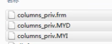
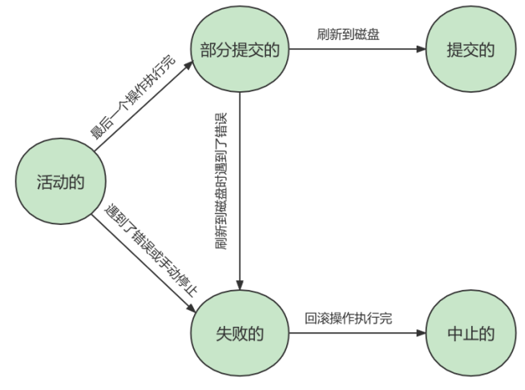
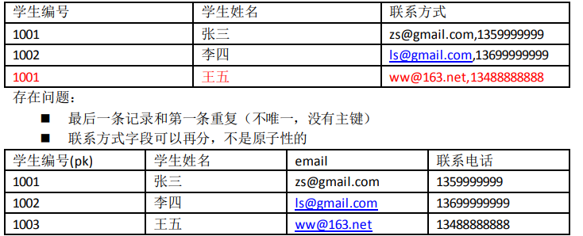
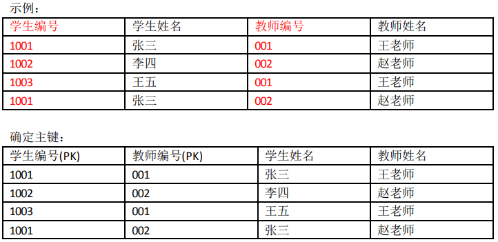
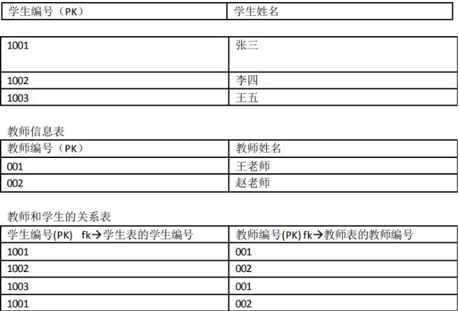
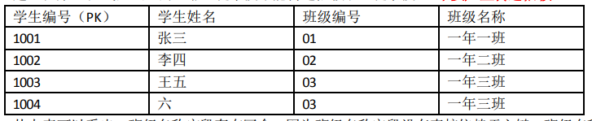
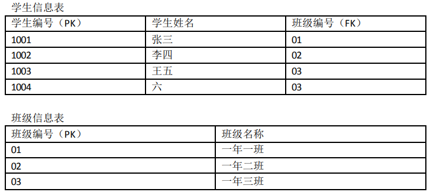

# MySQL概述

- DB：database，看做是数据库文件。（类似于：.doc、.txt、.mp3、.avi等）

- DBMS：数据库管理系统。（类似于word工具、wps工具、记事本工具、qq影音播放器等）

- MySQL数据库服务器中安装了MySQL DBMS,使用MySQL DBMS 来管理和操作DB，使用的是SQL语言。

`net stop mysql80`	终止服务
`net start mysql80`	开启服务

**SQL语言在功能上分为三类：**

- DDL（Data Definition Languages  数据定义语言） **CREATE、DROP、ALTER、RENAME、RUNCATE**
- DML（Data Manipulation Language  数据操作语言） **INSERT、DELETE、UPDATE、SELECT**等。
- DCL（Data Control Language  数据控制语言） **GRANT、REVOKE、COMMIT、ROLLBACK、SAVEPOINT**

### 关系型数据库和非关系型数据库

- 关系型数据库(RDBMS)：

  - 最古老的数据库类型，**通过二维表格存储数据结构**

  - 关系型数据库以`行(row)`和`列(column)`的形式存储数据，以便于用户理解。行和列组成表`(table)`，一组表组成库`(database)`
  - 表和表之间的数据记录有关系`(relationship)`。关系型数据库就是建立在关系模型上的数据库

- 非关系型数据库
  - **基于键值对存储数据**
  - 通过减少不常用的功能，使得**性能非常高**

# 基本SELECT语句

```sql
SELECT 字段1,字段2,... FROM 表名
```

1. **Windows系统中的SQL语句不区分大小写**
2. **字符串用单引号’**


- **列的别名	AS**	

1.(alias 别名) 可以省略
2.列(字段)的别名可以使用""引起来

```sql
SELECT employee_id ID,last_name AS 姓,salary "工资"
FROM employees;
```

- **去除重复行	DISTINCT**

```sql
SELECT DISTINCT department_id 
FROM employees;
```

- **空值参与运算**

所有运算符或列值遇到null值，运算的结果都为null

```sql
SELECT employee_id,salary 月工资,salary * (1 + commission_pct) * 12 "年工资",commission_pct
FROM employees;
```

**解决方案	IFNULL**

```sql
SELECT employee_id,salary 月工资,salary * (1 + IFNULL(commission_pct,0)) * 12 "年工资",commission_pct
FROM employees;
```

注意
1.MySQL中，null不等于空字符串。一个空字符串的长度是0，而一个空值的长度是空
2.MySQL中，空值是占用空间的

- **着重号 ``**

出现名字和sql语言中的**关键字重名**的现象，用``处理

```sql
SELECT * FROM ORDER;# 这里order表名和ORDER关键字冲突
SELECT * FROM `order`;#正确
```

- **查询常数**

在 SELECT 查询结果中增加一列固定的常数列，该常数列的取值可以指定。

```sql
SELECT '西电',employee_id,last_name
FROM employees;
```

- **显示表中字段详细信息	DESCRIBE / DESC**

```sql
DESCRIBE employees;
DESC departments;
```

- **过滤数据	WHERE**

```sql
SELECT * 
FROM employees
WHERE department_id = 90;#过滤条件
```

**CASE WHEN**

CASE WHEN THEN ELSE END

# 运算符

除法	/或DIV
取余	%或MOD

**1.在SQL中，字符串存在隐式转换（字符串尝试转化为数字），如果转换不成功，则为0。如`0 = 'a'`**
**2.运算中存在null时，大多数情况下结果为null（除了安全等于）**

```sql
# 在SQL中，+表示加法，不区分数据类型，会将字符串转化为数值（隐式转换）
SELECT 100 + '1' # 101 Java中结果为1001，相当于字符串的连接
FROM DUAL;
```

## 比较运算符

特殊：
1.**安全等于	<=>**	可以判断null
2.**不等于**	**!= 或 <>**

在SQL中，+表示加法，不区分数据类型，会将字符串转化为数值（隐式转换）

```sql
SELECT 100 + '1' # 101 Java中结果为1001，相当于字符串的连接
FROM DUAL;
```

## 非符号运算符

- **IS NULL\ IS NOT NULL\ ISNULL  判断空值**	

- **LEAST \ GREATEST  最小值\最大值**	

- **BETWEEN A AND B**

- **IN \ NOT IN  判断离散值**

- **LIKE  模糊查询（筛选）**

**另外：**
**%	代表不确定个数的字符**
**_	  代表一个不确定的字符**
**\ 	 转义字符**

```sql
查询第四个字符是_且第五个字符是o的员工
SELECT last_name
FROM employees
WHERE last_name LIKE '___\_o%';
```

## 逻辑运算符

|   运算符   | 作用 |
| :--------: | :--: |
|  NOT 或 !  |  非  |
| AND 或 &&  |  与  |
| OR 或 \|\| |  或  |
|    XOR     | 异或 |

# 排序和分页

## ORDER BY

**关键字	ORDER BY	默认升序**

升序:**ASC**
降序:**DESC**

```sql
# 将员工信息先按照部门号一级排序，再根据工资二级排序
SELECT employee_id,department_id,salary
FROM employees
ORDER BY department_id DESC,salary ASC;
```

##  LIMIT

如果查询结果返回的记录太多，采用分页的方式，每次只返回特定页数的数据。

**关键字 LIMIT**
格式：`LIMIT 位置偏移量, 条目数`

**注意：**
**1.位置偏移量 -1 表示真实位置**
**2.LIMIT子句必须放在SELECT语句的最后**

```sql
# 取工资大于6000的员工按工资升序排列，数据为第三页
SELECT employee_id, last_name, salary
FROM employees
WHERE salary>6000
ORDER BY salary ASC
LIMIT 20,10;
```

另外*：关键字OFFSET
`LIMIT 3 OFFSET 4`表示获得从第五条记录开始的后面三条记录

# 多表查询

也称为关联查询，指多个表一起完成查询的操作。需要将关联字段进行连接

**错误方法**

```sql
SELECT employee_id,department_name
FROM employees,departments;# 查询出2889条数据 107*27
```

原因：出现了**笛卡尔积**的错误，即两个表的每个数据都进行了一次匹配,类似于坐标

(两张表进行连接查询，没有任何限制的情况下，查询结果条数为两张表条数的乘积)

**正确方法**    添加**连接条件**

```sql
SELECT T1.employee_id,T2.department_name,T1.department_id
FROM employees T1,departments T2
WHERE T1.department_id = T2.department_id;
```

## 多表查询分类：

###  等值连接和非等值连接

非等值连接即数据的连接条件为一个连续区间而不是特定值

```sql
# 按不同工资等级获取员工信息并升序排列
SELECT e.last_name,e.salary,j.grade_level
FROM employees e, job_grades j
WHERE e.salary BETWEEN j.lowest_sal AND j.highest_sal
ORDER BY grade_level ASC; 
```

### 自连接和非自连接

同一张表中的不同列存在关联，通过这些关联进行的连接是自连接

```sql
# 在同一张表中列出员工和对应管理者的名字及id
SELECT e.employee_id,e.last_name,m.employee_id manager_id,m.last_name
FROM employees e,employees m
WHERE e.manager_id = m.employee_id;
```

### 内连接和外连接

**内连接(INNER JOIN)：两个表在连接过程中，结果中不包含不匹配的行（含null）**

SQL语法中有SQL92 和 SQL99，SQL99语法可读性更好但是语句更“繁琐”

```sql
# 内连接 SQL92语法
SELECT e.last_name,m.last_name manager_name
FROM employees e,employees m
WHERE e.manager_id = m.employee_id;#仅显示106行，内连接（存在一个员工管理者为null）
```

```sql
# SQL99语法实现内连接
SELECT e.last_name,d.department_name,l.city
FROM employees e JOIN departments d
ON e.department_id = d.department_id
JOIN locations l
ON d.location_id = l.location_id;
# 用到哪个表就join哪个，on加连接条件
```

**外连接(OUTER JOIN)：两个表在连接过程中，不论匹配不匹配都会显示该行**

左外连接(LEFT OUTER JOIN)
右外连接(RIGHT OUTER JOIN)
满外连接(FULL OUTER JOIN)

```sql
# 左外连接
SELECT last_name,department_name
FROM employees e LEFT JOIN departments d
ON e.department_id = d.department_id;# 107行 空部门的员工
```

```sql
# 右外连接
SELECT last_name,department_name
FROM employees e RIGHT JOIN departments d
ON e.department_id = d.department_id;# 122行 空员工的部门
```

注意：SQL92不能实现外连接，SQL99可以实现内外连接，但是不能实现满外连接

## SQL99	多表查询

基本语法： **JOIN ON **  结构
JOIN+表，ON+连接条件

```sql
# 标准语言结构
SELECT table1.column, table2.column,table3.column
FROM table1
    JOIN table2 ON table1 和 table2 的连接条件
        JOIN table3 ON table2 和 table3 的连接条件
```

### 七种 SQL JOINS✨


#### UNION 和 UNION ALL

语法格式（即连接SELECT语句）：

```sql
SELECT column,... FROM table1
UNION [ALL]
SELECT column,... FROM table2
```

UNION	并集，会执行去重操作，效率低
UNION ALL	并集，不会执行去重操作，效率高
一般使用后者UNION ALL

例子：

```sql
# 查询哪些部门没有员工
# 右外连接
SELECT d.department_id,d.department_name,e.employee_id
FROM employees e RIGHT OUTER JOIN departments d
ON e.department_id = d.department_id
WHERE e.employee_id IS NULL;
# 左外连接
SELECT d.department_id,e.department_id,d.department_name,e.employee_id
FROM departments d LEFT JOIN employees e
ON e.department_id = d.department_id
WHERE e.department_id IS NULL

# 说明：e.department_id和e.employee_id都可作为最后的判断条件。
# 因为外连接后新增的16条数据的e.department_id和e.employee_id都为null
```

需注意：连接条件e.department_id = d.department_id并不是将两边合并，结果表中同时存在e.department_id 和 d.department_id，只是前者新增了16行空值(e.employee_id同样)

# 聚合函数

**注意：MySQL中聚合函数不能嵌套**

**AVG()** 均值

**SUM()** 求和

**MAX()**	 **MIN()**  极值

## COUNT

统计表中的记录数，一般使用`COUNT(*)`

## GROUP BY

将表中数据分成若干组

```sql
# 查询不同部门下的平均工资
SELECT department_id,AVG(salary)
FROM employees
GROUP BY department_id;
```

```sql
# 错误的,因为工种和部门不是唯一对应的，而结果仅显示一个工种
SELECT department_id,job_id,AVG(salary)
FROM employees
GROUP BY department_id;
```

**结论：**
**1.SELECT中出现的非组函数字段必须声明在GROUP BY中，而GROUP BY中声明的字段可以不出现在SELECT中**
**2.GROUP BY声明在FROM、WHERE后面，ORDER BY、LIMIT前面**

## HAVING

在分组的基础上进行过滤

```sql
SELECT   department_id, MAX(salary)
FROM     employees
GROUP BY department_id
HAVING   MAX(salary)>10000;
```

**注意：**
1.**HAVING使用的基础是GROUP BY**，必须在分组的基础上进行过滤
2.聚合函数只能在HAVING中声明，WHERE中不能使用聚合函数
3.HAVING声明在GROUP BY后

**WHERE和HAVING的对比：**
1.WHERE可以直接使用表中的字段作为筛选条件，但不能使用与分组结果相关的函数作为筛选条件；HAVING则必须与GROUP BY配合使用，可以使用分组相关的函数或字段作为筛选条件。
2.对于数据的处理，WHERE是先筛选后连接，效率高；HAVING是先连接后筛选，效率低。

原因：WHERE 在 GROUP BY 之前，所以无法对分组结果进行筛选。HAVING 在 GROUP BY 之后，在需要对数据进行分组统计的时候，HAVING 可以完成 WHERE 不能完成的任务（可以使用分组字段和分组中的计算函数）。

**开发中的选择：**

1.可以同时使用WHERE和HAVING
2.过滤条件中无聚合函数时，使用WHERE，有聚合函数时，聚合函数必须使用HAVING修饰

## SELECT执行过程

### SQL92 & 99 结构

```sql
#SQL92：
SELECT ...,....,...
FROM ...,...,....
WHERE 多表的连接条件
AND 不包含组函数的过滤条件
GROUP BY ...,...
HAVING 包含组函数的过滤条件
ORDER BY ... ASC/DESC
LIMIT ...,...

#SQL99：
SELECT ...,....,...
FROM ... JOIN ... 
ON 多表的连接条件
JOIN ...
ON ...
WHERE 不包含组函数的过滤条件
AND/OR 不包含组函数的过滤条件
GROUP BY ...,...
HAVING 包含组函数的过滤条件
ORDER BY ... ASC/DESC
LIMIT ...,...
```

### 执行顺序

FROM -> WHERE -> GROUP BY -> HAVING -> SELECT 的字段 -> DISTINCT -> ORDER BY -> LIMIT

**举例：**

```sql
SELECT DISTINCT player_id, player_name, count(*) as num # 顺序 5
FROM player JOIN team ON player.team_id = team.team_id # 顺序 1
WHERE height > 1.80 # 顺序 2
GROUP BY player.team_id # 顺序 3
HAVING num > 2 # 顺序 4
ORDER BY num DESC # 顺序 6
LIMIT 2 # 顺序 7
```

在SELECT语句执行过程中，每个步骤都会产生一个隐含的**虚拟表**，然后将这个虚拟表传入下一个步骤中作为输入。

# 子查询

即 嵌套查询

子查询（内查询）在主查询（外查询）之前执行一次

```sql
# 查询比Abel工资高的员工
SELECT last_name,salary
FROM employees
WHERE salary > (
		SELECT salary
		FROM employees
		WHERE last_name = 'Abel'
		);
```

## 子查询分类

1.**单行子查询、多行子查询**
区分：查询结果返回一条还是多条记录
2.**关联子查询、非关联子查询**

```sql
# 显式员工的employee_id,last_name和location。其中，若员工department_id与location_id为1800的department_id相同，则location为’Canada’，其余则为’USA’

SELECT employee_id,last_name,CASE department_id WHEN (
							SELECT department_id
							FROM departments
							WHERE location_id = 1800
							) THEN 'Canada'
							ELSE 'USA' END 'location'
FROM employees
```

注意：
在SELECT中，除了在`group by`和`limit`之外，其他位置都可以声明子查询

## 子查询操作符

`IN`	等于列表中任意一个

`ANY`	和单行比较操作符一起使用，比较子查询返回的某一个值

`ALL`	和单行比较操作符一起使用，比较子查询返回的所有值

## EXISTS

`EXIST`和`NOT EXIST`

检查子查询中是否存在满足条件的行并返回true或false

# 创建和管理表

从系统架构来看，MySql数据库系统从大到小依次是`数据库服务器`、`数据库`、`数据表`、`数据表中行与列`

## 创建数据库

```sql
数据库创建方式
#方式1：创建数据库
CREATE DATABASE 数据库名;
#方式2：创建数据库并指定字符集
CREATE DATABASE 数据库名 CHARACTER SET 字符集;
#方式3：判断数据库是否已经存在，不存在则创建数据库（推荐）
CREATE DATABASE IF NOT EXISTS 数据库名;
```

注意：
DATABASE 不能改名。一些可视化工具可以改名，它是建新库，把所有表复制到新库，再删旧库完成的。

## 使用数据库

```sql
# 查看当前所有的数据库
SHOW DATABASES# 有一个s，代表多个数据库

# 查看当前正在使用的数据库
SELECT DATABASE()# 使用的MySql中一个的全局变量

# 查看指定库下所有的表
SHOW TABLES FROM 数据库名

# 查看数据库的创建信息
SHOW CREATE DATABASE 数据库名
SHOW CREATE DATABASE 数据库名\G

# 使用/切换数据库
USE 数据库名
```

## 修改数据库

```sql
# 更改数据库字符集
ALTER DATABASE 数据库名 CHARACTER SET 字符集
```

## 删除数据库

```sql
# 删除指定数据库
DROP DATABASE 数据库名
DROP DATABASE IF EXISTS 数据库名（推荐）
```

## 创建表

前提：
必须有CREATE TABLE权限

**方式一  直接创建**

```sql
CREATE TABLE [IF NOT EXISTS] 表名(
字段1, 数据类型 [约束条件] [默认值],
字段2, 数据类型 [约束条件] [默认值],
字段3, 数据类型 [约束条件] [默认值],
……
[表约束条件]
);
```

注意：
1.加上了IF NOT EXISTS，则表示：如果当前数据库中不存在该表则创建数据表，如果存在则不创建数据表
2.创建时，必须指明：表名、列名、数据类型、长度

**方式二  根据现有的表创建**

```sql
# 例：复制employees表，包括数据
CREATE TABLE employees_copy
AS
SELECT *
FROM employees;
```

## 修改表

在表中 `增删改查` 字段

```sql
ALTER TABLE myemp2
ADD salary DOUBLE(10,2);# 默认添加在末尾（小数点前8位，后2位）
DESC myemp2;

# 修改一个字段：数据类型、长度、默认值
ALTER TABLE myemp2
MODIFY last_name VARCHAR(25) DEFAULT 'Aa';# 更改字符串长度和默认值

# 重命名一个字段
ALTER TABLE myemp2
CHANGE salary monthly_salary DOUBLE(10,2);

ALTER TABLE myemp2
CHANGE email e_number VARCHAR(50);

# 删除一个字段
ALTER TABLE myemp2
DROP COLUMN e_number;

# 重命名表
RENAME TABLE myemp2
TO myemp3;
```

## 删除表

```sql
# 删除表
DROP TABLE IF EXISTS myemp2

# 清空表
TRUNCATE TABLE employees_copy;
```

**TRUNCATE TABLE和DELETE FROM区别**

相同点:
都可以实现对表中所有数据的删除，同时保留表结构。

不同点:
TRUNCATE TABLE:一旦执行此操作，表数据全部清除。同时，数据是不可以回滚的。
DELETE FROM:一旦执行此操作，表数据可以全部清除（不带WHERE)。同时，数据是可以实现回滚

## COMMIT & ROLLBACK

COMMIT:提交数据。
一旦执行COMMIT，数据就被永久的保存在了数据库中，意味着数据不可以回滚。
ROLLBACK:回滚数据。
一旦执行ROLLBACK，则可以实现数据的回滚。回滚到最近的一次COMMIT之后。

**DDL和DML的说明**

DDL的操作一旦执行，就不可回滚。（DDL执行完一次后，会自动COMMIT）

DML的操作默认情况下，一旦执行，也是不可回滚的。但是，如果在执行DNL之前，执行了`SET autocommit = FALSE`，则执行的DML操作就可以实现回滚。

# 数据类型

| 整数类型             | TINYINT、SMALLINT、MEDIUMINT、INT、BIGINT                    |
| -------------------- | ------------------------------------------------------------ |
| **浮点类型**         | **FLOAT、DOUBLE**                                            |
| **定点数类型**       | **DECIMAL**                                                  |
| **位类型**           | **BIT**                                                      |
| **日期类型**         | **YEAR、TIME、DATE、DATETIME、TIMESTAMP**                    |
| **文本字符串类型**   | **CHAR、VARCHAR、TINYTEXT、TEXT、MEDIUMTEXT、LONGTEXT**      |
| **枚举类型**         | **ENUM**                                                     |
| **集合类型**         | **SET**                                                      |
| **二进制字符串类型** | **BINARY、VARBINARY、TINYBLOB、BLOB、MEDIUMBLOB、LONGBLOB**  |
| **JSON类型**         | **JSON对象、JSON数组**                                       |
| **空间数据类型**     | **单值类型：GEOMETRY、POINT、LINESTRING、POLYGON；<br />集合类型：MULTIPOINT、MULTILINESTRING、MULTIPOLYGON、 GEOMETRYCOLLECTION** |

关于**浮点数和定点数**，需要注意：
1.浮点数不准确，一般会产生误差。所以一般采用定点数DECIMAL
2.使用 DECIMAL(M,D) 的方式表示高精度小数。其中，M被称为精度，D被称为标度。0<=M<=65， 0<=D<=30，D<M。例如：DECIMAL(5,2)，表示该列取值范围是-999.99 ~ 999.99。
3.浮点数优点是取值范围大，但是不精准；定点数取值范围相对小，但是精准，没有误差。

# 约束

**表中数据的限制条件**。保证表中记录的完整性和有效性。

分类：

- **主键约束(primary key)**

  主键约束是一个列或多个列的组合，**主键值是每一条记录的唯一性标识**，方便快速查询。**主键约束 = 唯一约束 + 非空约束**，即主键列不允许出现重复也不允许出现空值。在实际开发中，任何一张表都应该有主键。

  ```sql
  # 创建主键约束
  create table emp3( 
    name varchar(20), 
    deptId int, 
    salary double, 
    primary key(name,deptId)
  );
  # 删除主键约束
  alter table emp1 drop primary key;
  ```

- **自增长约束(auto_increment)**

  一般搭配主键约束，主键定义为自增长后，就不需要用户输入数据了。每增加一条记录主键会以相同的步长自增。

- **非空约束(not null)**

- **唯一性约束(unique)**

- 默认约束(default)

- 零填充约束(zerofill)

- **外键约束(foreign key)**

  将数据库中两个表通过某个列建立联系。

  子表外键引用父表中的某个字段。

  ```sql
  create table t_class (
  	cid int primary key,
      cname varchar(255)
  );# 父表
  create table t_student (
  	sid int primary key auto_increment,
      name varchar(255),
      cid int,
      foreign key(cid) reference t_class(cid)
  );# 子表
  ```

# 存储引擎

`ENGINE`指定存储引擎 (MySQL**默认InnoDB**)

`CHARSET`指定字符集 (MySQL**默认UTF-8**)

```sql
# 建表时可以在末尾指定存储引擎和字符集
create table t_emp (
	id int primary key,
    name varchar(255)
) engine = InnoDB default charset = UTF8
```

MySQL支持9大存储引擎

### MyISAM存储引擎

> MyISAM存储的表以三种文件的形式存储：
>
> 1. 格式文件 - 存储表结构的定义(.frm)
> 2. 数据文件 - 存储表行的内容(.MYD)
> 3. 索引文件 - 存储表的索引(.MYI)



**MyISAM存储引擎的特点：**

- **可以被转换为压缩、只读表来节省空间**。这是这种存储引擎的优势。
- MyISAM不支持事务机制，安全性低

### InnoDB

MySQL默认存储引擎

> InnoDB特征：
>
> 1. 每个 InnoDB 表以.frm 格式存储
> 2. 支持事务机制，可以在数据库崩溃后自动恢复
> 2. 表空间(tablespace)用于存储表的数据和索引
> 2. 行级锁定

**总结：InnoDB最大的特点就是支持事务，可保证数据的安全，但是效率并不高，并且也不能进行压缩以及转换为只读，因此不能很好的节省存储空间。**

### MEMORY

MEMORY存储引擎将表数据和索引**存储在内存**中，并且行的长度固定。因此，MEMORY存储引擎很快。

> MEMORY存储引擎管理的表具有以下特征：
>
> 1. 每个 MEMORY 表以.frm 格式存储
> 2. 表数据和索引存储在内存中
> 3. 表级锁机制

MEMORY引擎以前被称为HEAP引擎

总结：

- 优点：MEMORY查询效率最高(不需要IO)
- 缺点：不安全，关机之后数据消失

# 事务

事务就是一个完整的业务逻辑

> 举例：
>
> a账户转账至b账户，该操作是一个工作单元，**要么同时成功要么同时失败**，不可再分。

**只有DML(INSERT DELETE UPDATE)语句才会有和事务有关系**，因为这三个是操作数据库表中数据进行增删改的。

总结：事务就是指多个DML语句同时成功或同时失败。

- 存储引擎和事务

**只有InnoDB存储引擎支持事务**，并提供一组用于记录事务性活动的日志文件。

在事务的执行过程中，每一条DML操作都会记录到“事务性活动的日志文件”中。

## 提交和回滚

- **提交事务(COMMIT)：清空事务性活动的日志文件，将数据全部持久化到数据库表中**
  - **提交事务意味着事务的结束，并且是一种全部成功的结束。**

- **回滚事务(ROLLBACK)：将之前所有的DML操作全部撤销，并且清空事务性活动的日志文件**
  - **回滚事务标志着事务的结束，并且是一种全部失败的结束。**

MySQL中默认的事务行为是自动提交的，即每执行一条DML语句，就提交一次。但是这种提交不符合开发习惯，通常一个业务需要多条DML语句共同执行才能完成的，而且必须同时成功之后才能提交，所以不能执行一条语句就提交。

## 开启事务

**`START TRANSACTION`或 `BEGIN`:开启事务机制(关闭自动提交)**

①`READ ONLY`：标识当前事务是一个只读事务，也就是属于该事务的数据库操作只能读取数据，而不 能修改数据。

②`READ WRITE`：标识当前事务是一个读写事务，也就是属于该事务的数据库操作既可以读取数据， 也可以修改数据。

③`WITH CONSISTENT SNAPSHOT`：启动一致性读。

## 事务特性(ACID)

- **原子性(Atomicity)**

  事务是最小的单元，**不可再分**

- **一致性(Consistency)**

  在同一个事务中，所有操作必须**同时成功或同时失败**，以保证数据的一致性

- **隔离性(Isolation)**

  **一个事务不会影响其他事务的运行**。即一个事务内部的操作及使用的数据对并发的其他事务是隔离的，**并发执行的各个事务之间不能互相干扰**。

- **持久性(Durability)**

  在事务完成以后，该事务对数据库所作的更改将**持久地保存**在数据库中，不会被回滚。
  
  其中，持久性是通过**事务日志**来保证的。日志包括了**重做日志**和**回滚日志**。当我们通过事务对数据进行修改的时候，首先会将数据库的变化信息记录到重做日志中，然后再对数据库中对应的行进行修改。因此即使数据库系统崩溃，数据库重启后也能找到没有更新到数据库系统中的重做日志，重新执行，从而使事务具有持久性。

## 事务的状态

MySQL根据操作执行的不同阶段，把事务大致划分成几个状态：

- 活动的

事务对应的数据库操作正在执行过程中时，我们就说该事务处在活动的状态。

- 部分提交的

当事务中的最后一个操作执行完成，但由于操作都在内存中执行，所造成的影响并没有刷新到磁盘时，我们就说该事务处在 部分提交的 状态。 

- 失败的

当事务处在 活动的 或者 部分提交的 状态时，可能遇到了某些错误（数据库自身的错误、操作系统 错误或者直接断电等）而无法继续执行，或者人为的停止当前事务的执行，我们就说该事务处在 失败的 状态。

- 中止的

如果事务执行了一部分而变为 失败的 状态，那么就需要把已经修改的事务中的操作还原到事务执 行前的状态。换句话说，就是要撤销失败事务对当前数据库造成的影响。我们把这个撤销的过程称 之为 回滚 。当 回滚 操作执行完毕时，也就是数据库恢复到了执行事务之前的状态，我们就说该事 务处在了 中止的 状态。

- 提交的

当一个处在 部分提交的 状态的事务将修改过的数据都 同步到磁盘 上之后，我们就可以说该事务处 在了 提交的 状态。



### 4个隔离级别

按照从低到高的隔离级别

- **读未提交(read uncommited)**

  事务A可以读取到事务B未提交的数据(脏读)

  这种隔离级别存在的脏读问题(Dirty Read)，即读到了脏数据。

- **读已提交(read commited)**

  事务A只能读取到事务B已提交的数据(Oracle默认隔离级别)

  解决了脏读问题，但是存在不可重复读取数据的问题，即两次执行同样的查询，可能有不同的结果。

- **可重复读(repeatable read)**

  事务A开启之后，每次在事务A中读取到的数据都是一致的，即使事务B修改并提交了数据，事务A读取到的数据仍然不变(MySQL默认隔离级别)

  解决了不可重复读现象，但是存在幻读现象，即，每一次读到的数据都是幻象，不够真实

- **序列化/串行化(serializable)**

  最高的隔离级别，效率最低。这种隔离级别表示事务排队，不能并发。每次读取到的数据都是最真实的。


# 索引

索引被用来快速找出特定的行。没有索引，MySQL 不得不首先以第一条记录开始，然后读完整个表直到它找出相关的行。表越大，花费时间越多。

对于一个有序字段，可以运用二分查找（Binary Search），这就是为什么性能能得到本质上的提高。**MYISAM 和 INNODB 都是用 B+Tree 作为索引结构**

**主键和unique 都会默认的添加索引**

- 创建索引

  ```sql
  # 基本
  CREATE INDEX indexName ON table_name (column_name)；
  # 修改表结构后添加索引
  ALTER table tableName ADD INDEX indexName(columnName)；
  # 创建表时指定索引
  CREATE TABLE mytable(  
      ID INT NOT NULL,   
      username VARCHAR(16) NOT NULL,  
      INDEX [indexName] (username(length))  
  ); 
  ```

- 删除索引

  ```sql
  DROP INDEX [indexName] ON mytable;
  ```

- 显示索引

  ```sql
  SHOW INDEX FROM table_name
  ```

# 视图

视图是一种根据查询（也就是 SELECT 表达式）定义的数据库对象，用于获取想要看到和使用的局部数据。

为什么使用视图？在开发过程中select语句可能需要在多个地方使用，如果频繁的拷贝，会给维护带来成本，视图可以解决这个问题。

即，视图相当于把select语句封装起来

- 创建视图

  ```sql
  # 原select语句
  select ename,dname,sal,hiredate,e.deptno
  from emp e,dept d
  where e.deptno=e.deptno and e.deptno=10;
  
  # 创建视图
  create view v_dept_emp as
  select ename,dname,sal,hiredate,e.deptno
  from emp e,dept d
  where e.deptno=e.deptno and e.deptno=10;
  ```

- 修改视图

  ```sql
  alter view v_dept_emp as
  select ename,dname,sal,hiredate,e.deptno
  from emp e,dept d
  where e.deptno=20;
  ```

- 删除视图

  ```sql
  drop view if exists v_dept_emp;
  ```

# 数据库设计三范式

数据库表的设计依据，相当于设计规范

- **第一范式：要求任何一张表必须有主键，每一个字段原子性不可再分**
- **第二范式：在第一范式基础上，要求所有非主键字段完全依赖主键，不要产生部分依赖**
- **第三范式：在第二范式基础上，要求所有非主键字段直接依赖主键，不要产生传递依赖**

## 第一范式

数据库表中不能出现重复记录，每个字段是原子性的不能再分



## 第二范式

第二范式是建立在第一范式基础上的，另外要求所有非主键字段完全依赖主键，不能产生部分依赖



虽然确定了主键，但此表会出现大量的冗余，主要涉及到的冗余字段为“学生姓名”和“教师姓名”，出现冗余的原因在于，学生姓名部分依赖了主键的一个字段学生编号，而没有依赖教师编号，而教师姓名部门依赖了主键的一个 字段教师编号，这就是第二范式的**部分依赖**。

解决方案：多对多，建立三个表



## 第三范式

建立在第二范式基础上的，非主键字段不能传递依赖于主键字段。（不要产生传递依赖）



满足一二范式，不满足第三范式。存在**传递依赖，即：班级名称字段依赖于班级编号， 班级编号依赖于学生编号(班级名称->班级编号->学生编号)**



