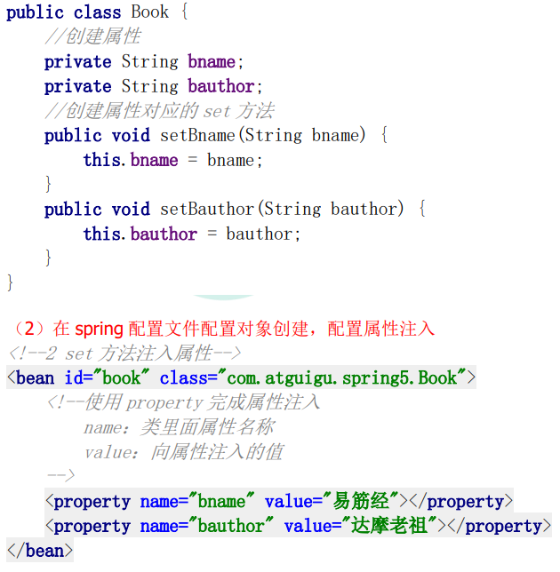
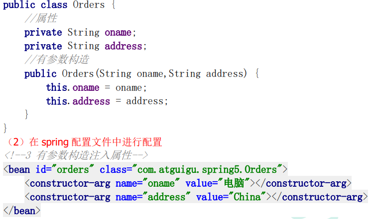
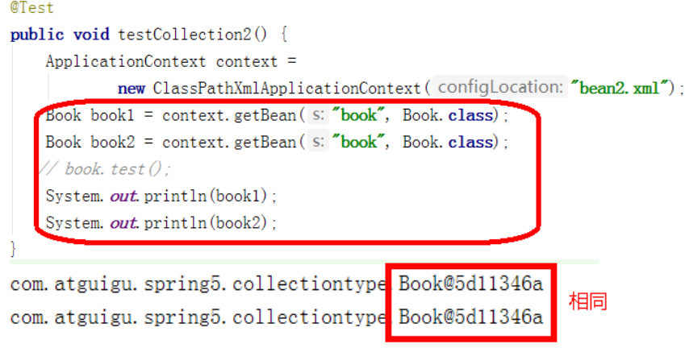
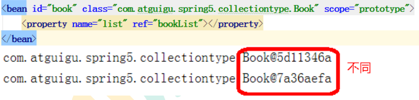
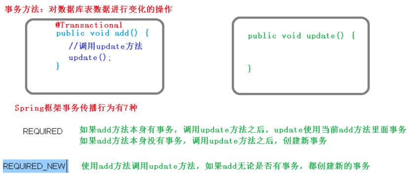
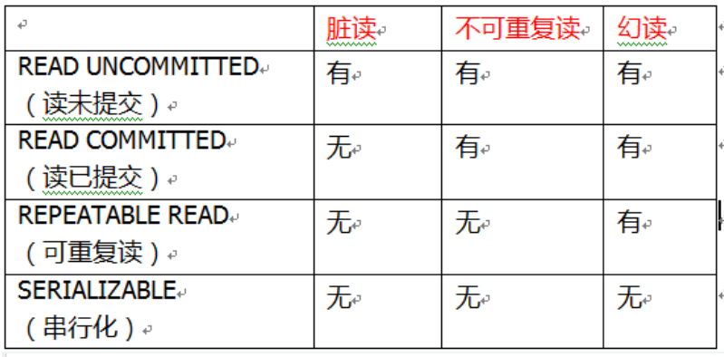

**三层架构分为表述层（或表示层）、业务逻辑层、数据访问层，表述层表示前台页面和后台servlet**

# Spring

Spring框架是开源的J2EE应用程序框架，是**针对bean的生命周期**进行管理的轻量级**容器**。用于**降低企业应用开发的复杂性，方便解耦**

- Spring有两个核心部分：IOC和Aop

**IOC	控制反转，把创建对象和调用对象的过程交给Spring管理**
**AOP	面向切面，不修改源代码进行功能增强**

## IOC

**底层原理：**
**xml解析、工厂模式、反射**

Spring 提供 IOC 容器实现两种方式：（两个接口）

（1）BeanFactory：IOC容器基本实现，是 Spring内部的使用接口，不提供开发人员进行使用 		加载配置文件时候不会创建对象，在获取对象（使用）才去创建对象 
（2）ApplicationContext：BeanFactory接口的子接口，提供更多更强大的功能，一般由开发人员进行使用
		加载配置文件时候就会把在配置文件对象进行创建

### Bean管理（xml）

> Bean管理指的是两种操作
> 1.Spring创建对象	2.Spring注入属性

> Bean管理的**操作方式**
> 1.基于**xml配置文件**实现	2.基于**注解**实现

#### 基于**xml配置文件**实现

1.创建对象

`<bean id = "user" class = "myProject.User"></bean>`

- 在 Spring 配置文件中，使用 bean 标签，标签里面添加对应属性，就可以实现对象创建
- 在 bean 标签常用属性

​		id 属性：唯一标识		class 属性：类全路径（包类路径）

- 默认执行无参数构造方法完成对象创建

2.注入属性

通过依赖注入（DI），就是注入属性

> 第一种注入方法：**set方法注入**
>
> 
>
> 第二种注入方法：**有参构造注入**
>
> 

#### xml注入其他类型属性

- null	`<null/>`

- 特殊符号	`<![CDATA[<<南京>>]]>`

​		也可以将<>进行转义 `&lt`、`&gt`

------

**外部bean**

```xml
<bean id = "userService" class = "service.UserService">
    <!--注入 userDao 对象
     name 属性：类里面属性名称
     ref 属性：创建 userDao 对象 bean 标签 id 值-->
    <property name = "userDao" ref = "userDaoImpl"></property>
</bean>
<bean id = "userDaoImpl" class = "dao.UserDaoImpl"></bean>
```

**内部bean**

```xml
<bean id="emp" class="com.atguigu.spring5.bean.Emp">
     <!--设置两个普通属性-->
     <property name="ename" value="lucy"></property>
     <property name="gender" value="女"></property>
    
     <!--设置对象类型属性-->
     <property name="dept">
         <bean id="dept" class="com.atguigu.spring5.bean.Dept">
         <property name="dname" value="安保部"></property>
         </bean>
     </property>
</bean>
```

**级联赋值**

```xml
<bean id="emp" class="com.atguigu.spring5.bean.Emp">
     <!--设置两个普通属性-->
     <property name="ename" value="lucy"></property>
     <property name="gender" value="女"></property>
     <!--级联赋值-->
     <property name="dept" ref="dept"></property>
</bean>

<bean id="dept" class="com.atguigu.spring5.bean.Dept">
     <property name="dname" value="财务部"></property>
</bean>
```

#### xml注入集合属性

```xml
<bean id="stu" class="collectiontype.Stu">
     <!--数组类型属性注入-->
     <property name="courses">
         <array>
         <value>java 课程</value>
         <value>数据库课程</value>
         </array>
     </property>
     <!--list 类型属性注入-->
     <property name="list">
         <list>
         <value>张三</value>
         <value>小三</value>
         </list>
     </property>
     <!--map 类型属性注入-->
     <property name="maps">
         <map>
         <entry key="JAVA" value="java"></entry>
         <entry key="PHP" value="php"></entry>
         </map>
     </property>
     <!--set 类型属性注入-->
     <property name="sets">
         <set>
         <value>MySQL</value>
         <value>Redis</value>
         </set>
     </property>
</bean>
```

- 使用util标签完成list

#### FactoryBean

Spring中有两种bean，**普通bean**和**工厂bean（FactoryBean）**

- **普通bean：在配置中定义bean类型和返回值类型相同**
- **工厂bean：在配置文件中定义的bean类型和返回值类型不同**

#### 单实例和多实例

在Spring中，创建bean实例默认是**单实例**



- scope属性：用于设置单实例/多实例

**`scope = singleton`	表示单实例**

**`scope = prototype`	表示多实例**



- singleton 和 prototype 区别

1.singleton 单实例，prototype 多实例
2.**`scope = singleton` 时，加载 spring 配置文件时会创建单实例对象**
   **`scope = prototype` 时，加载 spring 配置文件时不创建对象，而在调用 getBean 方法时候创建多实例对象**

#### bean生命周期

从对象创建到销毁的过程

> bean生命周期
>
> 1.通过构造器创建bean实例
> 2.设置属性值（调用set方法）
> 3.执行初始化方法
> 4.获取bean实例对象
> 5.容器关闭时，调用bean的销毁方法

#### xml自动装配

根据装配规则，Spring自动将匹配的属性值进行注入

bean标签属性**autowire**，配置自动装配

> autowire常用值：
>
> 1. **byName** 根据属性名称注入
>
> 2. **byType**   根据属性类型注入

### Bean管理（注解）

注解：
（1）注解是代码特殊标记
（2）使用注解，注解可以作用在类上面，方法上面，属性上面
（3）使用注解目的：简化 xml 配置

Spring针对Bean管理中创建对象提供注解
（1）**@Component**
（2）**@Service**
（3）**@Controller**
（4）**@Repository**
上面四个注解功能是一样的，都可以用来创建bean实例

## AOP

**面向切面编程，利用AOP可以对业务逻辑的各个方面进行隔离，从而降低各部分之间的耦合度，提高程序的可重用性，提高开发效率。**

即：**不修改源码的前提下，在主干功能里添加新功能，用以增强原有方法**

> AOP底层使用**动态代理**
>
> 1.**有接口，使用JDK动态代理**。
>
> ​				通过创建接口实现类代理对象，增强类的方法
>
> 2.**没有接口，使用CGLIB动态代理**。
>
> ​				创建**子类代理对象**，增强类的方法

### JDK动态代理

使用`Proxy`类的方法创建代理对象

`java.lang.reflact.Proxy`

调用newProxyInstance方法

```java
static Object new ProxyInstance(ClassLoader loader, 类<?>[] interfaces, InvocationHandler h)

//返回指定接口的代理实现类实例，该方法调用分派给指定的调用处理程序
    
//loader 类加载器
//interfaces 增强方法所在的类，这个类实现的接口，支持多个接口
//h 实现这个接口 InvocationHandler，创建代理对象，写增强的部分
```

### AOP操作

> 术语：
> 1.**连接点**	类中可以被增强的方法被称为连接点
> 2.**切入点**	实际被增强的方法
> 3.**通知**		实际增强的逻辑部分称为通知
>    分类：前置通知、后置通知、环绕通知、异常通知、最终通知
> 4.**切面**		把通知应用到切入点的过程

Spring框架一般基于**AspectJ**实现AOP操作。AspectJ不是Spring组成部分。

#### AspectJ实现AOP操作

1.基于xml配置文件实现
2.基于注解实现

**切入点表达式**
利用切入点表达式，对需要增强的方法进行定位

语法结构：`execution([权限修饰符][返回类型][类全路径][方法][参数列表])`

```txt
举例 1：对 com.atguigu.dao.BookDao 类里面的 add 进行增强
execution(* com.atguigu.dao.BookDao.add(..))

举例 2：对 com.atguigu.dao.BookDao 类里面的所有的方法进行增强
execution(* com.atguigu.dao.BookDao.* (..))

举例 3：对 com.atguigu.dao 包里面所有类，类里面所有方法进行增强
execution(* com.atguigu.dao.*.* (..))
```

## JdbcTemplate

Spring框架对JDBC进行封装，使用JdbcTemplate对数据库操作

> 步骤
>
> 1.配置数据库连接池
> 2.`dao`  `daoImpl`  `service` 
> `daoImpl`加注解`@Repository`，注入`JdbcTemplate`，重写方法
> `service`加注解`@Service`
> 3.`test`
> `ApplicationContext`  `ClassPathXmlApplicationContext`  `getBean`

增删改`update(String sql, Object... args)`

查：`queryForObject(String sql, RowMapper<T> rowMapper, Object... args)`

## 事务

**事务是数据库操作最基本的单元，逻辑上一组操作，必须都成功或者都失败。**

例子：银行转账

**事物的特性：ACID**
**原子性、一致性、隔离性、持久性**

### Spring事务管理

在Spring进行事务管理操作有两种方式：

**编程式事务管理**和**声明式事务管理**

编程式事务管理：
即通过try-catch等直接编程方式管理事务

> 1.开启事务 2.业务操作 3.没有异常则提交事务，有异常则回滚事务

#### 声明式事务管理
1.基于**注解**方式
2.基于 xml 配置文件方式

**在 Spring 进行声明式事务管理，底层使用 AOP 原理**

**使用注解`@Transactional`**配置事务

Transaction参数

- propagation：事务传播行为

多个事务直接进行调用的管理过程




- ioslation：事务隔离级别

事务的特性称为隔离性，多个事务操作不会产生影响

三个读问题：**脏读、不可重复读、虚读**

1. 脏读：一个未提交的事务读取到另一个未提交的事务的数据
2. 不可重复读：一个未提交事务读取到另一个提交事务修改数据
3. 虚读：一个未提交事务读取到另一提交事务添加数据

通过设置事务隔离级别解决读问题



- timeout：超时时间

1.事务需要在一定时间内进行提交，如果不提交进行回滚
2.默认值是 -1 ，设置时间以秒单位进行计算

- readOnly：是否只读

1.读：查询操作，写：添加修改删除操作
2.readOnly 默认值 false，表示可以查询，可以添加修改删除操作
3.设置 readOnly 值是 true，设置成 true 之后，只能查询

- rollbackFor：回滚
- noRollbackFor：不回滚

# Spring MVC

https://mowangblog.github.io/SpringMVC-Demo/#/?id=agt%e6%b7%bb%e5%8a%a0web%e6%a8%a1%e5%9d%97

## MVC

MVC是一种软件架构的思路，将软件分为**模型、视图、控制器**

- **M	Model，模型层，如JavaBean，用于处理数据**
- **V	  View，视图层，如html、jsp，作用是与用户进行交互和展示数据**
- **C	  Control，控制层，如servlet，作用是接收请求和响应浏览器**

**MVC工作流程**：
用户通过视图层发送请求到服务器，在服务器中请求被Controller接收，Controller调用响应Model层处理请求，处理完毕后将结果返回Controller，Controller再根据请求处理的结果找到相应的View视图，渲染数据后最终响应给浏览器

**Spring MVC 是 Spring的子项目**

## 创建工程

用maven管理项目，步骤：

1.引入依赖

```xml
<dependencies>
    <!-- SpringMVC -->
    <dependency>
        <groupId>org.springframework</groupId>
        <artifactId>spring-webmvc</artifactId>
        <version>5.3.1</version>
    </dependency>

    <!-- 日志 -->
    <dependency>
        <groupId>ch.qos.logback</groupId>
        <artifactId>logback-classic</artifactId>
        <version>1.2.3</version>
    </dependency>

    <!-- ServletAPI -->
    <dependency>
        <groupId>javax.servlet</groupId>
        <artifactId>javax.servlet-api</artifactId>
        <version>3.1.0</version>
        <scope>provided</scope>
    </dependency>

    <!-- Spring5和Thymeleaf整合包 -->
    <dependency>
        <groupId>org.thymeleaf</groupId>
        <artifactId>thymeleaf-spring5</artifactId>
        <version>3.0.12.RELEASE</version>
    </dependency>
</dependencies>
```

2.配置web.xml

位于WEB-INF下，需要在web.xml中注册**前端控制器`DispatcherServlet`**，**对浏览器发送的请求进行统一处理**

前端控制器的配置：

```xml
<!--配置servlet前端控制器，对浏览器发送的请求进行统一处理-->
<servlet>
    <servlet-name>SpringMVC</servlet-name>
    <servlet-class>org.springframework.web.servlet.DispatcherServlet</servlet-class>

    <!--配置SpringMVC配置文件的位置和名称-->
    <init-param>
        <param-name>contextConfigLocation</param-name>
        <param-value>classpath:springMVC.xml</param-value>
    </init-param>

    <!--将前端控制器DispatcherServlet的初始化时间提前到服务器启动时-->
    <load-on-startup>1</load-on-startup>
</servlet>

<servlet-mapping>
    <servlet-name>SpringMVC</servlet-name>
    <url-pattern>/</url-pattern>
</servlet-mapping>
```

3.请求控制器

前端控制器对浏览器发送的请求进行了统一处理，但是具体的请求有不同的处理过程，因此需要创建**处理具体请求**的类。即请求控制器

请求控制器中每一个处理请求的方法称为**控制器方法**

因为SpringMVC的控制器由一个POJO（普通的Java类）担任，因此需要通过注解`@Controller`将其标识为一个控制层组件，交给Spring的IOC容器管理，此时SpringMVC才能够识别控制器的存在
