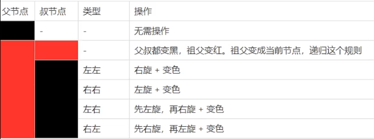

# 数据结构

## 稀疏数组

当数组中大部分元素为0或为同一个元素时，可用稀疏数组保存该数组

```txt
0	0	0	22	0	0	0	0	0	0	-1	
0	36	0	0	0	0	0	0	0	0	0	
0	0	0	0	0	0	0	0	0	0	0	
0	0	0	0	0	0	0	0	0	-62	0	
0	0	0	0	0	0	0	0	0	0	0	
0	0	0	0	0	0	0	0	0	0	0	
0	0	0	0	0	0	0	0	0	0	0	
3	0	0	0	0	0	0	0	0	0	0	
0	0	0	0	0	0	0	0	0	0	0	
0	0	0	0	0	0	0	98	0	0	0	
0	0	0	65	0	0	0	0	0	0	0
↓	↓	↓
11	11	7
0	3	22
0	10	-1
1	1	36
3	9	-62
7	0	3
9	7	98
10	3	65
```

**稀疏数组特点：**
1.三列；
2.第一行：行数、列数、非零元素个数；
3.其余各行：非零元素的行、列、值

## 队列

队列是有序列列表（数组或链表），遵循**先入先出**的原则

### 基础队列

头指针`front`：首元素的前一个位置。初始值-1
尾指针`rear`：尾元素的位置。初始值-1

存数据时`rear`动，取数据时`front`动

缺点：该队列只能按顺序存取一次，指针位置不会循环变化，不能复用

### 环形队列

首尾相连
1.`front`:指向队列的第一个元素，即`arr[front]`就是队列的第一个元素。初始值0
2.`rear`:指向队列末尾元素后一个位置，空出一个空间做为约定。初始值0
3.当队列满的条件:`(rear + 1) % maxSize = front`
4.对队列为空的条件:`rear == front`
5.当我们这样分析，队列中有效的数据的个数`(rear + maxSize - front) % maxSize`

## 链表

单链表：节点尾连接		next
双链表：节点首尾连接	pre、next

### 单链表

**核心：**节点类中必须有指向下一个节点的**next变量**,需要一个**指针temp**

**需注意**
1.代码顺序。顺序颠倒导致了死循环、空指针等问题
2.该单链表的前提是有一个永不赋值的头节点(空的头节点)
3.循环时，节点从前一个节点开始，实际上操作还是`temp.next`

### 双链表

基础是单链表

**需注意**
按排名添加节点时，根据定位后面有无节点分为两种情况：
1.若定位处后面无节点，则可以直接添加，2次连接，顺序无要求
2.若后面有节点，需要重新分配该处节点连接情况，4次连接，顺序是重点

### 约瑟夫问题

**Joseph Question**

n个人围坐一圈，约定编号为k 的人从1开始报数，数到m的那个人出列，它的下一位又从1开始报数，数到m的那个人又出列，依次类推，直到所有人出列为止，由此产生一个出队编号的序列。

通过**单向环形链表**模拟约瑟夫问题：
没有空的头节点,链表存储节点对象，该对象的属性只有`int no`

## 栈 Stack

栈( stack )是限定仅在表尾进行插入和删除操作的线性表

**先入后出。 出栈pop，入栈push**

```java
//实现
private int maxSize;
private int[] stack;
private int top = -1;//栈顶

public ArrayStack(int maxSize) {
    this.maxSize = maxSize;
    stack = new int[this.maxSize];//初始化栈数组
}
//栈满
public boolean isFull() {
    return top == maxSize - 1;
}
//栈空
public boolean isEmpty() {
    return top == -1;
}
```

## 二叉树

每个节点只能有两个子节点的树是二叉树


# 算法

## 后缀表达式

- **前缀表达式：**从右到左扫描，先将所有数字压入堆栈。遇到运算符时，弹出栈顶的两个数，对栈顶元素和次顶元素进行运算，阱将结果入栈。重复上述过程直到算完。
  举例：`(3+4)×5-6 = - × + 3 4 5 6`
- **中缀表达式：**即人类便于理解的算法

- **后缀表达式：**从左到右扫描，数字和运算符一起扫描，遇到数字压入，遇到运算符则弹出栈顶两个数进行运算并入栈，重复上述过程直到算完。逆波兰表达式，即后缀表达式。
  举例：`(3+4)×5-6 = 3 4 + 5 × 6`

### 中缀表达式转后缀表达式

**步骤**

1. 初始化两个栈:运算符栈s1和储存中间结果的栈s2
2. 从左至右扫描中缀表达式;
3. 遇到操作数时，将其压s2;
   1. 遇到运算符时，比较其与s1栈顶运算符的优先级
      如果s1为空，或栈顶运算符为左括号“("，则直接将此运算符入栈;
      2.若优先级比栈顶运算符的高，也将运算符压入s13
      3.否则，将s1核顶的运算符弹出并压入到s2中，再次转到(4-1)与s1中新的栈顶运算符相比较;
4. 遇到括号时:
   (1)如果是左括号“("，则直接压入s1
   (2)如果是右括号“)"，则依次弹出s1栈顶的运算符，并压入s2，直到遇到左括号为止，此时将这一对括号丢弃
5. 重复步骤2至5，直到表达式的最右边
6. 将s1中剩余的运算符依次弹出并压入s2
7. 依次弹出s2中的元素并输出，结果的逆序脚为中缀表达式对应的后缀表达式

## 递归（回溯）

规则：

1.当程序执行到一个方法时，就会开辟一个**独立的栈空间**
2.方法的局部变量是独立的，不会互相影响
3.当方法中使用的是引用变量，会共享该引用类型的数据
4.return 返回

### 迷宫

#### 规范

10*10迷宫，二维数组表示。
0为地面，1为墙，2为轨迹，3为死路。
移动的先后策略：下 右 上 左（不同策略下的路径不同）

#### 思路

1.构造迷宫
2.检测当前位置元素的上下左右四个元素的值，并进行递归

### 八皇后

#### 思路

存储：用一维数组存储位置，索引为横坐标，值为纵坐标
检测：同一行不需要检测；
			同一列`arr[i] == arr[n]` ;
			同一斜线`Math.abs(arr[n] - arr[i]) == Math.abs(n - i)`
下棋：每次递归前判断是否到第八个棋子，是，则退出。
			每个棋子都要从行首到行尾全部判断一次

## 排序

分为**内部排序**和外部排序

内部排序：使用内存排序
外部排序：使用内存和外部储存

### 时间复杂度

**时间频度**：一个算法中语句执行次数称为时间频度，记作T(n)

**时间复杂度**：若有某个辅助函数f(n)，使得当n趋近于无穷大时，T(n) / f(n) 的极限值为不等于零的常数，则称f(n)是T(n)的同数量级函数。记作 T(n)=O( f(n) )，简称时间复杂度。即**一个算法执行所耗费的时间**

**空间复杂度**：运行一个程序所需内存的大小

**常见的时间复杂度**：常数阶O(1)、对数阶O(log2n)、线性阶O(n)、线性对数阶O(nlog2n)、平方阶O(n^2)、立方阶O(n^3)、k次方阶O(n^k)、指数阶O(2^n)

所以，时间复杂度可以理解为循环次数。

**平均时间复杂度**：所有可能的输入实例均以等概率出现的情况下，该算法的运行时间。
**最坏时间复杂度**：最坏情况下的时间复杂度。

### 各种排序方法

#### 冒泡排序

规则：每次循环，依次比较相邻元素的值，若逆序则交换，使得值较大的元素逐渐向后移动。

```txt
[8, 9, 1, 7, 2, 3, 5, 4, 6, 0]

[8, 1, 7, 2, 3, 5, 4, 6, 0, 9]
[1, 7, 2, 3, 5, 4, 6, 0, 8, 9]
[1, 2, 3, 5, 4, 6, 0, 7, 8, 9]
[1, 2, 3, 4, 5, 0, 6, 7, 8, 9]
[1, 2, 3, 4, 0, 5, 6, 7, 8, 9]
[1, 2, 3, 0, 4, 5, 6, 7, 8, 9]
[1, 2, 0, 3, 4, 5, 6, 7, 8, 9]
[1, 0, 2, 3, 4, 5, 6, 7, 8, 9]
[0, 1, 2, 3, 4, 5, 6, 7, 8, 9]
```

#### 选择排序

每次循环后，找到当前最小的一位数，并将其与位置最靠前的数交换

```txt
[8, 9, 1, 7, 2, 3, 5, 4, 6, 0]

[0, 9, 1, 7, 2, 3, 5, 4, 6, 8]
[0, 1, 9, 7, 2, 3, 5, 4, 6, 8]
[0, 1, 2, 7, 9, 3, 5, 4, 6, 8]
[0, 1, 2, 3, 9, 7, 5, 4, 6, 8]
[0, 1, 2, 3, 4, 7, 5, 9, 6, 8]
[0, 1, 2, 3, 4, 5, 7, 9, 6, 8]
[0, 1, 2, 3, 4, 5, 6, 9, 7, 8]
[0, 1, 2, 3, 4, 5, 6, 7, 9, 8]
[0, 1, 2, 3, 4, 5, 6, 7, 8, 9]
```

#### 插入排序（简单插入排序）

插入排序属于内部排序。

将n个待排序的元素看作一个有序表和一个无序表。排序时每次从无序表中取出无序表中第一个元素，并与有序表中元素进行比较，找到插入索引并插入。

```
[8, 9, 1, 7, 2, 3, 5, 4, 6, 0]

[8, 9, 1, 7, 2, 3, 5, 4, 6, 0]
[1, 8, 9, 7, 2, 3, 5, 4, 6, 0]
[1, 7, 8, 9, 2, 3, 5, 4, 6, 0]
[1, 2, 7, 8, 9, 3, 5, 4, 6, 0]
[1, 2, 3, 7, 8, 9, 5, 4, 6, 0]
[1, 2, 3, 5, 7, 8, 9, 4, 6, 0]
[1, 2, 3, 4, 5, 7, 8, 9, 6, 0]
[1, 2, 3, 4, 5, 6, 7, 8, 9, 0]
[0, 1, 2, 3, 4, 5, 6, 7, 8, 9]
```

#### 希尔排序

也属于插入排序，基于简单插入排序。

将下标按照增量分组，每组采用简单插入排序。随着分组的细化，最终完成排序。


#### 快速排序

对冒泡排序的一种改进。

每次确定一个基准数，将数组中数据从两边开始判断，并交换元素。最终两边的指针指向一个地方，将该处元素和基准数交换。

```txt
[8,9,1,7,2,3,5,4,6,0]

```

# 树

## 名词

节点、根节点、父节点、子节点、叶子节点、节点权、层、子树、树的高度、森林、

## 二叉树

**满二叉树**
所有叶子节点都在最后一层，并且节点总数为`2^n - 1`，`n`为层数

**完全二叉树**
叶子节点都在最后一层或倒数第二层，且最后一层只有叶子节点

**二叉树的遍历**

前序遍历：先输出父节点，再遍历左子树和右子树
中序遍历：先便利左子树，再输出父节点，再遍历右子树
后序遍历：先遍历左子树和右子树，再输出父节点

## 二叉排序树BST

二叉排序树/二叉查找树/二叉搜索树。

**特点**
1.左子树所有节点均小于根节点
2.右子树所有节点均大于根节点
3.左右子树也是二叉排序树

**二叉树可以提高查询效率：O(logn)**

## 平衡二叉树AVL

最重要的特性在于平衡，这使得我们能够在最坏情况下也保持O(logn)的时间复杂度实现查找（一个不具备平衡性的查找树可能退化成单链表，时间复杂度会到O(n)）

当二叉树的左右两棵子树的高度差超过1时，会对操作效率有影响。

**平衡二叉树特点**
1.任意节点的子树高度差均 >= 1
2.是二叉排序树

### 平衡二叉树的旋转

**平衡因子 BF**：左右子树高度差。BF > 1，则二叉平衡树失衡，需要进行旋转。

**最小不平衡二叉树**：距离插入节点最近的不平衡子树

当左子树比右子树高1以上，需要右旋
当右子树比左子树高1以上，需要左旋

举例：{3,2,1,4,5,6,7,10,9,8}的步骤
3 2 1 ，LL失衡，右旋 2 1 3
2 1 3 4 5 ，RR失衡，左旋 2 1 4 3 5
2 1 4 3 5 6 ，RR失衡，左旋 4 2 5 1 3 6
4 2 5 1 3 6 7 ，RR失衡，左旋 4 2 6 1 3 5 7
4 2 6 1 3 5 7 10 9 ，RL失衡，先右旋 4 2 6 1 3 5 7 9 10
												   再左旋 4 2 6 1 3 5 9 7 10
4 2 6 1 3 5 9 7 10 8 ，RL失衡，先右旋 4 2 6 1 3 5 7 9 8 10
													  再左旋 4 2 7 1 3 6 9 5 8 10
													  完毕

## 多路平衡查找树

2-3-4树是阶数为4的B树。

2-节点，包含 1 个元素和 2 个指针
3-节点，包含 2 个元素和 3 个指针
4-节点，包含 3 个元素和 4 个指针 


#### 顺序存储二叉树

1.只考虑完全二叉树
2.第n个元素的左子节点为`2n+1`
3.第n个元素的右子节点为`2n+2`
4.第n个元素的父节点为`(n-1)/2`

#### 堆排序

堆排序是一种选择排序。时间复杂度为O(nlogn)，是不稳定排序

**大顶堆**	节点的值大于左右孩子的值
**小顶堆**	节点的值小于左右孩子的值

#### 霍夫曼树

Huffman Tree

给定n个权值为n个叶子节点，构造一个二叉树，若该树的带权路径长度（wpl）达到最小，称其为最优二叉树，或霍夫曼树

霍夫曼树是带权路径最短的树，权值较大的节点离跟较近

**路径（长度）**
从一个节点往下可以到达的孩子或孙子的通路，称为路径。若规定根节点的层数为1，则从根节点到第n层节点的路径长度为`n-1`

**带权路径长度**
从根节点到该节点之间的路径长度与该节点的权的乘积

**树的带权路径长度**
树的所有叶子节点的带权路径长度之和

**霍夫曼树思路**
从上到下，从右到左

## 红黑树

**复杂度O(logn)**

对于AVL树，平衡条件是：左右子树深度差<=1。而对于红黑树，平衡的条件是：左右子树深度差一倍以内。

**BST树缺点：容易不平衡，在数据递增或递减时会退化为链表(logn --> n)，查询性能不佳。**
**AVL树缺点：完全平衡，查询效率高，但是在执行增删操作时，需要频繁变换树的结构。**
**红黑树：介于不平衡和完全平衡之间。通过每个节点有红黑两种颜色、从节点到任意叶子节点会经过相同数量的黑色节点等一系列规则，使得树的层数最大也只会有两倍的差距，这样既能提高插入和删除的效率，又能让树相对平衡从而有还不错的查询效率。从整体上讲，红黑树就是一种中庸之道的二叉树**

**红黑树规则**



# 图

不同于表和树，图是一种多对多的数据结构

`有向图`：顶点之间的连接有方向
`无向图`：顶点之间的连接没有方向
`带权图`：边带权值

## 图的表示方式
### 二位数组（邻接矩阵）


### 链表（邻接表）


## 图的遍历
### 深度优先 DFS
DFS (Depth First Search)

特点：
1.从初始访问节点出发，优先访问第一个邻接节点。即，每次访问完当前节点后，首先访问当前节点的第一个邻接节点
2.优先纵向挖掘
3.可见，深度优先搜索是一个递归过程

### 广度优先 BFS

BFS（Broadth First Search）

特点：
1.从初始节点出发，优先访问第一个邻接节点。即，每次访问完当前节点后
